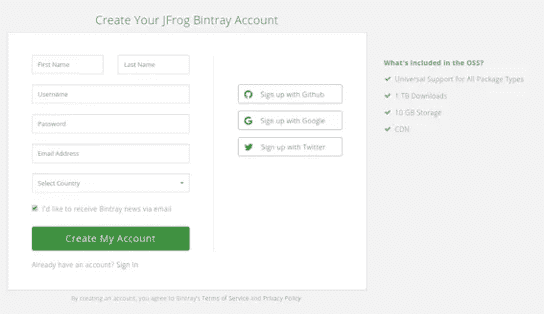
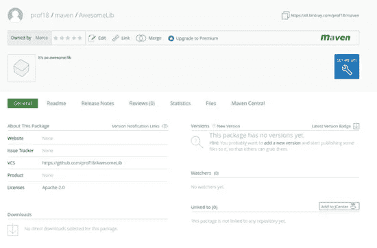

# 如何发布和分发您的 Android 库

> 原文：<https://medium.com/swlh/how-to-publish-and-distribute-your-android-library-ce845c68c7f7>


Photo by [Alfons Morales](https://unsplash.com/@alfonsmc10?utm_source=medium&utm_medium=referral) on [Unsplash](https://unsplash.com?utm_source=medium&utm_medium=referral)

你刚刚建立了一个非常棒的 Android 库，但你不知道如何发布它？你来对地方了；在本文中，我将向您解释我用来发布我的两个库的过程。

首先，我们假设你已经开发了你的 Android 库，那么你在 Android Studio 中有一个库模块。


An example of a library module

这个库将被发布到【bintray.com】托管的 *jCenter、*Maven 知识库。过程很简单:库在 Android Studio 中本地构建，工件将被上传到 *bintray* ，然后链接到 *jCenter。*


这样，想要使用你的库的开发者只需要在他们项目的 *build.gradle* 文件中声明它。例如:

```
implementation "com.prof.rssparser:rssparser:2.0.4"
```

首先要做的是创建一个 [Bintray](https://bintray.com/) 账户，对于开源项目是免费的。



Create a Bintray account

创建帐户后，您必须选择一个存储库。还是用 Maven 吧(我知道，你在想“为什么？我想把它发布到 jCenter”。如上所述，jCenter 是一个 Maven 仓库，所以我们必须选择 Maven)。


Choose Maven as repository

现在您可以在 Maven 存储库中创建一个新的包。


Add a new package to the Maven repository


Add basic information of the library

在添加了库的所有基本信息，如名称、描述、许可证、标签等之后。库的存储库已经准备好了。



现在，回到代码。我将把我开发的一个库作为参考，所以如果你愿意，你可以深入研究真正的代码。

[](https://github.com/prof18/RSS-Parser) [## prof18/RSS 解析器

### 一个解析 RSS 提要的 Android 库。在 GitHub 上创建一个帐户，为 prof18/RSS-Parser 的开发做出贡献。

github.com](https://github.com/prof18/RSS-Parser) 

首先，您必须将一些依赖项添加到项目的 *build.gradle* 文件中。

```
classpath 'com.github.dcendents:android-maven-gradle-plugin:2.0'        classpath 'com.jfrog.bintray.gradle:gradle-bintray-plugin:1.8.4'
```

**编辑:**`android-maven-gradle-plugin`已被弃用，如果您使用的是 Gradle 5 及以上版本，您必须更改插件以生成工件。这个新插件是由 Sky-UK 开发的，你需要将它应用到`publish.gradle`文件中(稍后会有更多细节)。

[](https://github.com/sky-uk/gradle-maven-plugin) [## sky-uk/gradle-maven-plugin

### 这是一个小“插件”,用来简化 maven-publish Gradle 插件的使用。你可以把这个插件用于 Java 库…

github.com](https://github.com/sky-uk/gradle-maven-plugin) 

因此，我们可以摆脱不赞成的依赖关系:

```
classpath 'com.jfrog.bintray.gradle:gradle-bintray-plugin:1.8.4'
```

至此，我们已经准备好创建发布脚本了。在库项目中，创建一个 *publish.gradle* 文件，并将其应用于库的 *build.gradle* 文件。

```
apply from: 'publish.gradle'
```

**编辑:**从 Gradle 5 及以上版本开始，之前的脚本不再有效，需要稍微修改一下。

为了更好地理解这些变化，你可以参考[](https://gist.github.com/prof18/ac3a632e7604436f483220c435b6edef/revisions#diff-d2449a02877e0ea0956446e281890efd)**。**

**在解释整个脚本之前，必须对库签名进行澄清。如前所述，库的签名具有以下形状:**

```
com.prof.rssparser:rssparser:2.0.4
```

**它由三部分组成:**

*   **群组 ID(*com . prof . RSS parser*)；**
*   **工件 ID(*RSS parser*)；**
*   **版本( *2.0.4* )。**

```
GROUP_ID:ARTIFACT_ID:VERSION
```

**因此，对于我们上面创建的示例库，组 ID 是:" *com.your.awesome.lib* "，工件 ID 是:" *awesomelib* "，版本是:" *1.0.0* "。这些字段是任意的，您必须选择一个名称；请记住，有了新的更新，签名中只有版本会发生变化。**

```
com.your.awesome.lib:awesomelib:1.0.0
```

**回到脚本，第[7–33]行(**EDIT:**【6–13】)负责构建库、生成工件并链接您正在使用的所有外部依赖项。**

**行[38–58](**编辑:**[15–38])负责库的上传。在这里你需要指定你的 bintray 用户名，bintray API 密匙(你可以在*编辑你的个人资料- > API 密匙*下检索和撤销)，版本，工件和库的组以及其他有用的信息。你可以在 gradle bintray 插件的文档中找到你能提供的所有不同的信息。**

**[](https://github.com/bintray/gradle-bintray-plugin) [## bintray/gradle-bintray-plugin

### 在 GitHub 上创建一个帐户，为 bintray/gradle-bintray-plugin 开发做贡献。

github.com](https://github.com/bintray/gradle-bintray-plugin) 

记住要保密用户名和私钥。有很多方法，比如我把它们保存在 *local.properties:*

```
bintray.user=<your-name>
bintray.apikey=<your-key>
```

并用几行简单的代码将它们加载到 *publish.gradle* 脚本中。

```
def properties = new Properties()
properties.load(new FileInputStream("local.properties"))user = properties.getProperty("bintray.user")    
key = properties.getProperty("bintray.apikey")
```

最后，是时候打开终端并启动构建和上传任务了(我建议使用 *— info* 标志来更好地了解它正在进行的事情)。

```
./gradlew clean build bintrayUpload --info
``` 

****编辑:**弃用`android-maven-gradle-plugin`后，启动构建和上传任务的命令被更改**

```
./gradlew clean publish bintrayUpload --info
```

**如果一切顺利，文物已经上传到 bintray，但尚未发布。**

****

**New version uploaded but not yet published**

**我故意禁用了自动发布，因为如果有一些错误，它可以挽救你的生命。但是如果你愿意的话，可以在 *publish.gradle* 文件中添加一个标志，一旦库被上传，它就会自动发布库。**

**要发布库，您必须单击库的存储库页面中出现的标题上的*发布*按钮。**

****

**现在是最后一步。您必须将库链接到 jCenter。这个过程只能在第一次完成。在 library repository 页面的右下方，有一个*添加到 jCenter**按钮。***

******

***Link the library to jCenter***

***发送请求并等待批准。***

******

***在最多两个小时内，您的库就会发布并链接到 jCenter，您可以在存储库页面中看到这一点。***

******

***最后，您可以向全世界介绍您令人敬畏的库，并提供实现它的签名。***

```
*dependencies { 
  implementation ‘com.your.awesome.lib:awesomelib:1.0.0’ 
}*
```

***这就是所有的人！我同意你的看法，这个过程并不简单，但我希望能消除你所有的疑虑。***