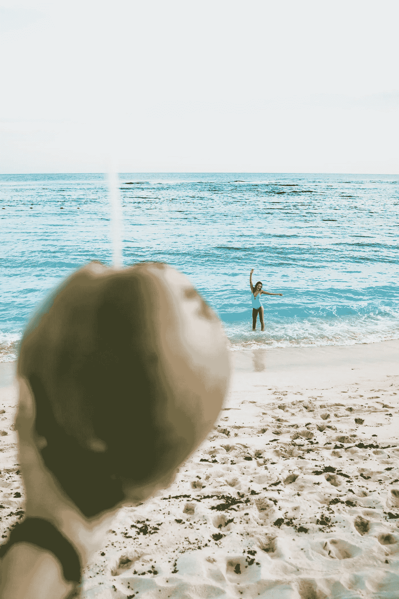

# 如何辞掉令人沮丧的工作，搬到天堂，并获得报酬，积极影响世界

> 原文：<https://medium.com/swlh/how-to-quit-your-depressing-job-move-to-paradise-and-get-paid-to-positively-impact-the-world-3c3a690bcca0>

Photo by [Peter Fogden](https://unsplash.com/photos/wgR6yzptp4s?utm_source=unsplash&utm_medium=referral&utm_content=creditCopyText)

像你一样——我一直是个作家。

> 我也有这种贪得无厌的信念，认为我是为更好的东西而生的。

自从我还是个孩子的时候，我在一年级的时候就开始创作和画漫画书，或者写一些有创意的短篇小说…