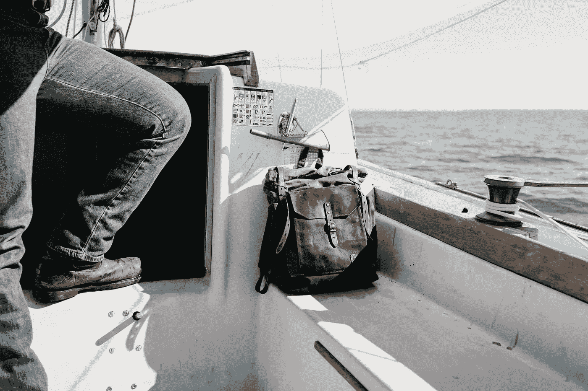

# 如何辞掉工作，卖掉财产，像专家一样流浪

> 原文：<https://medium.com/swlh/how-to-quit-your-job-sell-your-possessions-and-vagabond-like-an-expert-8127c33430b3>

Photo by [Andrew Neel](https://unsplash.com/@andrewtneel?utm_source=unsplash&utm_medium=referral&utm_content=creditCopyText) on [Unsplash](https://unsplash.com/search/photos/vagabond?utm_source=unsplash&utm_medium=referral&utm_content=creditCopyText)

“流浪者”这个词现在不是你经常听到的。这是一种特殊类型的旅行者。是旅行者没有工作，没有地方住，只是从一个地方流浪到另一个地方。

这些人我见过不少。他们中的一些人无家可归，靠在招待所工作和在……上从事繁重的劳动来维持生活