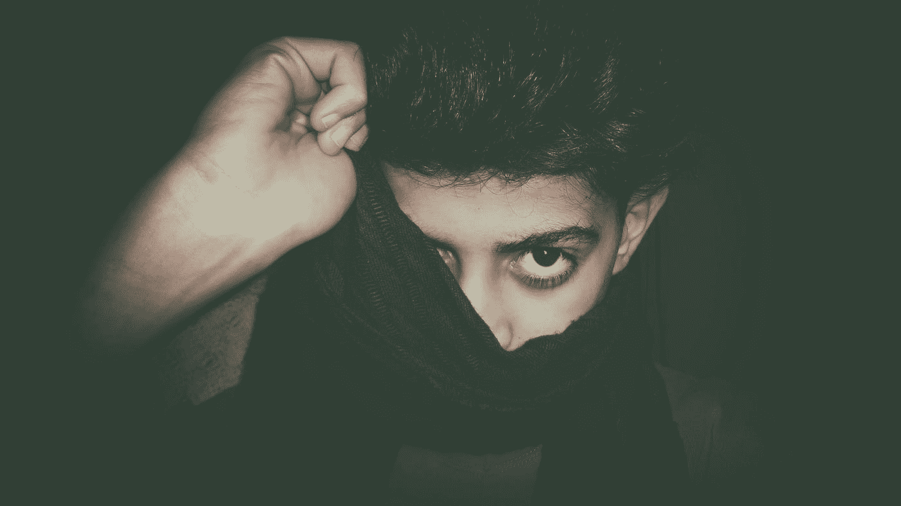

# 如何像读书一样“读懂”人:

> 原文：<https://medium.com/swlh/how-to-read-people-like-a-book-7ef2802945c5>

## 令人震惊的是，肢体语言可以帮助我们识别潜在的爱人和骗子

Photo by [Ali Tareq](https://unsplash.com/@a12li0?utm_source=medium&utm_medium=referral) on [Unsplash](https://unsplash.com?utm_source=medium&utm_medium=referral)

作家威拉·凯瑟(Willa Cather)说了一个人能说出的最真实的话之一，她说“他人的内心永远是一片黑暗的森林，无论它与自己的内心多么接近。”我从自己的经历中知道，我的一部分没有人完全…