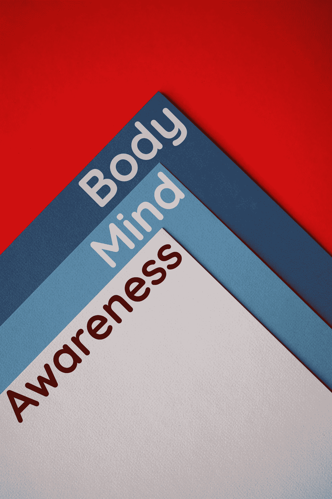

# 如何实现心灵和身体未被充分利用的潜力？

> 原文：<https://medium.com/swlh/how-to-realize-the-underutilized-potential-of-the-mind-and-the-body-4e6833073b2a>

## 意识弥合了我们是什么和我们的能力之间的差距。

我们的存在有三个基本组成部分。一个是物质的身体，第二个是思想，第三个是意识的能力，它独立于身体和思想。意识的本质是能够…