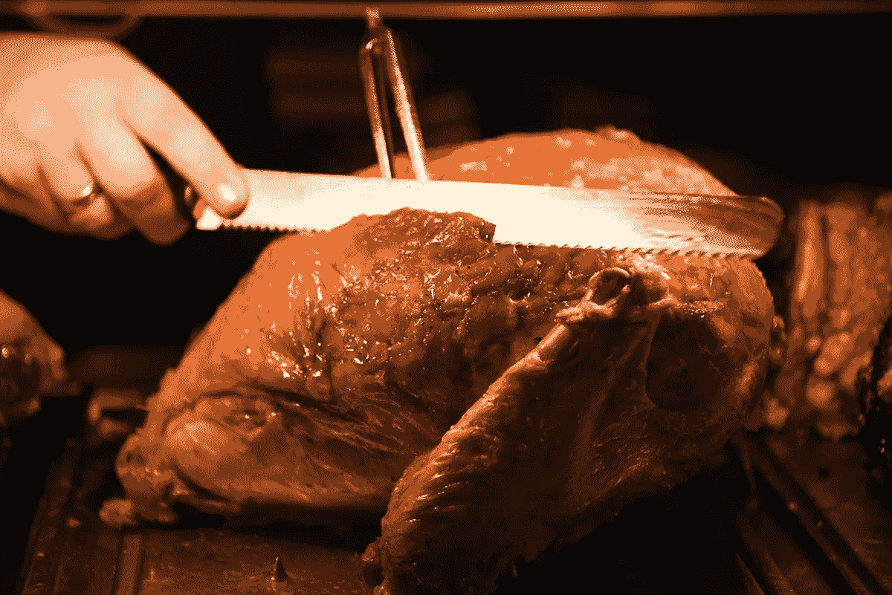

# 如何回收你最好的内容来推销你的法律业务

> 原文：<https://medium.com/swlh/how-to-recycle-your-best-content-to-market-your-law-practice-2369f2ce857a>

许多律师花费无数的时间准备 CLE 演示，撰写信息丰富的博客文章，接受媒体采访，并通常创建他们的客户，潜在客户和推荐来源感兴趣的信息内容。

最聪明的律师会通过在各种其他场合重复使用他们的内容来找到多种用途