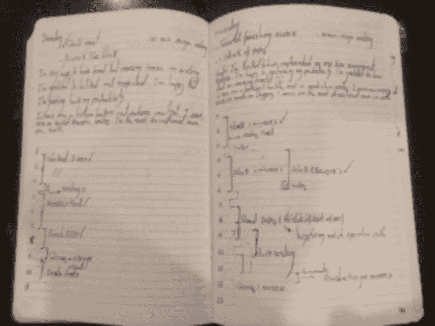

# 如何抵制诱惑和克服拖延——一个几乎 100%奏效的意志力黑客

> 原文：<https://medium.com/swlh/how-to-resist-temptations-and-overcome-procrastination-a-willpower-hack-that-works-almost-100-2537bf0042b5>

Photo Credit: [Kalen Emsley](https://unsplash.com/@kalenemsley) at [PixaBay](http://unsplash.com)

> *聪明的人想要自我控制；孩子们想要糖果。— Rumy*

你是否因屈服于诱惑或未能实现决心而感到沮丧？

你是否一直拖延你为自己设定的目标或任务？

好消息是…

如果你失败了，问题不在于你或你的[意志力](https://livelikepros.com/definite-guide-to-increasing-willpower-and-discipline/)。问题是你使用意志力的方式*。*

在这篇文章中，我将与你分享一种叫做“预先承诺”的意志力技巧，它帮助我粉碎诱惑，几乎百分之百地战胜拖延。

# 什么是预先承诺？

> 意志力不是抵抗、强迫或控制，而是选择。——彭尼·皮尔斯

预先承诺是指你提前决定在特定情况下你要做什么。

或者，

预先承诺是当你实际上 ***提前做出*** 决定，这样当你面对一个诱人或无聊的情况时，**你只剩下良性的道路。**

但最精彩的部分呢？

预先承诺实际上让你从一开始就不必依赖意志力。

依靠意志力有一个严重的问题:

你的每一个可能需要意志力的行为——无论你是想坚持你的决心，还是拒绝诱惑——都涉及 [***决策***](https://livelikepros.com/decision-fatigue/) 。

做决定在新陈代谢上是非常昂贵的。也就是说，它消耗了你大脑的大量能量。

因此，你的大脑会自然地试图通过制造一些不舒服的感觉，或者像史蒂文·普雷斯菲尔德所说的那样:抵制，来劝阻你不要做出这样的决定。

当你预先承诺时，你提前做了所有的决定。因此，当情况需要时，你不再需要依靠你的意志力来做出吓跑你大脑的决定。

这就是预先承诺的力量，它把你从意志力的束缚中解放出来。

以下是我试验过的三种不同的预先承诺，你真的可以依赖它们。

# 使用预先承诺的 3 种简单方法

> “动力是你开始的动力。承诺是你前进的动力。”—吉米·罗恩

## 1.在具体的日期和时间写下你的决心。

这个简单的技巧几乎从未让我失望过。

如果是我一直拖延的事情，比如开始一门新的在线课程的愿望，去健身房等等，保证执行就像写下我的决定并指定一个确切的*日期和时间*一样简单。

因此，如果任务是拖延症的长期受害者，你可以通过简单地写下你的任务并指定一个**特定的日期和时间来确保它的执行。**

这种技术的效果如何？

以至于我更进一步，采用了子弹日记系统，现在它是我大脑的延伸，从那以后，我体验到了巨大的生产力。

My Bullet Journal — Blurred Due to Privacy

但这并不是这项技术的全部。

如果你努力开始或完成的事情需要定期*完成*和*很长一段时间*，你可以做以下事情:

**以*信条*的形式写下你的决定，并*将它神圣化*。**

例如，自从我为早上按了 10 次贪睡键而感到羞愧，我就用下面这句简单的话把它从我的生活中消除了:

> 我，阿米尔，在此庄严宣誓再也不使用贪睡按钮了！

这个成圣过程有一个微妙的陷阱。

不要写一些平庸的东西，比如:*我保证每天去健身房。*

你必须用一种对你真正重要的属性或品质来使它神圣化。

不管是你的骄傲还是你的道德感等等。，**它得触发你。**

对我来说，当我写下这个 ***的时候，我向……***庄严宣誓，这既激发了我的自豪感，也激发了我的道德感，保证了它的有效性。

我现在确信:

> 写下来会引出承诺，而承诺会转化为行动。

## 2.预先承诺奥德修斯的方式。

Pre-commitment by Odysseus

预先承诺是奥德修斯为了通过塞壬诱惑而致命的歌声所做的。

他把自己绑在桅杆上，命令不要给他松绑，不管他多么努力地恳求去找塞壬。

他的手下以不同的方式预先犯下罪行，堵住他们的耳朵，让他们忘记塞壬迷人的歌声。

奥德修斯所做的是**在第一时间排除了纵欲的可能。**

即使他想，他也不会屈服于诱惑！

你想阻止自己强迫性地使用社交网络，而是专注于你的项目吗？

然后，通过阻止你对它们的访问来预先提交。或者如果你想更极端一点，干脆放弃它们。

那么，我如何使用奥德修斯的方式呢？

我已经从手机上移除了所有的社交媒体应用，在使用电脑时，我使用 *StayFocusd* 扩展功能，屏蔽了对不相关网站的访问。

这还不是这项技术的全部。

奇怪的是，这种方式也有额外的价值，即**保存你宝贵的意志力**和精神能量，因为它让你不必依赖它。

事实上，研究表明，自制力最强的人比其他人花费更少的时间抵制诱惑。这让研究人员感到困惑，直到出现了解释:

> 自制力最强的人不太需要使用意志力，因为他们较少受到诱惑和内心冲突的困扰。他们更善于安排自己的生活，以避免出现问题。

最后，我把最好的留到了最后。

## 3.公开预先承诺或向责任伙伴预先承诺。

我很想说这种技术 100%的时候都有效。我只想说，这也许是最防弹的。

这个技巧实际上把我从严重的抑郁中拯救了出来。

回到我极度沮丧和焦虑的时候。我知道这种锻炼对我的情况会有很大的帮助。

但是有一个严重的问题。

我既没有勇气也没有意愿去跑步。实际上，我的卧室感觉舒服多了。

所以，我强迫自己走出舒适区，答应父亲和他一起晨跑。

你注意到这种技术的巨大效果了吗？

当你经历抑郁时，有时你甚至没有意愿和心情去吃东西，更不用说在早上 6 点去跑步了。但是这种技术帮助我绕过了我死气沉沉的意志力。

但这不是我使用这项技术的最大成就。

在另一个场合，我决定继续 ***三天禁食*** (只喝水)，我让*很容易坚持下去，只是让我周围的每个人都知道我要这么做。*

# *最后的想法*

*我学习增强意志力和纪律性的技巧已经快 5 年了。*

*在我的失误中，我一直认为我没有足够地培养自己的纪律性。*

*直到我认识到，你不能仅仅依靠意志力就靠蛮力取得成功。*

*你必须知道[意志力是一种有限的资源，当你一整天都在使用它的时候，它就会被耗尽](https://livelikepros.com/decision-fatigue/)。*

*我也明白了要拥有[防弹意志力](https://livelikepros.com/bulletproof-willpower/)我必须有一个清晰的目标，并全力以赴去实现它。*

*所以，如果你失败了，不要像我曾经做过的那样，把自己搞得筋疲力尽，对自己说你很懒。你只需要知道[意志力是如何发挥作用的](https://livelikepros.com/definite-guide-to-increasing-willpower-and-discipline/)，然后聪明地运用它。*

# *概括起来*

*   *预先承诺是帮助你提高意志力和纪律性的最有力的技巧。*
*   *意志力是一种有限的资源，除非你通过严格的练习来增强它，否则你无法依赖它。*
*   *意志力的难点在于它需要决策，而决策在新陈代谢上是一种非常昂贵的行为。*
*   *预先承诺通过提前做决定，让你不必依赖意志力。*
*   *有三种方法可以使用预先承诺:*

1.  *通过指定确切的日期和时间，写下你想开始做的事情。如果这是你经常想做的事情，以信条或誓言的形式写下来。*
2.  *你可以通过消除诱惑的来源来预先承诺，例如阻止你访问社交媒体。*
3.  *您可以公开预先承诺或向责任伙伴预先承诺。*

****

## *这篇文章发表在 [The Startup](https://medium.com/swlh) 上，这是 Medium 最大的创业刊物，拥有+427，678 名读者。*

## *在这里订阅接收[我们的头条新闻](https://growthsupply.com/the-startup-newsletter/)。*

**