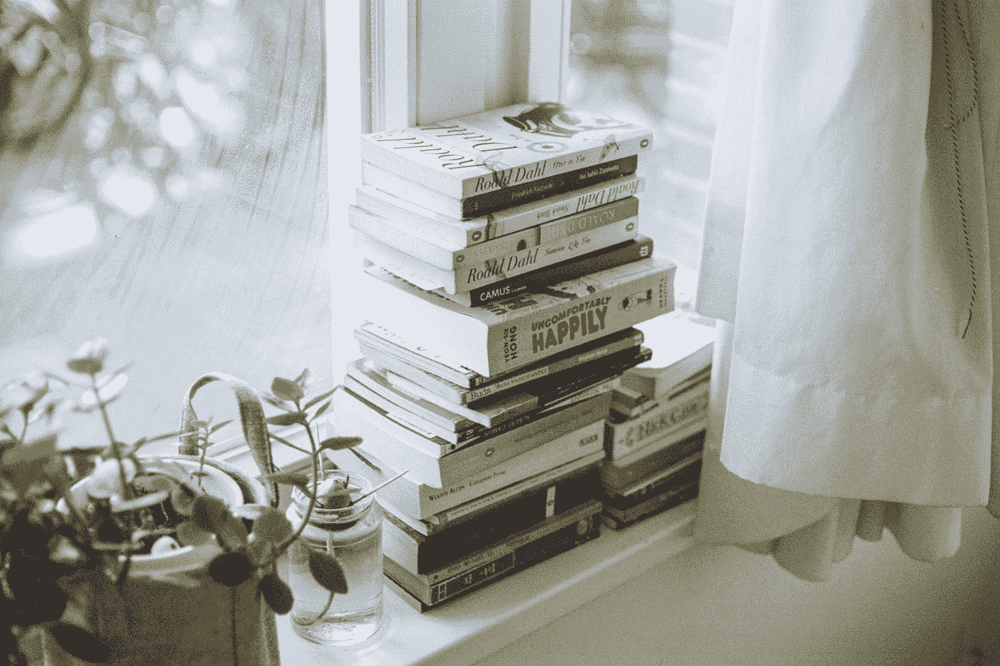

# 如何重新开始你的阅读习惯

> 原文：<https://medium.com/swlh/how-to-restart-your-reading-habit-e49a5bc7dba7>

“我每个月都会买几本书，包括纸质版和 kindle 版，但我一本也没看完。”——数百人之声。

Photo by [Florencia Viadana](https://unsplash.com/@florenciaviadana?utm_source=medium&utm_medium=referral) on [Unsplash](https://unsplash.com?utm_source=medium&utm_medium=referral)

对我们中的一些人来说，它们是最好的朋友。对有些人来说，它们是生活的一部分。对一些人来说，他们是超自然的力量，指引他们走向正确的道路。

但对我们大多数人来说，它们只是让你看起来很酷的东西…