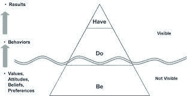

# 如何对你梦想的职业进行逆向工程

> 原文：<https://medium.com/swlh/how-to-reverse-engineer-the-career-of-your-dreams-fe754ee8eb57>

## 逆向工程。这是开始规划生活的方式。

> "生命的最大用处是把它花在比生命更长久的事情上."—威廉·詹姆斯

每一个开始都应该从你的结束开始。

让我们面对现实吧，我们，世界人民，正生活在一个以结果为导向的文化中。

“是关于结果的！”对吗？

我们在工作场所看到它。我们在电视上被提醒过。广告牌和社交媒体上都贴满了。

> 如果你有所成就——任何成就——这个结果将会定义你。他们告诉我们，这些结果才是最重要的。

你我都知道那是一堆垃圾。

我们被灌输了一种“是—做—有”的思维体系。这一切都归结于一种底线方法。“给我看看钱。”“你最近为我做了什么？”事实上，与我们的人生旅程相比，这种对结果的痴迷无关紧要。结果与生活在“是”和“做”状态中的分钟和小时不太一样。结果需要时间。它们通常是我们努力的目标。

我们应该朝着我们的目标和梦想努力。我是这个的主要支持者！要知道，你的精力最好花在充满活力、充满活力、完全沉浸在“做”和“做”的活动中。我也鼓励你认识到你可能已经有了很好的进展。你只需要欣赏它的本来面目。

在这三个阶段中，我们都能找到幸福、满足感和目标感。我们迷失和痛苦的地方是当我们过于关注未来——我们没有的东西。当我们渴望这些结果时，这可能不是我们内心真正想要的，它会导致焦虑和空虚感，让我们空虚和不满足。

# 构建您的基础

结果既有客观的，也有主观的。有些人一生都在努力取得特殊的成就，因为他们认为这会让他们的父母、男朋友、女朋友或同学感到骄傲。虽然这些都是很好的补充和副作用，但它们不应该成为*为什么*你做你现在做的事情的原因。你努力争取的结果，应该是为了自己的自我满足。

看看下面这个“是”、“做”和“有”的小图表我相信很久以来，我们的文化一直沉迷于结果。作为一个*结果*，人们很少关注像价值观、信念、态度和努力这样的细节。这些品质构成了我们的支柱——基础！如果我们绕过这些重要的步骤，我们就不可能在生活中取得大的成就。

我们需要价值观来帮助塑造我们的行为和人生观。我们的价值观反映了我们看待自己的方式。我们的行为符合我们的思维方式和我们珍视的价值观。以史蒂夫·乔布斯为例。他不是一个非常虔诚的人。但他是一个有着伟大信仰和信念的人。他坚信要相信自己——相信任何事情——对未来充满信心，然后带着热情和奉献精神为之努力。

一旦你把“做”和“被”放下，你就会收获成果。对吗？还是不对？你注意到了吗？！让我把剧本翻给你看。

# 你拿到了

> “把你的名字刻在心上，而不是墓碑上。一份遗产铭刻在其他人的脑海中，以及他们分享的关于你的故事中。”香农·阿尔德

如果你每天都从“拥有”开始生活，会怎么样？我的意思是，假设你是一个崭露头角的企业家。你想创建一个每个人都会喜欢的伟大的新应用。很有可能，你已经在编写代码了，也许你已经创建了一些东西来进行 beta 测试。可能会很棒。但你可能不这么认为。所以你怀疑。你觉得你需要外部的认可，比如销售和社交媒体的宣传。

你不知道。事实上，你对“拥有”的憧憬可能就是你已经拥有的。你在一个充满伟大的乘坐，转弯和变化的旅程。开始*活在那一刻*。那*就是*中的“有”！！

但是，如果你做了一些自省的调查，发现你对自己目前的状态并不完全满意，该怎么办呢？那么现在就开始让你的未来状态——你所拥有的——成为现实。你可能没有满座的竞技场或者崇拜你的粉丝。但开始表现得像你一样。开始想象“拥有”到底是什么样子。画一幅如此生动的画，它会让米开朗基罗脸红。

想象一下这到底是什么样子。以此为线索。过一个庆祝你未来成功的生活。然后，开始存在并做那是什么。这是哲学和文化范式的转变，将改变你每天的生活方式。它会推动你以超乎想象的速度实现你的梦想。

这是你如何创造一份遗产，并充分利用每一刻。

***找到我绝对最好的作品，再加上免费获得由*** [***订阅我的时事通讯上的精彩更新***](http://chrisdconnors.com/) ***！***

## 这篇文章发表在 [The Startup](https://medium.com/swlh) 上，这是 Medium 最大的创业刊物，拥有+428，678 名读者。

## 在这里订阅接收[我们的头条新闻](https://growthsupply.com/the-startup-newsletter/)。

