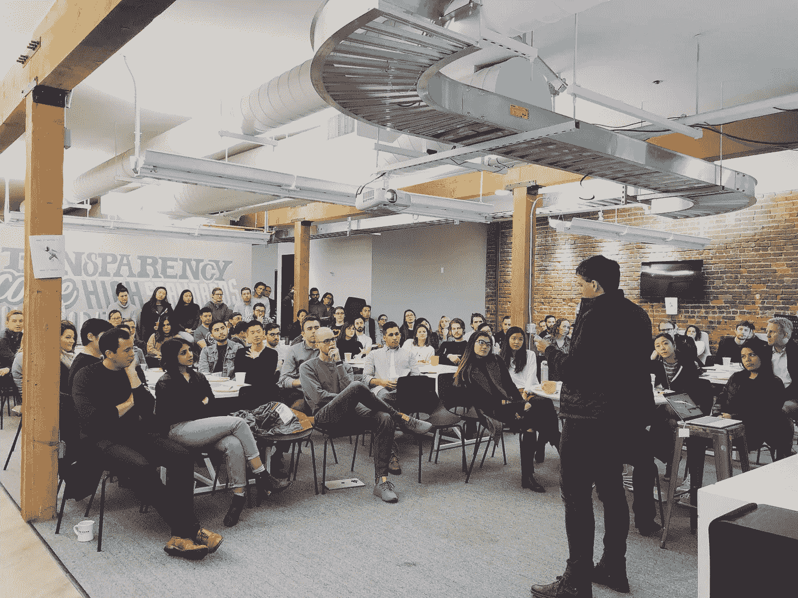

# 如何开一个高效的全体会议

> 原文：<https://medium.com/swlh/how-to-run-an-efficient-and-effective-all-hands-meeting-dc0808c4c8b1>

Front co-founder and CTO Laurent Perrin speaking at a recent All Hands

每周一上午太平洋时间 9 点(巴黎时间下午 6 点)，我们公司全体人员集合。它们涵盖了很多领域，但很少超过 30 分钟。

(我坚信[透明](/@collinmathilde/more-than-a-buzzword-how-we-practice-transparency-at-front-d415b94fd8a4)会让团队更有效率、更有成效、更投入。)我们的员工参与度调查证实，我们每周与所有人分享信息的程度能够建立信任，并…