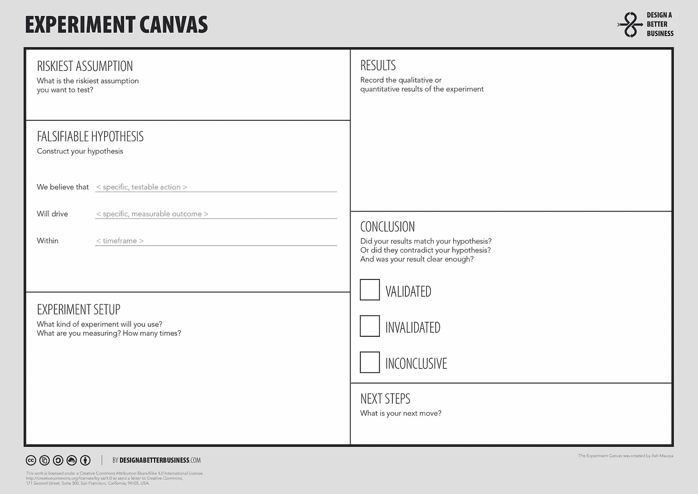

# 如何进行创业想法验证实验

> 原文：<https://medium.com/swlh/how-to-run-experiments-for-idea-validation-1fb71d99ea06>

## 如何在产品或创业的早期阶段进行实验，尽可能多地了解要解决的问题

Photo by [Louis Reed](https://unsplash.com/photos/pwcKF7L4-no?utm_source=unsplash&utm_medium=referral&utm_content=creditCopyText) on [Unsplash](https://unsplash.com/search/photos/laboratory?utm_source=unsplash&utm_medium=referral&utm_content=creditCopyText)

当你对一个产品、创业公司或副业项目有了新想法时，你可能会迫不及待地去尝试开发这个想法，建立一个 MVP，并启动它。但是，你可能知道，这也是非常危险的。你将花费数百个小时来建造人们可能不喜欢或不需要的东西。

明智的做法是走精益创业之路，进行实验来验证你的想法和你在这个过程中所构建的东西，从你的潜在客户和用户那里获取信息，并努力开发他们会喜欢的产品。

实验的类型很大程度上取决于你的想法发展到什么程度，以及你想测试什么。根据你的启动水平,(至少)有三种不同类型的实验可以进行。

1.  第 1-2 级:**验证想法的实验**
2.  第三层次:**问题-解决匹配实验**
3.  第 4-5 级:**产品市场适合度实验**

## 验证想法的实验

在开发新公司或产品的第一阶段，你需要确保你的想法解决了实际问题。

流行的术语称之为“想法验证”，但是你必须小心使用这个术语。“想法验证”打开了确认偏见的大门，因为它意味着你想看看你的想法是否“正确”。以我的经验来看，早期的想法几乎从来都不是。想法开始时是粗糙的、片面的、未开发的，并且基于非常有限的经验(你自己的)。

## 你宁愿是正确的吗？还是成功？

看你最初的想法是否“有效”也没什么意思。更有趣的是，看看你的想法是否与现实世界中人们每天经历的问题有关。如果你能找到这样的问题，并能把你的想法与它联系起来，你的想法可能会变成现实。如果没有，那只是浪费你的时间。

所以，在这个阶段，你应该进入探索模式，而不是以一种真/假的心态看待你尚未开发的想法。它是关于寻找与人们经历的问题相关的新信息。你需要爱上这个问题，并尽你所能了解它。

## 忘记你的解决方案

也许你最初的想法中有一个特定的解决方案来解决这个问题。在这个阶段，暂时忘掉那个解决方案。在这一点上，你打算如何解决问题并不重要。问题*是否存在*很重要。

你也想知道你在看什么样的问题。如果没有一个真正的*需求*让人们使用你的解决方案，如果没有一个*问题*你的想法为他们解决了，那么你就无法克服他们天生的惰性。人们不会采纳你的解决方案。他们会继续像以前一样生活。

*   **烦恼:**人们每天都会遇到的问题，除非付出高昂的代价或努力，否则无法避免或绕过。
*   **收获:**人们可能会经历的需求，但没有它也能生存。逐渐提高他们生活质量的东西。
*   **潜在需求:**人们还不知道自己需要的新的可能性。举个例子:在 90 年代，手机是大多数人的潜在需求。当时，大多数人根本无法想象他们今天不间断地使用手机的所有新用例。人们只是不知道他们还需要它。

在这些类别中，痛苦更容易转化为产品，而潜在需求是最难的。对于潜在的需求，你可能很难找到足够多的人在早期“理解”来验证你的结果。

## 如何进行创意验证实验

因为在这一点上你试图揭示所有种类的定性信息，所以很难进行一个明确的实验来测试一个假设，并根据得到的数据决定该假设是否有效。

你得到的信息很可能是模糊的、定性的，并且很容易被解读。

Use [Ash Maurya](https://medium.com/u/4c221b5f40f3?source=post_page-----1fb71d99ea06--------------------------------)‘s excellent [experiment canvas](https://designabetterbusiness.tools/tools/experiment-canvas) to help define your experiment.

尽管如此，定义[有风险的假设](https://designabetterbusiness.tools/tools/riskiest-assumption-canvas)并用清晰的假设建立[实验](https://designabetterbusiness.tools/tools/experiment-canvas)还是很有意义的。这有助于你集中精力寻找你想要的东西。通过定义你想和多少人交谈，做多少观察，以及你在这些观察中到底在寻找什么，避免确认偏差会容易得多。准备好面对一系列可解释的结果。在这个阶段，答案的多样性是好的。(如果你没有看到大量的回答者，这也不是一个大问题，你需要仔细检查这个阶段之后得出的有意义的数字。当你知道该问他们什么时，最好这样做。)

**创意验证的风险假设示例:**

*   “人们真的有这个问题”
*   “人们每天都在经历这个问题”
*   “人们真的很关心这个问题”
*   “人们希望有一个(更好的)解决方案”
*   “这是一种痛苦，而不是潜在的需求”

**想法验证的假设示例:**

*   “我们可以找到 10 多个经历过这个问题的人，并在 3 天内采访他们。”
*   "超过 70%的 20 岁以上受访者每天都会遇到这个问题."
*   "超过 70%的 20 岁以上受访者表示，这个问题每年要花费他们 100 多美元。"

这一阶段使用的工具主要是一份带问题的好的面试表，其次是诸如[人物角色](https://designabetterbusiness.tools/tools/persona-canvas)和[客户旅程](https://designabetterbusiness.tools/tools/customer-journey-canvas)之类的工具来理解结果。

**创意验证面试问题示例:**

*   去年你遇到过多少次这样的问题？
*   你能告诉我你上一次遇到这个问题是什么时候吗？
*   你感觉如何？
*   因为它发生了什么或者没有发生什么？
*   你有解决办法吗？你能避免这个问题吗？
*   你已经做了什么来防止或避免问题发生？你能描述一下上次发生时你是怎么做的吗？
*   你觉得这个变通办法怎么样？

**在哪里找到您的受访者**

进行实验的一个最重要的方面是在哪里找到你的回答者。这很大程度上取决于你的想法和你想解决的问题。

关键是尽可能找到真正的目标受众——或者你认为你的目标受众是什么样的人。朋友和家人是测试你面试问题的好地方，但是他们不会给你你需要的信息。

想想遇到问题的人聚集的地方(在线和离线)。他们使用的渠道是什么？他们参观的地点是什么？那是你需要去采访他们的地方。

如果你已经有了一个渠道(例如，一个现有的产品，一个被广泛访问的网站，一个合作伙伴渠道)来接触你的目标受众，那就更好了。事实上，对于许多创业想法来说，无法接触到可以采访和进行实验的人是一个真正的缺点。

## 解释结果

当查看不同的定性结果时，将它们分成不同的类别会很有帮助:

*   引用。受访者实际说了什么，以及他们使用的词语和描述的类型。
*   感知问题。受访者如何用他们的观点、看法和假设描述问题和环境。
*   感知需求。受访者认为他们真正需要的是什么(他们试图实现什么？他们的工作是什么？).他们还表达了哪些需求？他们主动提出了什么解决方案？
*   行为。受访者过去与问题相关的实际行为和活动。
*   观察。你作为面试官在面试时观察到了什么。
*   结论。这个结果集合中的什么影响了这个想法(积极的或消极的)
*   下一步。为了获得更多信息，还可以进行哪些实验？你对(部分)解决方案有什么新想法？关于这个问题，你还有什么问题？

## **建立你对问题的心理模型**

一旦你有了解释的结果，试着重建顾客旅程和人物角色。更好的是:与一些受访者一起构建顾客旅程。这些旅程图和人物角色将作为你对问题的心理模型的基础。

## 迭代！

不断重复你的想法验证步骤，直到你不再在答案中得到那么多新的大惊喜——或者直到你得到一个足够大的信号，告诉你你正在做某事。

继续实验！

PS。去过那里，为了验证想法而做的？看看[验证问题解决方案契合度](/swlh/how-to-run-experiments-for-problem-solution-fit-5462e1b123a9)或者[验证产品市场契合度](/@erikvdpluijm/how-to-run-experiments-for-product-market-fit-95d06ee1c5e)。

## 实验食谱

如果您想了解更多关于设计和运行产品市场适合度、想法验证或问题解决方案适合度实验的信息，[请查看在线课程“实验食谱”！](https://shop.wrkshp.tools/experiment-cookbook) 9 个模块，包含 25 个详细的现成实验配方。

## 这篇文章发表在 [The Startup](https://medium.com/swlh) 上，这是 Medium 最大的创业刊物，拥有+436，678 名读者。

## 在这里订阅接收[我们的头条新闻](https://growthsupply.com/the-startup-newsletter/)。

