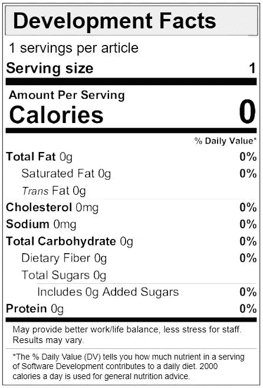

# 如何同时运行功能标记和版本管理

> 原文：<https://medium.com/swlh/how-to-run-feature-flagging-and-release-management-together-d4a0bf650359>

Photo by [Andrew Butler](https://unsplash.com/@drewbutler)

随着软件行业趋向于更小的版本，快速反馈循环可能会产生与直觉相反的行为作为补救措施。一个常见的二分法是生产系统的稳定性与对开发中最新版本的快速反馈的需求。就像毒品一样，客户的验证越快，你就越想推出更多的开发来再次获得成功。

# 尤里卡

> “我寻找，所以我发现”——我

然后某个聪明的人提出了特性标志，它本质上是包装在条件中的一整块代码。作为一个优点，它有助于减少多分支发布/测试的分支和维护。我不喜欢做不好的工作来引导我们，但是 Martin Fowler 已经有了一篇关于这种技术实现的很棒的文章。

特性标志是交钥匙系统的缩影，我坚信这是在迁移到云之前的[架构需求。特性标志也与连续交付(CD)和连续部署(容易混淆，也缩写为 CD)的概念紧密联系在一起。毕竟，将软件即服务应用程序的所有版本汇聚到单一发布流的需求符合 CD 的叙述(老实说，两者都是)。](https://www.linkedin.com/pulse/application-ascension-what-really-means-move-cloud-evan-wee-csm/)

这很有道理。包装表明:

*   降低维护成本
*   更快和持续的反馈
*   较小版本
*   更简单的测试和升级
*   降低总开发成本
*   质量更好

Please read and follow the label

我个人认为工作/生活平衡更好，员工压力更小，但结果可能会有所不同。:)

# 和解

> “但是等等，还有！”—每一个电视广告

但我和一位同事越想越觉得，这个猜想需要一系列先决条件:

1.  首先，识别并自动化生产的所有关口
2.  第二，调查涉众对于发布代码的舒适程度，这是一条不需要人工干预的快乐之路
3.  第三，画出团队(开发、DevOps、Ops、产品和销售)之间在各个阶段的沟通流程
4.  最后，调出所有当前的手动步骤，并计划消除它们

本质上，当将特性标记与发布管理联系在一起时，自动化是我们命运的线索，将这对夫妇缠绕在一起。也许是好是坏。

A slightly thicker thread of fate. Couple not included. (Photo by [Will O](https://unsplash.com/@blnk_kanvas))

由此推论，代码发布和特性发布是分离的。这意味着代码，无论功能是否完整，都将被推向生产。这一事实需要向组织的高管和利益相关者解释清楚，并让他们接受。

# 责任

> “你是父亲！”— [莫里](https://en.wikipedia.org/wiki/Maury_(talk_show))

我不会给出一个 [RACI](/@ggiiaa/when-lack-of-clarity-is-killing-your-teams-effectiveness-raci-for-startups-5e85a5ef9931) 的答案，我会给出部分答案，剩下的就是作业了:

*   代码发布-开发、开发运维的责任
*   功能发布-产品、营销/销售的责任

Yes, I am quite serious about the homework. (Photo by [Pedro da Silva](https://unsplash.com/@pedroplus))

理想情况下，通过特性标记，两种发布类型都是独立的。我们可以并且应该一直推进到生产阶段，以最小化开发和生产代码线之间的任何差距/差异，但有一点需要注意:*如果特性标志总是关闭，那么 DevOps 和 Ops 就可以放心地投入生产，并持续交付和自动发布门控*。

然后，产品可以决定在最终用户/客户方便的时候向他们发布该功能，同样带有以下警告:

1.  标志的启用应该是一个决策点，与相关的组进行协调
2.  需要存在来自开发的声明的到期窗口，到那时，特征标志**必须开启**

警告让我们诚实地保持一致，并解决了功能标志债务随着时间不知不觉地增长的问题。到期窗口尤其重要；尽管到期窗口不会影响代码合并/发布，但是延迟会影响测试以及新特性标志在关键路径中的吸收。根据您的组织规模，这可能是致命的。

# 显示

> “如果说我看得更远，那是因为我站在巨人的肩膀上。”——伊萨克·牛顿

这种方法让人想起 Azure DevOps，它们的黑暗启动和测试版功能的功能切换最终使其进入永久启用状态，这通常会给那些不太喜欢冒险的人带来惊喜。公平地说，微软确实好心地给[提供了一个先睹为快的机会](https://docs.microsoft.com/en-us/azure/devops/release-notes/)，而且他们最近也变得越来越有吸引力。

All this talk about manifestations makes me nervous (Photo by [Mikhail Vasilyev](https://unsplash.com/@miklevasilyev))

对于那些刚开始使用这种方法，但对随时随地持续部署到生产环境犹豫不决的人来说，可以使用已建立并声明的维护窗口的想法来替代，而不管您是否实际使用它们。随着时间的推移，随着信心的增加和代码发布过程的优化，这些窗口可以慢慢地被废弃。