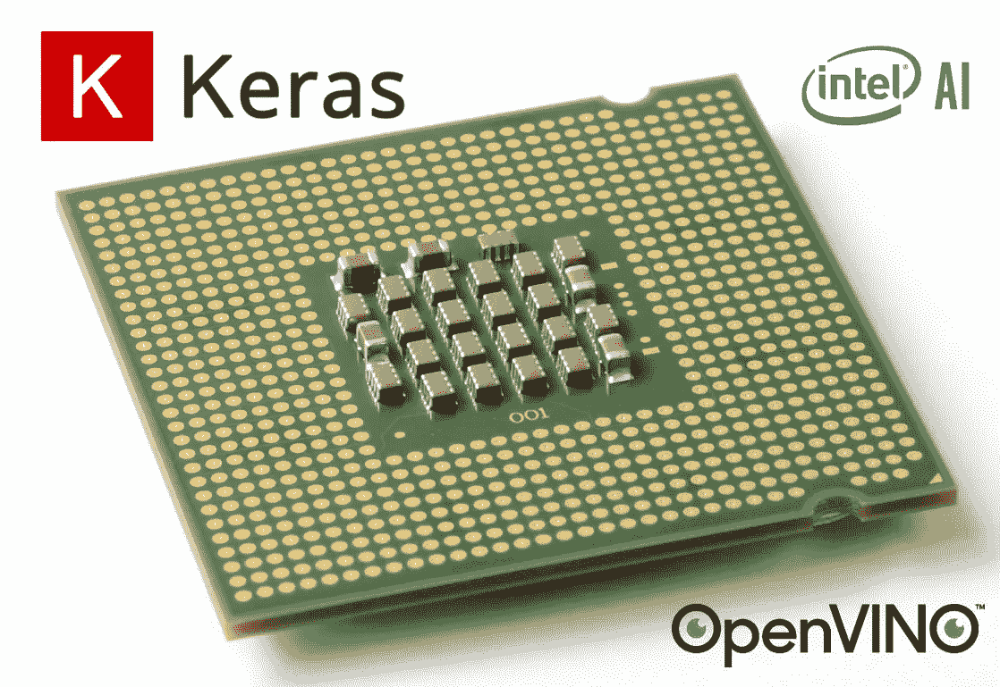
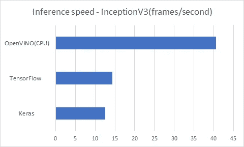

# 如何利用 CPU 和英特尔 OpenVINO 将 Keras 模型推理运行速度提高 x3 倍

> 原文：<https://medium.com/swlh/how-to-run-keras-model-inference-x3-times-faster-with-cpu-and-intel-openvino-85aa10099d27>



在这个快速教程中，您将学习如何设置 OpenVINO，并在不增加任何硬件的情况下使您的 Keras 模型推断速度至少提高 3 倍。

虽然有多种选择可以加速你在边缘设备上的深度学习推理，举几个例子，

1.  添加低端 Nvidia GPU，如 GT1030

*   优点:

> 易于集成，因为它也利用 Nvidia 的 CUDA 和 CuDNN 工具包来加速推理，就像您的开发环境一样，不需要进行重大的模型转换。

*   缺点:

> PCI-E 插槽必须存在于目标设备的主板上，以与图形卡接口，这增加了边缘设备的额外成本和空间。

2.使用面向加速神经网络推理的 ASIC 芯片，如 [Movidius 神经计算棒](https://software.intel.com/en-us/movidius-ncs)、 [Lightspeeur 2801 神经加速器](https://www.gyrfalcontech.ai/solutions/2801s/)。

*   优点:

> 就像 u 盘一样，它们也工作在不同的主机上，无论是采用 Intel/AMD CPU 的台式电脑，还是采用 ARM Cortex-A 的 Raspberry Pi 单板电脑。
> 
> 神经网络计算被卸载到这些 u 盘上，使得主机的 CPU 只需担心更多的通用计算，如图像预处理。
> 
> 随着边缘设备上吞吐量需求的增加，扩展可以像插入更多 USB 棒一样简单。
> 
> 与 CPU/Nvidia GPU 相比，它们通常具有更高的性能功耗比。

*   缺点:

> 由于它们是 ASIC(专用集成电路),预计对某些 TensorFlow 层/操作的支持有限。
> 
> 它们还需要特殊的模型转换来创建特定 ASIC 可理解的指令。

3.嵌入式 SoC 带有 NPU(神经处理单元)，如 Rockchip RK3399Pro。

*   NPU 类似于 ASIC 芯片，需要特殊的指令和模型转换。不同之处在于，它们与 CPU 位于同一个硅芯片中，这使得外形尺寸更小。

前面提到的所有加速选项都需要额外的成本。但是，如果一个边缘设备已经有了英特尔的 CPU，你还不如用英特尔的 OpenVINO toolkit 免费加速它的深度学习推理速度 x3 倍。

# OpenVINO 和设置简介

您可能想知道，如果没有额外的硬件，额外的加速从何而来？

首先，因为 OpenVINO 是英特尔的产品，所以它针对其处理器进行了优化。

OpenVINO 推理引擎可以推理具有不同输入精度支持的 CPU 或英特尔集成 GPU 模型。

CPU 只支持 FP32，而它的 GPU 同时支持 FP16 和 FP32。

CPU 插件利用面向深度神经网络(MKL-DNN)的英特尔数学内核库以及 OpenMP 来并行化计算。

您将在本教程的后面部分看到模型优化，在此过程中，会采取额外的步骤来使模型更加紧凑，以便进行推理。

*   群卷积的合并。
*   用 ReLU 或 eLU 融合卷积。
*   融合卷积+和或卷积+和+ ReLu。
*   移除电源层。

现在，让我们在你的机器上安装 OpenVINO，在[这个页面](https://software.intel.com/en-us/openvino-toolkit/choose-download)上选择你的操作系统，按照说明下载并安装它。

**系统要求**

*   第六至第八代英特尔酷睿
*   英特尔至强 v5 家族
*   英特尔至强 v6 家族

**操作系统**

*   Ubuntu* 16.04.3 长期支持(LTS)，64 位
*   CentOS* 7.4，64 位
*   64 位 Windows* 10

如果您已经安装了 Python 3.5+，则可以安全地忽略安装 Python 3.6+的通知。

安装完成后，运行`C:/Intel/computer_vision_sdk/deployment_tools/model_optimizer/install_prerequisites/install_prerequisites_tf.bat`

或者`~/Intel/computer_vision_sdk/deployment_tools/model_optimizer/install_prerequisites/install_prerequisites_tf.sh`

依赖于您的操作系统来安装 OpenVINO 使用 TensorFlow 所需的任何 Python 包。

# OpenVINO 中的 InceptionV3 模型推理

您可以从 [my GitHub](https://github.com/Tony607/keras_openvino) 下载本教程的完整源代码，它包括一个 all in one Jupyter 笔记本，引导您为 OpenVINO 转换 Keras 模型，进行预测以及对所有三种环境——Keras、TensorFlow 和 open vino——的推理速度进行基准测试。

在调用`jupyter notebook`之前运行`setupvars.bat`来设置环境。

```
C:\Intel\computer_vision_sdk\bin\setupvars.bat
```

或者在 Linux 中添加下面一行到`~/.bashrc`

```
source ~/intel/computer_vision_sdk/bin/setupvars.sh
```

以下是将 Keras 模型转换为 OpenVINO 模型并进行预测的工作流程概述。

1.  将 Keras 模型保存为单个`.h5`文件。
2.  加载`.h5`文件并将图形冻结到一个 TensorFlow `.pb`文件中。
3.  运行 OpenVINO `mo_tf.py`脚本，将`.pb`文件转换为模型 XML 和 bin 文件。
4.  用 OpenVINO 推理引擎加载模型 XML 和 bin 文件，并进行预测。

# 将 Keras 模型保存为单个`.h5`文件

对于本教程，我们将从 Keras 加载一个预训练的 ImageNet 分类 InceptionV3 模型，

# 将图形冻结为单个张量流`.pb`文件

这一步将删除推理不需要的任何层和操作。

# OpenVINO 模型优化

以下代码片段在 Jupyter 笔记本中运行，它根据您的操作系统(Windows 或 Linux)定位`mo_tf.py`脚本，您可以相应地更改`img_height`。`data_type`也可以设置为 FP16，以便在英特尔集成 GPU 上进行推理时获得额外的速度提升，同时降低进动。

运行脚本后，您会发现在目录`./model`、`frozen_model.xml`和`frozen_model.bin`下生成了两个新文件。它们是基于训练好的网络拓扑、权重和偏差值的模型的优化中间表示(IR)。

# 使用 OpenVINO 推理引擎(IE)进行推理

如果您已经正确设置了环境，那么像`C:\Intel\computer_vision_sdk\python\python3.5`或`~/intel/computer_vision_sdk/python/python3.5`这样的路径将存在于`PYTHONPATH`中。这是在运行时加载 Python `openvino`包所必需的。

以下代码片段使用 CPU 运行推理引擎，如果您之前选择使用 FP16 `data_type`，它也可以在英特尔 GPU 上运行。

# 速度基准

基准设置，

*   TensorFlow 版本:1.12.0
*   操作系统:Windows 10，64 位
*   CPU:英特尔酷睿 i7–7700 HQ
*   计算平均结果的推理次数:20。

所有三种环境的基准测试结果— Keras、TensorFlow 和 OpenVINO 如下所示。

```
Keras          average(sec):0.079, fps:12.5
TensorFlow     average(sec):0.069, fps:14.3
OpenVINO(CPU)  average(sec):0.024, fps:40.6
```



结果可能因您正在试验的英特尔处理器而异，但与在 CPU 后端使用 TensorFlow / Keras 运行推理相比，预计会有显著的加速。

# 结论和进一步阅读

在本教程中，您学习了如何使用英特尔处理器和 OpenVINO toolkit 运行模型推理，其速度比股票 TensorFlow 快几倍。虽然 OpenVINO 不仅可以加速 CPU 上的推理，但本教程中介绍的相同工作流可以很容易地适应 Movidius neural compute stick，只需进行一些更改。

OpenVINO 文档可能对您有所帮助。

[安装英特尔 open vino toolkit for Windows * 10 分发版](https://software.intel.com/en-us/articles/OpenVINO-Install-Windows)

[安装英特尔发布的 open vino toolkit for Linux *](https://software.intel.com/en-us/articles/OpenVINO-Install-Linux)

[open vino——高级主题——CPU 插件](https://software.intel.com/en-us/articles/OpenVINO-InferEngine#inpage-nav-8-2-2),在这里您可以了解更多关于各种模型优化技术的信息。

## 从 [my GitHub](https://github.com/Tony607/keras_openvino) 下载本教程的完整源代码。

[在推特上分享](https://twitter.com/intent/tweet?url=https%3A//www.dlology.com/blog/how-to-run-keras-model-inference-x3-times-faster-with-cpu-and-intel-openvino-1/&text=How%20to%20run%20Keras%20model%20inference%20x3%20times%20faster%20with%20CPU%20and%20Intel%20OpenVINO) [在脸书分享](https://www.facebook.com/sharer/sharer.php?u=https://www.dlology.com/blog/how-to-run-keras-model-inference-x3-times-faster-with-cpu-and-intel-openvino-1/)

*原载于*[*www.dlology.com*](https://www.dlology.com/blog/how-to-run-keras-model-inference-x3-times-faster-with-cpu-and-intel-openvino-1/)*。*

[](https://medium.com/swlh)

## 这篇文章发表在 [The Startup](https://medium.com/swlh) 上，这是 Medium 最大的创业刊物，拥有+416，678 名读者。

## 在这里订阅接收[我们的头条新闻](http://growthsupply.com/the-startup-newsletter/)。

[](https://medium.com/swlh)