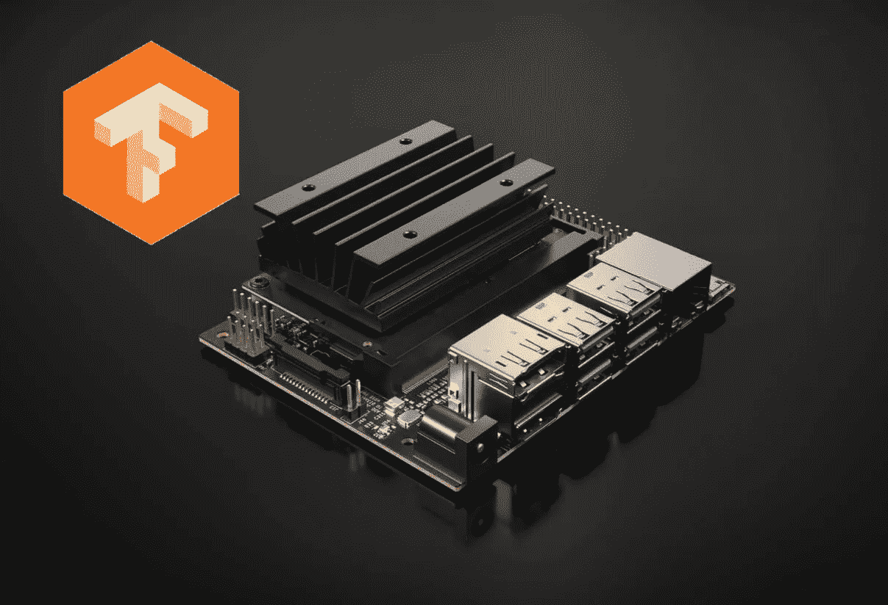
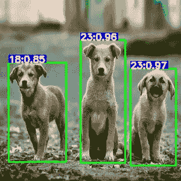

# 如何在 Jetson Nano 上运行 TensorFlow 对象检测模型

> 原文：<https://medium.com/swlh/how-to-run-tensorflow-object-detection-model-on-jetson-nano-8f8c6d4352e8>

之前，您已经学习了如何在 Jetson Nano 上运行 Keras 图像分类模型，这次您将了解如何在其上运行 Tensorflow 对象检测模型。它可以是 [Tensorflow 检测模型动物园](https://github.com/tensorflow/models/blob/master/research/object_detection/g3doc/detection_model_zoo.md)中的预训练模型，用于检测人/车/狗等日常对象，也可以是自定义训练的对象检测模型，用于检测您的自定义对象。

在本教程中，我们将转换在 coco 数据集上训练的 SSD MobileNet V1 模型，用于常见对象检测。

这里有一个分解如何让它发生，略有不同，从以前的图像分类教程。

1.  下载预先训练好的模型检查点，建立 TensorFlow 检测图，然后用 TensorRT 创建推理图。
2.  在 Jetson Nano 上加载传感器推理图并进行预测。

这两个步骤将在两个独立的 Jupyter 笔记本上处理，第一个在开发机器上运行，第二个在 Jetson Nano 上运行。

在继续之前，请确保您已经[设置了](https://www.dlology.com/blog/how-to-run-keras-model-on-jetson-nano/) Jetson Nano 并安装了 Tensorflow。

# 步骤 1:创建 TensorRT 模型

在带有 [Tensorflow nightly builds](https://github.com/tensorflow/tensorrt#installing-tf-trt) 的开发机器上运行这个步骤，默认情况下它包含 TF-TRT，或者你可以在[这个 Colab 笔记本](https://colab.research.google.com/github/Tony607/tf_jetson_nano/blob/master/Step1_Object_detection_Colab_TensorRT.ipynb)的免费 GPU 上运行。

在笔记本中，您将从安装 Tensorflow 对象检测 API 和设置相关路径开始。它的[官方安装文档](https://github.com/tensorflow/models/blob/master/research/object_detection/g3doc/installation.md)对于初学者来说可能看起来令人望而生畏，但是你也可以通过运行一个笔记本电池来完成。

接下来，您将从预先训练的 **ssd_mobilenet_v1_coco** 检查点下载并构建检测图，或者从笔记本提供的列表中选择另一个检查点。

最初，默认 Tensorflow 对象检测模型采用可变批量大小，现在固定为 1，因为 Jetson Nano 是资源受限的设备。在`build_detection_graph`调用中，其他几个变化也适用于 Tensorflow 图，

*   分数阈值设置为 0.3，因此模型将删除置信度分数低于阈值的任何预测结果。
*   IoU(并集上的交集)阈值被设置为 0.5，使得任何检测到的具有相同类别重叠的对象都将被移除。你可以阅读更多关于 IoU(交集超过并集)和非最大抑制[这里](https://www.dlology.com/blog/gentle-guide-on-how-yolo-object-localization-works-with-keras-part-2/)。
*   对冻结对象检测图形应用修改，以提高速度并减少内存消耗。

接下来，我们创建一个 TensorRT 推理图，就像图像分类模型。

一旦你有了 TensorRT 推理图，你可以把它保存为 **pb** 文件，并根据需要从 Colab 或你的本地机器下载到你的 Jetson Nano 中。

# 步骤 2:加载 TensorRT 图并进行预测

在您的 Jetson Nano 上，使用命令`jupyter notebook --ip=0.0.0.0`启动 Jupyter 笔记本，您已经将下载的图形文件保存到了`./model/trt_graph.pb`。下面的代码将加载 TensorRT 图，并为推理做好准备。

现在，我们可以使用图像进行预测，并查看模型是否正确。请注意，我们将图像的大小调整为 300 x 300，但是，您可以尝试其他大小或保持大小不变，因为图形可以处理可变大小的输入。但是请记住，因为与台式机相比，Jetson 的内存非常小，所以它几乎不能拍摄大图像。

如果您以前玩过 Tensorflow 对象检测 API，这些输出应该看起来很熟悉。

这里，结果可能仍然包含具有不同类别标签的重叠预测。例如，同一对象可以在两个重叠的边界框中标记两个类。

我们将使用自定义的非最大值抑制函数来移除具有较低预测分数的重叠边界框。

让我们通过绘制边界框和标签叠加来可视化结果。

下面是创建覆盖图并显示在 Jetson Nano 笔记本上的代码。

在 coco 标签图中，18 级代表一只狗，23 级代表一只熊。坐在那里的两只狗被错误地归类为熊。也许在 coco 数据集中，坐着的熊比站着的狗多。

进行了类似的速度基准测试，Jetson Nano 使用 SSD MobileNet V1 模型和 300 x 300 输入图像实现了 **11.54 FPS** 。

# 结论和进一步阅读

在本教程中，您学习了如何转换 Tensorflow 对象检测模型并在 Jetson Nano 上运行推理。

## 查看更新的 [GitHub repo](https://github.com/Tony607/tf_jetson_nano) 获取源代码。

如果你对结果不满意，还有其他预训练的模型供你看看，我建议你从 SSD MobileNet V2(SSD _ MobileNet _ v2 _ coco)开始，或者如果你喜欢冒险，尝试 **ssd_inception_v2_coco** ，这可能会推动 Jetson Nano 的内存极限。

您可以在 [Tensorflow 检测模型动物园](https://github.com/tensorflow/models/blob/master/research/object_detection/g3doc/detection_model_zoo.md)中找到这些模型，“速度(毫秒)”度量将为您提供关于模型复杂性的指南。

考虑使用免费的数据中心 GPU 训练您的自定义对象检测模型，请查看我以前的教程— [如何免费轻松训练对象检测模型](https://www.dlology.com/blog/how-to-train-an-object-detection-model-easy-for-free/)。

*原载于*[*https://www.dlology.com*](https://www.dlology.com/blog/how-to-run-tensorflow-object-detection-model-on-jetson-nano/)*。*

 [## Tony607/tf_jetson_nano

### 如何在 Jetson Nano 上运行 Keras 模型？通过在…上创建帐户，为 Tony607/tf_jetson_nano 开发做出贡献

github.com](https://github.com/Tony607/tf_jetson_nano) 

## 这篇文章发表在 [The Startup](https://medium.com/swlh) 上，这是 Medium 最大的创业刊物，拥有+445，678 名读者。

## 在这里订阅接收[我们的头条新闻](https://growthsupply.com/the-startup-newsletter/)。

