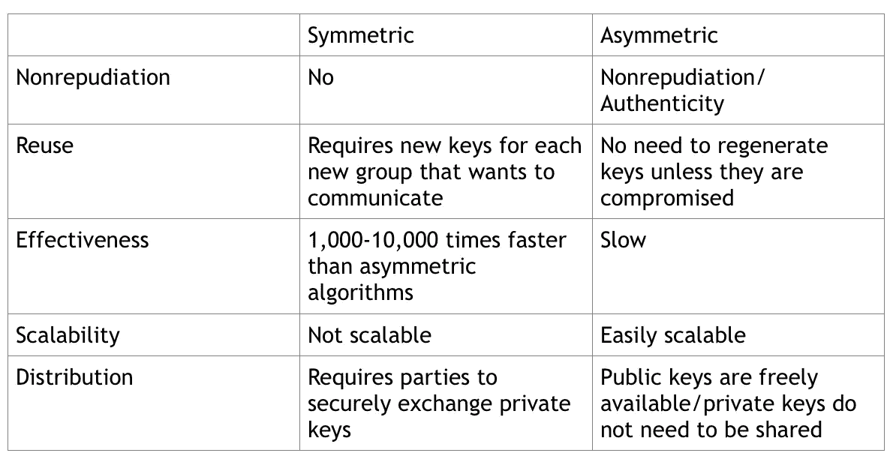

# 如何发送秘密消息

> 原文：<https://medium.com/swlh/how-to-send-secret-messages-1c106250b884>

Photo by [Markus Spiske](https://unsplash.com/@markusspiske?utm_source=medium&utm_medium=referral) on [Unsplash](https://unsplash.com?utm_source=medium&utm_medium=referral)

最基本的，密码学是使用代码和密码来保护信息的科学。加密是对消息进行编码，目的是只让预期的接收者理解消息的含义。这是一个双向功能(您需要能够撤销对消息所做的任何扰乱)。这是为了保护传输中的数据。最早的密码之一涉及简单的移位。例如，如果您只是将字母表中的所有字母移动一些，字母表可能如下所示:

ABCDEFGHIJKLMNOPQRSTUVWXYZ

NOPQRSTUVWXYZABCDEFGHIJKLM

然后，字母表中的每个字母对应一个不同的字母，但如果你还不知道是哪一个，就很难弄清楚了。使用这种密码，信息“你好”翻译成“Uryyb”。

不幸的是，分析的进步，特别是自动化分析和非常强大的计算机使得这些类型的密码非常容易被破解。为了应对这种情况，我们开发了非常强大、复杂的算法。这些加密可以分为两种基本类型—对称算法和非对称算法。对称算法也称为“秘密密钥”算法，非对称算法称为“公开密钥”算法。两者的关键区别在于，对称算法使用相同的密钥进行编码和解码(见下图一)，而非对称算法使用不同的密钥进行加密和解密(见下图二)。

[图 1]使用对称加密，如果 Bob 和 Midge 想要通信，Bob 首先用密钥加密他的消息(加密的消息称为密文)，然后发送给 Midge。Midge 然后用相同的密钥解密该消息，并且能够读取该消息。要发回消息，过程正好相反。这个过程快速、可扩展，并且非常安全。它的问题是，它要求双方已经拥有相同的密钥。如果没有，他们需要通过不安全的通道传递，这实质上消除了加密的安全性。

[图 2]使用非对称加密，如果 Bob 和 Midge 想要通信，Bob 用 Midge 的公钥加密他的消息并发送给她。然后，她用自己的私钥解密该消息以阅读它。要发回消息，过程正好相反。这样，任何人都可以向 Midge 发送消息，因为她可以向任何人提供她的公钥，但只有她可以解密消息(因为她对自己的私钥保密)。它还解决了沿不安全通道传递密钥的需要，因为根本不需要传递秘密。缺点是，它要求每个想要通信的人都有两个不同的密钥(不可伸缩)，并且相对较慢。

一般来说，谈到加密时，最重要的考虑因素是:

*   身份验证/不可否认性——本质上，这只是您是否能够证明消息来自哪里(我能确定是谁发送了这条消息吗？).
*   重复使用—我可以继续使用这个密钥吗？还是每次新的通信都需要重新生成这个密钥？
*   有效性—我传输大量数据的速度有多快？
*   可伸缩性——这对大型团队来说可行吗？
*   分发——如何将密钥分发给与您通信的人，而又不将秘密泄露给其他任何人？

这就是对称加密和非对称加密之间的显著差异，总结如下:

为了两全其美，许多现代加密协议将使用非对称加密来建立连接并创建共享秘密。然后，他们将转向对称加密，以从速度差异中获益。

Source: giphy.com