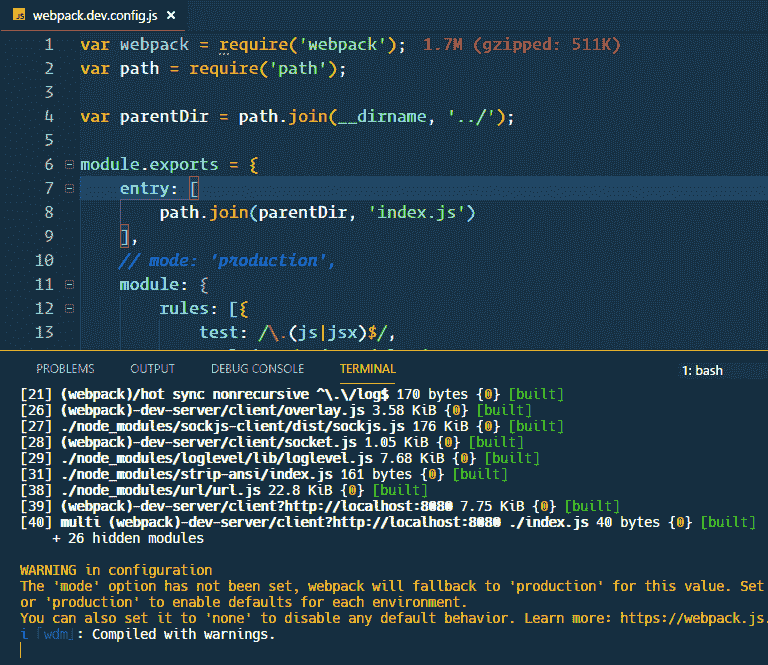
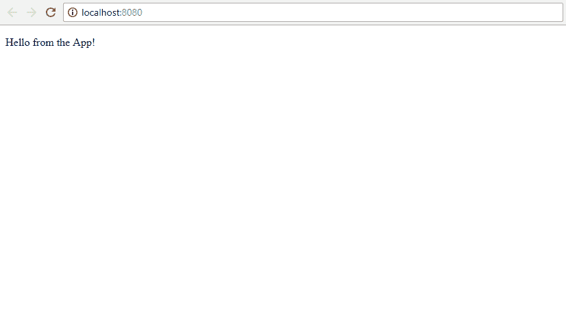

# 如何从头开始建立一个 React 项目

> 原文：<https://medium.com/swlh/how-to-set-up-a-react-project-from-scratch-78261a9c2bbb>


## 特征反应过程

[](https://www.educative.io/collection/5740745361195008/5676830073815040?affiliate_id=5312887308419072) [## 学习反应的道路

### 更新时间:2018 年 10 月🔥] 33.000 多名学生从“React 学习之路”中学习了 React。该课程编织所有的…

www.educative.io](https://www.educative.io/collection/5740745361195008/5676830073815040?affiliate_id=5312887308419072) 

尽管 React 很受欢迎，但一开始设置应用程序是一项艰巨的任务。为了解决这个问题，脸书推出了隐藏复杂功能的`create-react-app`，并向最终用户展示了一个可用的应用程序。今天，花点时间了解一下 easy react 应用程序的复杂性吧！

自己设置可能听起来不太实际，在很多情况下你都不应该这样做。然而，理解里面的东西可能很重要。万一有一天你不喜欢 create-react-app 样板文件，那就创建你自己的样板文件，用它开始每个 react 项目。

**确保您已经安装了:**

1.  NodeJS
2.  npm
3.  末端的
4.  文本编辑器

**从头开始设置 react 库:**

我们将使用 webpack 和 babel 来设置 react，我不希望您感到困惑。

1.  Babel 是下一代 JavaScript **的编译器。**它将较新的 JavaScript (ES6/7/8)编译成较旧的 ES5 标准，以便在新旧浏览器上运行。
2.  Webpack 是一个模块捆绑器。我们将使用多目录和多文件方法来简化项目管理。Webpack 将我们所有的文件捆绑成一个，提供更好的性能和更容易的依赖管理。

设置围绕着这些工具，所以我们将得到详细的配置。

让我们开始，启动强大的终端！

```
mkdir react-from-scratchcd react-from-scratchnpm init -y
```

这会创建一个目录`react-from-scratch`并初始化节点项目，使用-y 标志跳过所有带有默认答案的问题。

现在我们有了保存项目的目录，让我们安装 react

npm 安装反应反应随机

[查看 raw](https://gist.github.com/therj/f3ac87beea665037683ebea1d6d40536/raw/43d78bbd9cd6c70c286fe1007846d78fd3628892/install-react.sh)[install-react . sh](https://gist.github.com/therj/f3ac87beea665037683ebea1d6d40536#file-install-react-sh)托管方式

由 [GitHub](https://github.com/)

这将安装`react`和`react-dom`。

`node_modules`文件夹将存储所有的模块及其依赖关系。

`package.json`保存关于名称、依赖关系和更多脚本的信息。

`package-lock.json`用于依赖性完整性，没有“在我的电脑上运行良好”。

# 什么是`react`和`react-dom`？

`react`是定义视图组件的库，React 组件。

`react-dom`是创建视图的库。`react-dom`相当于 Web DOM。它创建并显示网页。

这种分离允许 React 在多个平台上使用，只需改变渲染库来代替`react-dom`。iOS 和 Android 的 React 原生渲染。ReactVR 是针对 VR 设备的。

# 正在初始化 Webpack 开发服务器

我们现在有了创建和渲染 React 组件的方法。我们还没有将这些组件发送到浏览器来显示它们。这就是 web 服务器的用途。

npm 安装 web pack web pack-dev-server web pack-CLI-save-dev

[查看 raw](https://gist.github.com/therj/f3ac87beea665037683ebea1d6d40536/raw/43d78bbd9cd6c70c286fe1007846d78fd3628892/webpack-dev-server.sh)[web pack-dev-server . sh](https://gist.github.com/therj/f3ac87beea665037683ebea1d6d40536#file-webpack-dev-server-sh)托管与

由 [GitHub](https://github.com/)

`--save-dev`标志将这些保存为开发依赖项。它们不会是部署在服务器上的最终版本的一部分，它们将用于开发过程。需要`webpack-cli`从终端运行项目。

`webpack`必须安装，因为`webpack-dev-server`依赖于它。这个开发服务器将实时重新加载我们的应用程序。

# 创建 React 应用程序

在我命名为`react-from-scratch`的根目录下，创建一个新文件`index.html`。这将是提供给浏览器的主文件。

```
<!DOCTYPE html>
<html lang="en">
<head>
    <meta charset="UTF-8">
    <title>ReactJS Sample Project</title>
</head>
<body>
<div id="root"></div>
<script type="text/javascript" src="bundle.js"></script>
</body>
</html>
```

*   react 组件将放入 id 为`root`的`div`中。
*   脚本`bundle.js`将使用 webpack 创建，它将包含我们所有的 react 代码，包括 react 库和渲染器，格式正确。

用下面的代码创建一个文件`index.js`

```
import React from 'react';
import {render} from 'react-dom';render(
  React.createElement("div", null, "Hello World"),
  document.getElementById("root")
);
```

React 应用程序必须导入 react。`render`使用析构从`react-dom`导入方法。

`render`有两个参数:第一个是组件，第二个是位置。

做出反应。CreateElement 是一个顶级的 React API。它创造了元素，不包括 JSX。

由于它没有 JSX 不是很实用，我们稍后会用`</App>`组件替换它。

```
import React from 'react'
import { render } from 'react-dom'
import App from './containers/App'render(<App />, document.getElementById('root'))
```

`document.getElementById("root")`是我们在`index.html`的位置。

# 设置 Webpack 开发服务器

我们已经安装了 webpack，但是我们还没有使用它。

回到候机厅，

`webpack-dev-server`将在`localhost:8080`编译我们的代码，然后服务器将找不到`./src`。这是因为`webpack`在`./src/`等待`index.js`。您可以将`index.js`移动到`src`或者修改`package.json`文件或者在 webpack 配置文件中设置入口文件。最后一个选项是最首选的，我们将使用相同的不动。

```
mkdir webpackcd webpacktouch webpack.dev.config.js
```

用文件`webpack.dev.config.js`创建一个目录`webpack`。

在`webpack.dev.config.js`中设置入口点

```
var webpack = require('webpack');
var path = require('path');module.exports = {
	entry: [
		path.join(__dirname, '../index.js')
	]
}
```

它使用`webpack`作为依赖项，并将入口点设置为`index.js`

我们需要加载模块，因此将`webpack.dev.config.js`修改为

```
var webpack = require('webpack');
var path = require('path');var parentDir = path.join(__dirname, '../');module.exports = {
    entry: [
        path.join(parentDir, 'index.js')
    ],
    module: {
        rules: [{
            test: /\.(js|jsx)$/,
                exclude: /node_modules/,
                loader: 'babel-loader'
            },{
                test: /\.less$/,
                loaders: ["style-loader", "css-loder", "less-loader"]
            }
        ]
    },
    output: {
        path: parentDir + '/dist',
        filename: 'bundle.js'
    },
    devServer: {
        contentBase: parentDir,
        historyApiFallback: true
    }
}
```

它包含了一系列规则:

**入口点**

`index.js`是所有脚本的起点。

**包装**

*   `babel-loader`用于加载 jsx 文件。
*   `less-loader`用于加载较少的文件
*   `less-loader`要求`less`作为对等依赖。

安装所有依赖项和对等依赖项:

`npm install --save-dev style-loader css-loader less-loader less`

**输出**

捆绑文件命名为`bundle.js`，包含在`dist`目录下。

**开发服务器**

当前目录被用作基本目录。

# 建立巴别塔

我们需要 babel 将 ES6 代码转换成 ES5。

安装 babel 和支持库

`npm install --save-dev babel-cli babel-core babel-loader babel-plugin-transform-object-rest-spread babel-preset-es2015 babel-preset-react babel-preset-stage-0 babel-register`

配置 react 应用程序以利用`package.json`中的 babel。

```
"babel": {
  "presets": ["es2015", "react", "stage-0"],
  "plugins": ["transform-object-rest-spread"]
}
```

它还使用一个插件来支持 rest/spread 操作符。

对`index.js`进行更改，使用`App`组件代替手动创建元素。

这是我们的新`index.js`

```
import React from 'react'
import { render } from 'react-dom'
import App from './containers/App'render(<App />, document.getElementById('root'))
```

创建`./containers/App.js`文件来服务应用程序

```
mkdir containerscd containerstouch App.js
```

现在用一些基本的 React 代码填充`App.js`

```
import React, {Component} from 'react';class App extends Component {
    render () {
        return <p>Hello from the App!</p>
    }
}
export default App
```

我们想要创建一个脚本来为我们运行 react 应用程序。

```
"scripts": {
  "test": "echo \"Error: no test specified\" && exit 1",
  "dev": "./node_modules/.bin/webpack-dev-server --config ./webpack/webpack.dev.config.js"
}
```

`npm run dev`将使用来自`./webpack/webpack.dev.config.js`的配置文件从节点模块运行 webpack-dev-server。

这是我得到的

`npm run dev`



如果收到警告，请在 webpack 配置文件中添加一个模式来移除它。

检查上面的注释代码`mode: 'production',`。其他模式有`'develpment'`和`'none'`。

默认端口是 8080。



根据您的选择调整配置，享受您的设置。

# 特色 React JS 课程

## [React 16 —完整指南(包括 React 路由器 4 & Redux)](http://thebestdevlist.link/react-the-complete-16-guide-incl-redux)

4.7/5 星 **||** 33.5 小时视频**| |**61597 名学生

学习反应或深入研究。学习理论，解决作业，在演示项目中实践，并构建一个在整个课程中不断改进的大型应用程序:汉堡生成器！ [**了解更多。**](http://thebestdevlist.link/react-the-complete-16-guide-incl-redux)

[](http://thebestdevlist.link/react-the-complete-16-guide-incl-redux) [## React 16 —完整指南(包括 React Router 4 和 Redux)

### 投身其中，从头开始学习 React！了解 Reactjs、Redux、React Routing、动画、Next.js 基础知识以及更多内容！

thebestdevlist.link](http://thebestdevlist.link/react-the-complete-16-guide-incl-redux) 

## 结束语:

如果这篇文章有帮助，请点击拍手👏按钮下面几下，以示支持！⬇⬇

[](https://medium.com/swlh)

## 这篇文章发表在 [The Startup](https://medium.com/swlh) 上，这是 Medium 最大的创业刊物，拥有+405，714 名读者。

## 订阅接收[我们的头条新闻在这里](http://growthsupply.com/the-startup-newsletter/)。

[](https://medium.com/swlh)