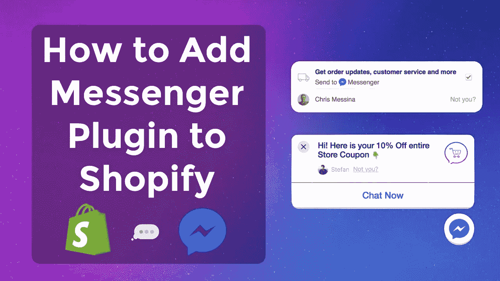
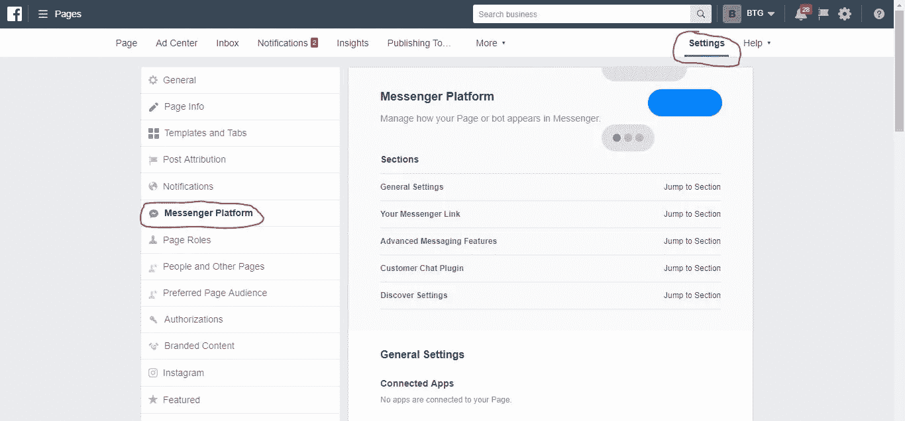
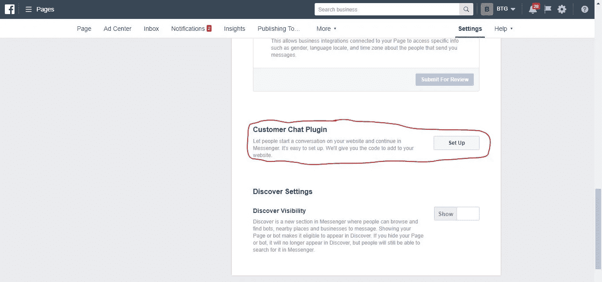
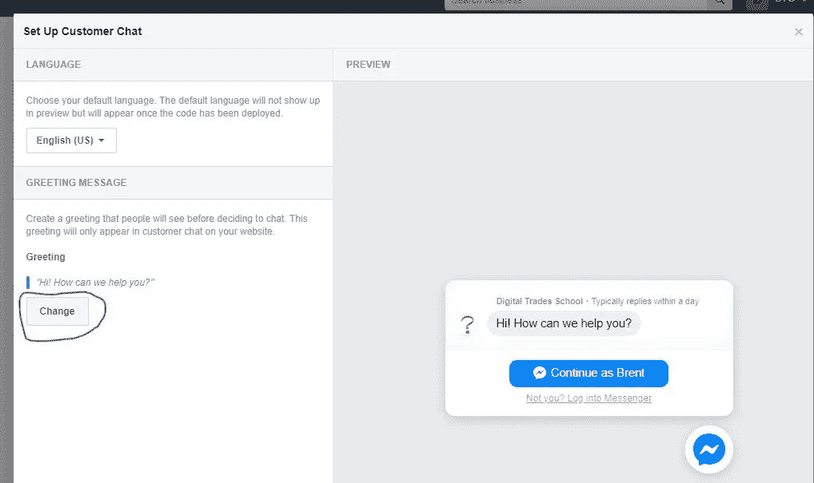
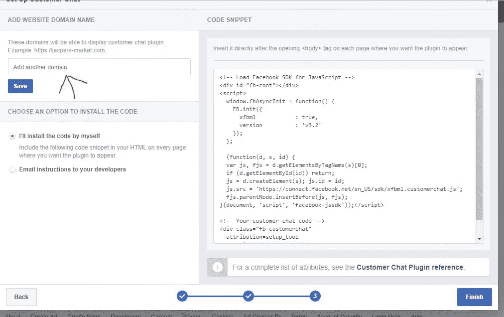
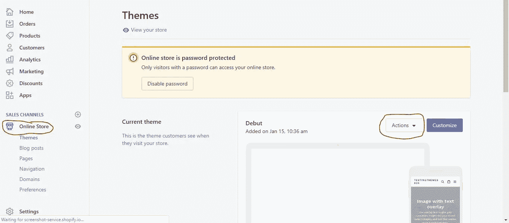
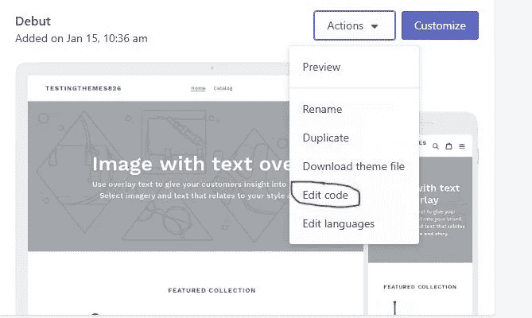
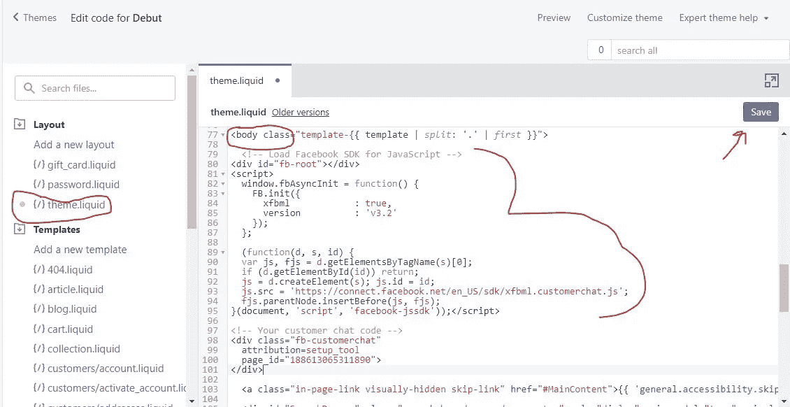
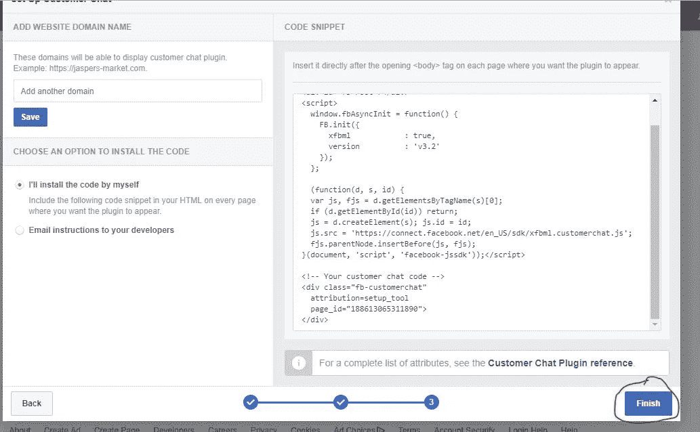

# 如何在您的 Shopify 商店设置 Facebook Messenger 聊天

> 原文：<https://medium.com/swlh/how-to-set-up-facebook-messenger-chat-on-your-shopify-store-a13e40186a75>

如果你一直关注我的博客文章，你会知道我总是强调在你的商店上有一个实时聊天功能，原因有很多。我被问到的一个常见问题是，我可以在我的商店上使用我的脸书信使聊天吗？答案是…是的，你绝对可以，而且是 100%免费的。在 Shopify 后端，你可以选择建立一个 Facebook Messenger 销售渠道，这很好，但不是很好。我不认为这个选项很好的原因是访问者的用户体验不是最好的，因为当你点击它时，它会把你带离网站。例如，请参考下面的视频:

幸运的是，这个问题有一个解决方案，你需要做的是将 Facebook Messenger 插件安装到你的商店(从你的脸书页面)。一旦聊天插件被放到你的商店上，你的访问者将能够打开网站上的聊天，并且不用被重定向就可以使用它。让访问者留在你的网站上非常重要，每当你的商店里有一个应用程序把访问者从你的页面上带走，你就大大增加了用户分心而无法完成购买的风险。此外，让用户在使用聊天功能时留在你的网站上，可以让他们在等待你的回复时继续浏览和购物。

# 要在您的商店上安装 Facebook Messenger 插件，请遵循以下简单步骤。

1.  转到您的商店脸书页面(您必须是该页面的管理员或所有者)。
2.  进入你的设置，点击“信使平台”。

3.向下滚动到底部，在“客户聊天插件”下点击设置。

4.通过设置向导，你可以改变问候信息和小工具的颜色。

5.当你完成设置后，你会看到这个页面，确保将你的网站添加到域名列表中，然后获取代码并复制它。

6.一旦你有代码复制到你的 Shopify 后端，进入在线商店，然后点击主题，然后点击操作按钮，并在下拉列表中选择编辑代码。找到 theme.liquid 模板，将刚刚复制的代码粘贴到标签的正下方，然后单击 save。

7.一旦你这样做了，回到你的脸书页面，点击完成，就这样。您的 Shopify 主题上不会安装脸书聊天应用程序，它将直接在页面上运行，不会带您去任何地方。

我希望这份文件有所帮助，如果任何人有任何麻烦或关于设置这个问题，请让我知道，请留下评论或给我发电子邮件到 brent@onlygrowth.com

如果你想看我做设置的视频，你可以在这里看视频:

For more tutorial videos visit my youtube channel [https://www.youtube.com/channel/UC-FFxTVUwEpqN2842c-tm0w](https://www.youtube.com/channel/UC-FFxTVUwEpqN2842c-tm0w)

## 这篇文章发表在 [The Startup](https://medium.com/swlh) 上，这是 Medium 最大的创业刊物，拥有+439，678 读者。

## 在这里订阅接收[我们的头条新闻](https://growthsupply.com/the-startup-newsletter/)。

