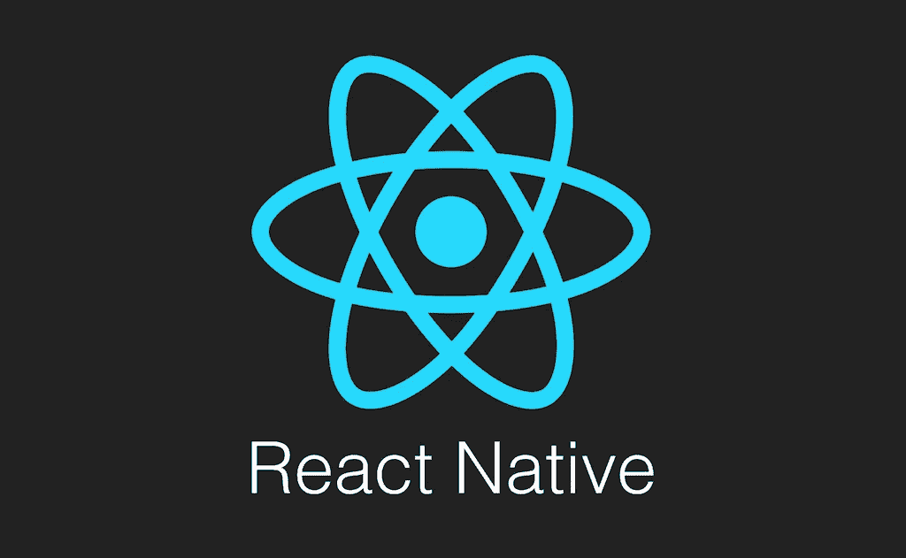
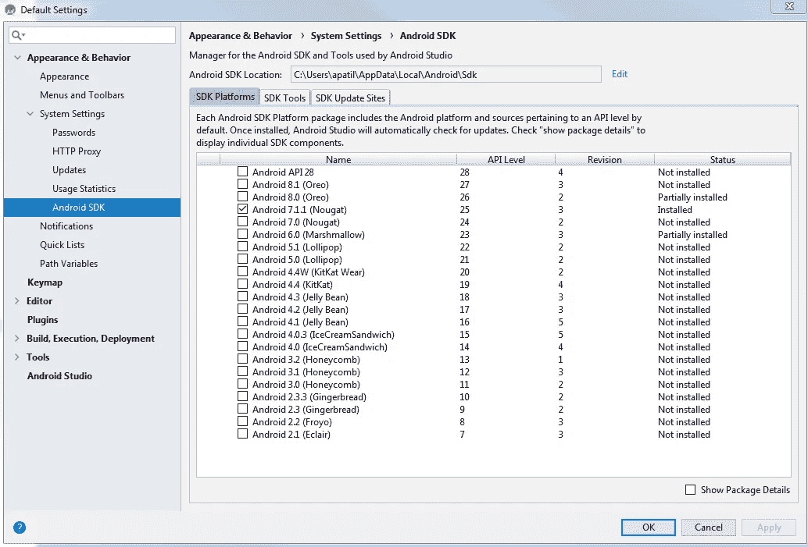
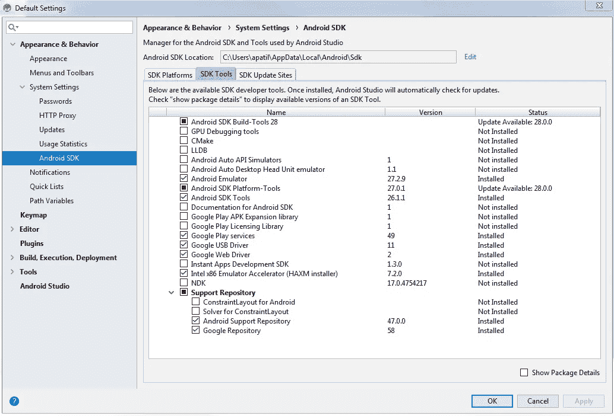
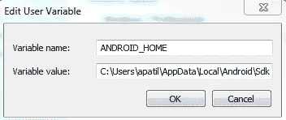
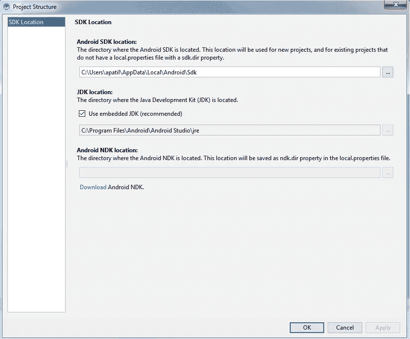
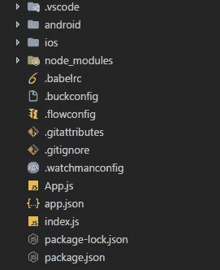
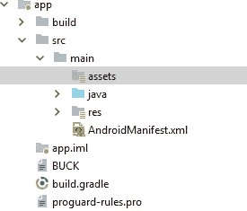
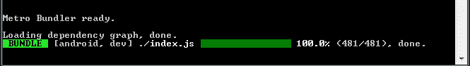
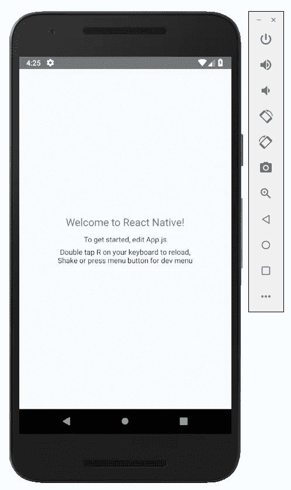

# 如何在 Windows 上使用 React Native 设置开发环境？

> 原文：<https://medium.com/swlh/how-to-setup-your-development-environment-using-react-native-on-windows-768a14ff8aec>

React Native 是一个 JavaScript 框架，用于开发 iOS 和 Android 的跨平台移动应用程序。它基于 React，**脸书的**流行 JavaScript 库，用于构建面向移动平台的用户界面。

由于我对开发跨平台移动应用程序非常兴奋，我决定探索并使用 React Native 来开发 Android 应用程序。然而，仅仅为了建立我的开发环境，我就遇到了很多挑战。在 Windows 上设置 React Native 是一项挑战，需要关注许多移动部分，即使你想在模拟器上启动并运行一个基本的应用程序。

在这篇文章中，我将讨论如何使用 **React Native framework** 和 **Android Studio** 在 Windows 上设置您的开发环境来构建 Android 应用程序。

我将使用以下工具来设置我的开发环境:

*   Windows 操作系统
*   节点程序包管理器(NPM)
*   Node.js(版本 8 或更新版本)
*   React 本机命令行界面(React 本机 CLI)
*   Java 开发工具包(JDK 8 或更新版本)
*   安卓工作室
*   Android Studio 中的内置仿真器
*   Visual Studio 代码



## 步骤 1:安装 Visual Studio 代码

从 https://code.visualstudio.com/[下载并安装最新版本的 Visual Studio 代码](https://code.visualstudio.com/)

## 步骤 2:安装 Android Studio

*   从 https://developer.android.com/studio/[下载并安装最新版本的 Android Studio for Windows】](https://developer.android.com/studio/)
*   Android Studio 默认安装最新的 Android SDK。React Native 需要 Android 6.0(棉花糖)SDK 或更高版本。我决定用安卓 7.1.1(牛轧糖)。请随意使用最新的 SDK。



Figure 1: Android SDK Location

*   确保您安装了以下 SDK 工具:



Figure 2: Android SDK Tools

**重要提示:**您需要英特尔 x86 模拟器加速器(HAXM 安装程序)才能在 Windows 上运行模拟器。如需了解更多信息，请参考以下链接:[https://github . com/Intel/haxm/wiki/Installation-Instructions-on-Windows](https://github.com/intel/haxm/wiki/Installation-Instructions-on-Windows)

**注意:**您需要通过更改 BIOS 设置来启用英特尔虚拟化技术。请查看以下链接，了解如何做到这一点:

[](https://stackoverflow.com/questions/21635504/error-during-installing-haxm-vt-x-not-working) [## 安装 HAXM 时出错，VT-X 不工作

### 本网站使用 cookies 来提供我们的服务，并向您显示相关的广告和工作列表。通过使用我们的网站，您…

stackoverflow.com](https://stackoverflow.com/questions/21635504/error-during-installing-haxm-vt-x-not-working) 

*   配置 ANDROID_HOME 环境变量。打开 Windows 控制面板中**系统和安全**下的系统窗格，然后点击**更改设置。**打开**高级**选项卡，点击**环境变量。**点击 **New** 创建一个新的 ANDROID_HOME 用户变量，指向您的 Android SDK 的路径:



Figure 3: PATH variable for Android

*   最后，将 Android 调试桥(ADB)添加到 PATH 环境变量中。这将有助于您了解连接了哪些设备，或者哪些模拟器当前正在运行。ADB 的安装位置:*C:\ Users \ apatil \ AppData \ Local \ Android \ Sdk \ platform-tools \ ADB . exe*

## 步骤 3:安装节点

*   从 https://nodejs.org/en/[下载并安装最新版本的 Node.js。**注意:** Npm 随 Node.js 一起安装。](https://nodejs.org/en/)

**注意:**确保将 NPM 添加到 PATH 环境变量中。

*   安装 npm 后，通过在 Visual Studio 代码中从 Windows 提示符命令行或集成终端运行以下命令来安装 React Native CLI。**注:**综合端子可以在**视图→综合端子**下找到

```
npm install -g react-native-cli
```

## 步骤 4:使用嵌入式 JDK

Android Studio 自带嵌入式 JDK，推荐使用。确保在 Android Studio 中的**文件→其他设置→默认项目结构**下选中以下选项:



Figure 4: Embedded JDK Location

## 步骤 5:创建新的 React 本机应用程序

最后，让我们通过在您的工作区位置运行以下命令来创建我们的第一个 React 本地应用程序

```
react-native init SampleReactNativeProject
```

当您在 Visual Studio 代码中打开项目时，这会创建以下项目目录结构。



Figure 5: React Native initial directory structure

## 步骤 6:为 Android 构建

*   在我们继续运行应用程序之前，在 android Studio 中打开我们项目中的“Android”目录，并在 app/src/main 下创建一个“assets”目录。



Figure 6: Adding “assets” directory in Android project directory structure

*   为了简化构建和安装过程，在 package.json 中，在“脚本”下添加以下脚本:

```
"android-windows": "react-native bundle --platform android --dev false --entry-file index.js --bundle-output android/app/src/main/assets/index.android.bundle --assets-dest android/app/src/main/res && react-native run-android"
```

*   现在运行以下命令来安装应用程序，并查看它在模拟器上的运行情况。这将运行我们在 package.json 中设置的脚本。

```
npm run android-windows
```

这将在新的命令提示符实例中启动 Metro Bundler 实例，并在模拟器上安装应用程序，如下所示:



Figure 7: Metro Bundler Window



Figure 8: Android Emulator

**注意:**如果仍然遇到以下错误，**“Java . lang . unsupportedclassversion Error:com/Android/build/grad le/app plugin:Unsupported major . minor version 52.0”，**确保您已经按照上面第 4 步所示检查了嵌入式 JDK。

*这篇文章还登上了* [*让我们反应过来*](http://newsletter.letsreact.io/issues/44?m=web#6qSaqiQ)*一个反应过来的土人快讯*。**

*如果你喜欢读这篇文章，请留下你的评论或点击下面的拍手图标以示感谢。如果你想让其他人从这篇文章中受益并帮助传播，请在你最喜欢的社交媒体平台上分享。谢谢你的时间。*

# *关于我*

*Amrut 是一名全栈软件工程师，他对技术、网络和移动应用充满热情。他喜欢写关于编码、投资、交易、金融和经济的文章。业余时间，阿姆鲁特喜欢了解上市公司的商业模式，并分析它们的财务报表。他坚信通过高质量的工作为人们的生活增加价值，并赋予人们掌控个人财务的权力。他也喜欢观看和讨论美式足球。*

*[](https://medium.com/swlh)*

## *这篇文章发表在 [The Startup](https://medium.com/swlh) 上，这是 Medium 最大的创业刊物，拥有+423，678 名读者。*

## *在此订阅接收[我们的头条新闻](https://growthsupply.com/the-startup-newsletter/)。*

*[](https://medium.com/swlh)*