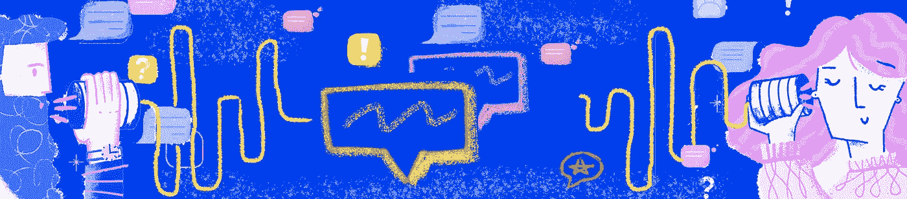

# 一份更具可操作性的 UX 研究报告——为设计提供信息并建立共鸣

> 原文：<https://medium.com/swlh/how-to-share-ux-research-ensure-it-informs-design-decisions-and-builds-empathy-32fd052ee90b>

Images adapted from the work of [Agnieszka](https://dribbble.com/Nezkafe)

作为一名 UX 的顾问，我被雇佣来领导各种项目，从像素完美的验证设计，到构思研讨会，再到各种类型的用户研究(蓝天← →当前的痛点)。用户研究项目是最令人兴奋的，对团队来说是最有活力的，也是最难阐明过程的。我已经决定把我的“前 5 条经验”放在一起…