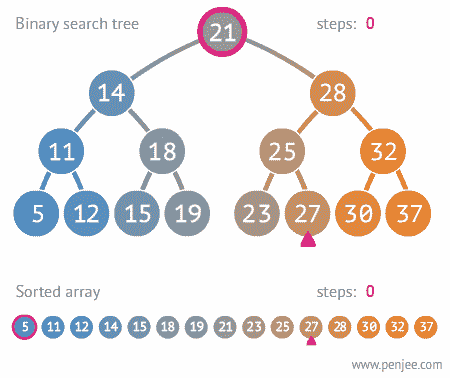

# 如何解决一道 JS 二叉查找树题

> 原文：<https://medium.com/swlh/how-to-solve-a-js-binary-search-tree-problem-585673fc3287>

## 当你不知道什么是二分搜索法树的时候

[Binary Search Tree Example](https://upload.wikimedia.org/wikipedia/commons/9/9b/Binary_search_tree_example.gif)

本周，我试用了 Pramp，与其他软件工程面试者一起练习技术编码面试。如果你对 Pramp 不熟悉，你可以和某人配对，轮流做采访者和被采访者。我和一个好心的家伙配对，他用二进制代码提示我…