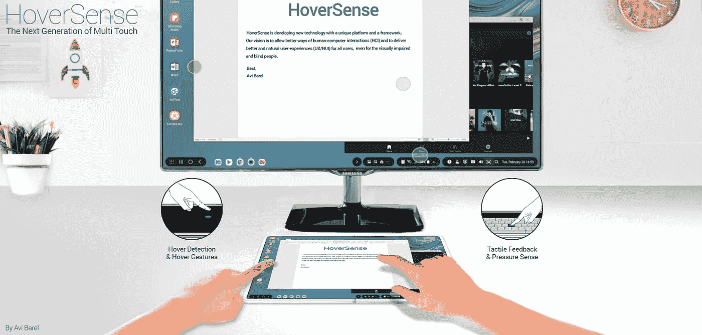
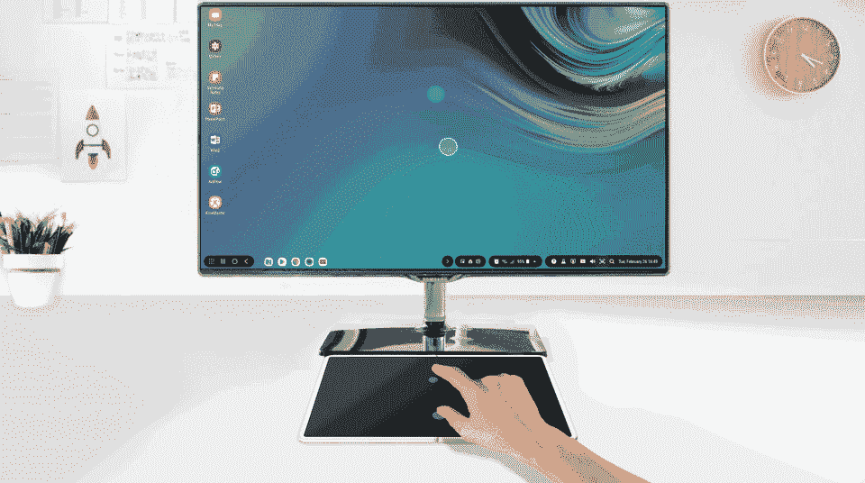
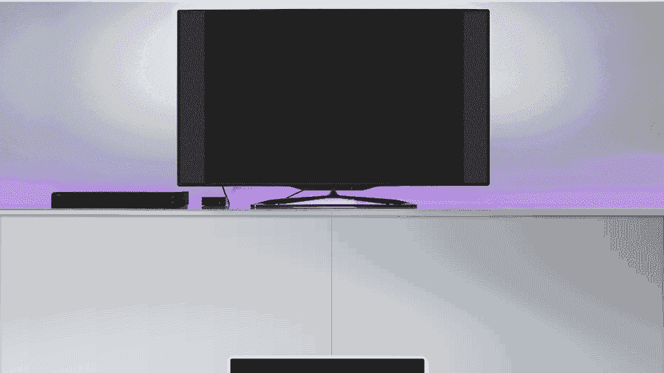
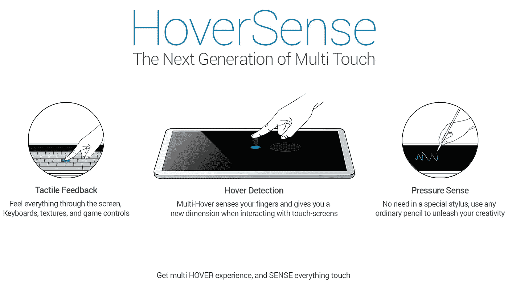

# 如何解决可折叠的问题

> 原文：<https://medium.com/swlh/how-to-solve-the-issues-with-foldables-b9f0afc6d724>

## HoverSense 希望解决可折叠设备的问题

A new touch technology for Foldables and Dual-screen devices.

当我购买第一代 iPad 时，我就有了改进触摸屏技术的想法。事实上，我在 2014 年初开始开发最初的概念，作为一个兼职项目，就在我离开思科之后，加入微软之前。最初的目标是帮助视障人士甚至盲人以更好的方式使用触摸设备。但后来，在收到我的一些朋友、同行和同事的反馈后，我意识到我在这里有了更独特的东西，当我们最终开始看到可折叠设备时，这些东西可以派上用场，可以改变我们所有人使用触摸屏的方式，也可以帮助视力障碍者(正如我一开始想做的那样)。所以我决定把这个想法束之高阁，并申请专利，以便在时机成熟时开发它(我们稍后会谈到这一点)。

**快进到 2018 年:**最近几年这么多文章(包括[我自己的](/adventures-in-consumer-technology/smartphones-will-replace-pcs-soon-541b5c8a4f48))谈论移动世界的停滞，最近甚至谈论可折叠和双屏设备的所有问题，这让我很困扰……所以我决定做点什么！毕竟，如果我有一个可以解决问题的想法，为什么要在我的文章中抱怨，就像 UXers 应该做的那样。在我的 UX 职业生涯中，我对解决问题的方法产生了热情，尤其是当我看到可用性问题的时候。特别是当涉及到操作系统、移动和尖端技术[如 VR/AR/MR](/adventures-in-consumer-technology/design-and-develop-for-ar-mr-ed752e8b74ba) 等的 HCI & [UX 时。](https://uxplanet.org/apple-its-time-to-merge-ios-with-macos-4f04c947c19d)

如果你读过我的文章和帖子(在[媒体](/@4Barel/apple-its-time-to-merge-ios-with-macos-4f04c947c19d)、[推特](https://twitter.com/4Barel)、 [LinkedIn](https://www.linkedin.com/in/abarel/) 和[脸书](https://www.facebook.com/startux.net))，那么你可能已经注意到我对人机交互非常有热情。我认为，即使我们用 AR/MR(空间计算)取代我们目前的工作环境，而不需要外设，甚至通过脑机接口控制一切(如埃隆·马斯克的 [Neuralink](https://www.neuralink.com/) )即使如此，我相信我们仍将使用触摸屏、全息图，甚至语音命令，因为它们将相互补充，不会相互取代，至少在不久的将来是这样。

A NextGen touchscreen with Hover-sensitivity, Tactile-feedback, and Pressure-sensitivity.

# 为什么触摸屏对生产力如此不利？

今天，我们的移动设备如此强大，以至于它们可以[取代我们的电脑](https://uxplanet.org/creative-people-ux-ui-fed-the-future-is-now-6095a7a1440c)，但具有讽刺意味的是，我们无法以富有成效的方式使用它们，因为[就像 50 年前](http://www.computinghistory.org.uk/det/613/the-history-of-the-computer-mouse/)一样，我们仍然需要鼠标和键盘来进行专业和创造性的工作。更不用说，就技术而言，50 年是一个永恒！相比之下，我们的智能手机比 1970 年美国宇航局阿波罗 17 号的所有计算机加起来还要强大数百万倍！

## 那么为什么我们不能使用触摸设备来完成一些严肃的工作呢？

1.**触觉反馈问题**:我们目前的触摸屏没有真正的触觉反馈，包括可折叠和双屏设备。在整个人类历史中，我们用双手控制一切，创造万物。但不幸的是，十多年来触摸屏没有任何变化。它们保持平坦，没有其他维度，当你在虚拟键盘上打字时，没有真正的触觉反馈，所以你无法感觉到你用手指触摸的按键、按钮、纹理和 UI 元素。

2.**悬停检测问题**:即使你连接了 HDMI 线缆，或者将你的设备屏幕投射到外部显示器上，你也无法高效地使用它。外部显示器上没有手指悬停指示器，所以你仍然需要看着设备的屏幕才能与之交互。因此，实在没有必要使用外部显示器(用于游戏、演示、文档编辑、视频图片镜像等)。)如果你不看的话。

3.**触摸和压力问题**:目前的触摸屏无法检测你用手指按压的力度，这很遗憾，因为就像悬停检测和触觉反馈一样，压力感可以为创意人员甚至游戏行业开辟新的交互方式。

甚至当谈到一些雄心勃勃的设备和概念时，当你看着它们时，你可以感觉到缺少了一些东西，例如:许多人抱怨双屏电脑，因为他们知道在触摸屏上很难打字。然而，他们一直在开发和销售这些类型的产品，这里有几个例子:

*   **联想的** [**瑜伽书**](https://www.theverge.com/2018/10/25/18019840/lenovo-yoga-book-c930-review-e-ink-tablet-laptop-windows) :试着在上面[打字，不要看](https://www.reddit.com/r/yogabook/comments/5xwe58/does_anybody_do_a_lot_of_typing_on_their_yoga_book/)按键。我试了一下，直接回到我的 MacBook Pro！。
*   **英特尔的** [**毫无新意的概念**](https://www.theverge.com/2018/10/18/17993690/intel-computer-concept-copper-harbor-tiger-rapids-dual-screen-pc-prototype?fbclid=IwAR1dtpO8yFngjL06vjby1NgSwB6QtTGg25380XkjcNjv9kaqRq8_PpfEIbk) :就像瑜伽书一样。我看不出它为什么比普通的笔记本电脑好…
*   **微软的** [**双屏视觉**](https://www.theverge.com/2019/3/4/18249679/microsoft-windows-lite-dual-screen-devices-chromebooks-report?fbclid=IwAR0aPgVUjFqPXwUn19YqlaI8oDSJNQL9i5I5PfMcCoL-bVZRlTJ20_BULH4) **:** 和英特尔、联想一样的问题。这个可折叠的概念来自 2009 年。
*   **谷歌的** [**诡异的 chrome book**](https://www.google.com/chromebook/device/google-pixel-slate/)**:**嗯，连 [MKBHD 都失望了](https://youtu.be/Ja_GMU7-sjs)！是笔记本电脑还是平板电脑？！
*   **苹果的**[**Touch-bar**](https://9to5mac.com/2018/10/19/touch-bar-a-gimmick/)**:**一个我从来不用的噱头，[而且我不是一个人](https://youtu.be/ssomTi96Pc4)！看不出它比真正的功能按钮好多少…
*   **三星的** [**DeX 模式**](https://www.theverge.com/2018/8/13/17675072/galaxy-note-smartphone-software-feature-history-computer) **:** 差不多了，但是我还需要[携带 DeX 带键盘带鼠标](https://youtu.be/7ICP6aI7EK8)。

HoverSense: A NextGen touchscreen for better productivity without peripherals.

# 我们如何解决所有这些问题？

与此同时，我们的平板电脑和手机可以取代我们的电脑，这完全取决于触觉！就像我几年前在文章《T21》中说的那样。就我个人而言，我使用我的 iPad Pro 来完成一些严肃的工作，甚至是我的 Galaxy Note 9。我并不孤单，越来越多的专业人士正从个人电脑转向移动设备，如 iPad Pro。就像亨妮·塔比尼斯一样:

What’s a computer?

现在，想象一下，你可以使用移动设备提高工作效率和创造力，就像使用电脑一样。如果有一种更好的方法来实现这一点，而不需要外围设备(鼠标和键盘、键盘盒、遥控器、手写笔等)会怎么样？)?

## 好吧，实际上有一个更好的方法:见见 HoverSense！

Get multi **HOVER** experience, and **SENSE** everything you touch and see on the screen!

# HoverSense 是什么，背后有什么故事？

当我在 2014 年初开始我的研究时，我咨询了我的一些朋友、同行和同事(根据 NDA 的合同)，因为他们是以色列“创业国家”中的知名人物，他们的反馈对我很重要。
我发现自己是一个才华横溢的本地知名公司的 CTO。在完成商业计划和一些概念之后，就在我们会见一些天使投资人、风险投资人和加速器经理之前，我们认为时机不对，主要是因为对我来说，未来显然是可折叠/灵活的(如果你还记得[三星的](https://youtu.be/HU2nG9qy6vs)和[诺基亚的](https://youtu.be/qEs8HQIa9Nc)概念)。然后，在 2015 年，我收到了一些诱人的工作机会，所以我离开了 HoverSense，决定搁置这个概念。

几个月后，我发现自己成了微软在以色列 R&D 中心的一个网络部门的 UX 主管。尽管我负责 5 个以上的跨平台产品，但我决定参与其他孵化项目，指导和帮助 UX 的其他团队，并探索机会，以及与公司内的相关高管建立网络，以便衡量在为这样一个惊人和资源丰富的公司工作时，开展这种项目(HS)有多有趣。

微软鼓励员工参加黑客马拉松、创新和孵化项目，我也是！我参加是因为创新是我真正热爱的。参与和帮助一些内部孵化和黑客马拉松项目是有趣和鼓舞人心的，因为那时我有机会和我在微软的一个朋友一起领导一个名为 OneAlbum 的个人(获奖)项目[。](http://www.avi-b.com/portfolio/onealbum-one-place-for-all-of-your-photos/)

至于 HoverSense，我甚至咨询了以色列 R&D 中心的首席执行官 Yoram Yaacovi，他非常友好地表示愿意提供帮助，尽管他要求我不要透露这个想法的细节(除非我决定在微软内部开发)。但我最终决定在公司外部进行这项工作，并将 HoverSense 从愿景变为现实，而不是让它只属于一个组织，因为我相信这种技术应该成为行业标准，可供所有科技公司(及其用户)使用。

# 今后

为了给未来的 VR 和 AR/MR(甚至 XR)眼镜/镜片带来更好的沉浸式体验，这些领域需要手势/悬停检测和触觉反馈。现在谈论它还为时过早，这并不容易，但是的，V2 也为未来做好了准备！
至于现在，我真的不能在这里得到所有的细节，所以你可能想检查一下[网站](https://www.startux.net/hoversense/)。

现在，无论你是否同意 HoverSense 的方法，我相信思考和讨论触摸界面的未来是很重要的。所以欢迎你和我分享你的想法和反馈，也请和你的朋友分享 hover sense:[https://startux.net/hoversense](http://www.startux.net/hoversense/)

## 这篇文章发表在 [The Startup](https://medium.com/swlh) 上，这是 Medium 最大的创业刊物，拥有+438，678 名读者。

## 在这里订阅接收[我们的头条新闻](https://growthsupply.com/the-startup-newsletter/)。

