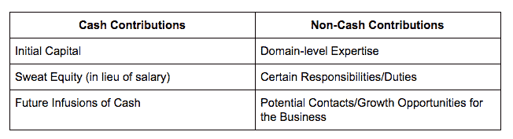
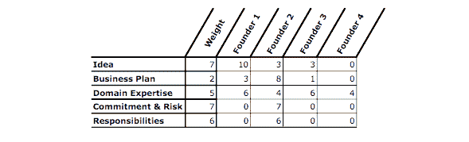
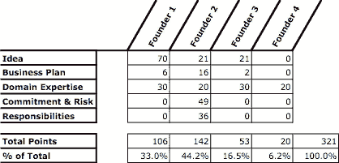

# 如何公平分割联合创始人股权

> 原文：<https://medium.com/swlh/how-to-split-co-founder-equity-fairly-5dbb416df63e>

遵循这个公式，就每位创始人的价值、贡献和承诺水平进行公平对话。

Credit: Getty Images

让我们平分股权吧。

*这样很“公平”，我们是平等的伙伴。*

*你说呢？*

哈佛商学院教授诺姆·乏色曼发现，近 40%的创业团队花了一天或不到一天的时间就股权达成一致，他在 15 年的时间里研究了 6000 多家创业公司的高风险决策。其中，绝大多数人平分了他们的股权。

> “快速、均匀的拆分表明，创始人不具备进行艰难对话的商业成熟度”
> 
> —诺亚·乏色曼

根据乏色曼的研究，无论是因为回避、过于乐观还是缺乏知识，默认分割股权的创始人团队在团队内部也有三倍的不快乐。

这就引出了为什么？

归根结底是公平问题。

随着时间的推移，不同的工作风格、个性和关于贡献的问题出现了。一个创始人可能投入更多的时间，或者另一个可能投入更多的资本，这导致围绕股权分割的问题出现。

这还公平吗？

如果我每周工作 60 小时，但我的联合创始人只工作 40 小时，我应该得到更多。

*我更投入。我应该是为公司做最后决定的人。*

对于创始人来说，股权分割也有助于决定决策权。

平均分配意味着创始人需要达成共识。如果股权分割的公平性出现问题，创始人无法解决这些问题，僵局和无法前进会对公司产生负面影响。怨恨增加，挫败感增加，团队变得功能失调。

这就是为什么你如何在早期决定股权会对联合创始人的动力和公司产生持久的影响。

在进行股权分配对话时，将这些问题考虑在内，增加初创公司的成功机会。

# 谁有经营企业的经验？

在分配股权时，应该更多地考虑创始人在创建公司过程中的任何商业经验。

创建一家初创公司是一项艰巨的工作，任何先前的融资经验、与投资者的关系、创建 MVP 或扩大产品规模都是无价的资产，可以增加初创公司的成功机会。

对于大多数第一次创业的人来说，这是很难说服的。其他非商业或非技术创业者会认为这是不公平的，而创意者，如果不是之前有商业经验的人，会认为这个创意更有价值。

> “……‘点子人’坚持认为点子是 90%的价值(和 90%的权益)。在现实世界中，“想法”是整个等式中非常小的一部分。创业的关键在于“执行”——也就是说，股权应该根据每个合伙人带来的价值来分配
> 
> —马丁·双立人

这个想法只是等式的一部分；能够在上面执行要重要得多。

以 Myspace 和脸书为例。这两个相似的社交网站各自以不同的方式执行他们的想法。脸书在这方面做得更好，建立了一系列功能，保持其在社交媒体领域的主导地位，而 Myspace 却没有，并逐渐变得默默无闻。

出于这个原因，确保初创企业拥有成长所需的资源和资本，并执行这个想法，最终是企业创始人应该获得更多股权的原因。

请记住，如果创业失败是因为业务没有增长和执行，50%的零是零。

# 每个人带来了什么价值？

Credit: Getty Images

在你进行股权分配对话的过程中，价值问题会反复出现。

每个人都带来了什么？

*每个人将如何为创业公司的成功做出贡献？*

*什么技能比别人更有价值？*

无论对话如何进行，这些问题都有助于确定每位创始人给初创公司带来了哪些现金和非现金贡献。

根据创始人团队的不同，这些贡献的权重也不同。

> 为任何初始资本出资发行可转换债券或一系列种子优先股，像对待种子投资者一样对待它。

这些贡献的价值将决定你需要从每个创始人那里得到多少承诺。

# 大家的承诺是什么？

每个人都是为了长远打算吗？

*我们是全职工作还是兼职工作？*

*如果我们的承诺水平增加、减少或我们中的一人离开，我们的权益会发生什么变化？*

刚开始的时候热情会很高。每个人都会被激起工作的欲望。然而，随着时间的推移，这种情况会发生变化。资金没有进来。MVP 需要更长的时间来建立。资源开始枯竭。

以下面的例子为例:

一位创始人拿走了汗水股权，而不是薪水。他没有稳定的收入来源，大约一年半后，这家初创公司仍然没有带来任何稳定的收入。创始人越来越气馁。种子融资有希望，但他认为风险太高，可能是他离开的时候了。他想保留他的股权。你会怎么做？

这种情况很常见，这就是为什么对承诺要坦诚(并且要清楚当有人离开时会发生什么)。

> **专业建议:**无论你决定如何分配，[确保创始人的股份在一段时间内归属](https://www.entrepreneur.com/article/231044)(通常为四年)，并在合伙协议中包括明确的指导方针，规定如果创始人退出、被迫退出或自愿离开，他们的股份会发生什么变化。

把更大的份额给一个只有一半承诺、一两年后就会离开、或者风险水平较低的创始人是没有意义的。

 [## 如何与你的商业伙伴达成完美的合作协议

### 你刚刚构思了一个十亿美元的创业点子；您已经为自己定义了完美的价值主张…

fi.co](https://fi.co/insight/how-to-create-the-perfect-cofounder-agreement-with-your-business-partner) 

弄清楚每个创始人的承诺水平，确保他们的股权随着时间的推移而归属，以及每个人将如何兑现他们的承诺。

# 有公式可循吗？

简单的回答是肯定的。

被称为[创始人的馅饼计算器](http://www.andrew.cmu.edu/user/fd0n/35%20Founders%27%20Pie%20Calculator.htm)，这是一种由弗兰克·德姆勒(Frank Demmler)创造的量化股权分割决策过程中各种因素的方法。

这个公式将所有关于商业敏锐度、价值和承诺的考虑纳入五个不同的类别，创始人必须适应他们的情况。

这导致每个人都有一个关于他们如何评价每个人的谈判。通过一开始就进行这种类型的对话，每个人都有机会“测试”创始人的关系，看看最后你们是否都能同样满意。

方正派计算器中的五个不同元素是:

1.  想法
2.  商业知识
3.  领域专业知识
4.  承诺和风险
5.  责任

德姆勒还警告说，根据创业公司所处的行业，每个元素可能有不同的权重(从 1 到 10)。

例如，如果公司是基于新技术的，创意部分可以被给予更多的权重，或者如果初创公司需要相当大的资本来启动创意，则商业部分可以被给予更多的权重。

下面的图表创建了进行这些对话的结构。

为了说明这一点，德姆勒举了一个高科技创业公司的例子，这家公司来自一个大学项目，有四个创始人团队:

1.  有独创性想法的发明家
2.  拥有行业知识的商业人士为初创企业打开大门
3.  技术专家是发明者的得力助手。
4.  贡献不多但恰好在正确的时间出现的研究员

如下图所示，**团队合作并决定想法的权重**为 7，商业计划为 2，领域专长为 5，承诺&风险为 7，责任为 6。创始人还必须从 1 到 10 说明每个元素如何适用于他们。

然后，将每个元素的权重乘以创始人的排名，相加得出创始人的股权比例。例如，创始人 1 的创意排名为 10，这意味着他对此的贡献最大。我们用 7 的重量乘以 10 得到 70 分。我们重复这个过程，如下所示:

在这种情况下，创始人 1 将拥有公司的 33%，创始人 2 将拥有 44.2%，创始人 3 将拥有 16.5%，创始人 4 将拥有 6.2%。

与大多数创始人团队决定的传统平均分配方式不同。这个过程需要时间，可能会不舒服，但会给创始人团队安全感，他们的股权分割是公平的。。

然而，虽然该工具是创建股权对话结构的一个很好的资源指南，但它可能会让一些人感觉被贬低了。在本例中，创始人 4 获得的股权最少，可能不会让股权分配对话愉快。

# 那么，如何确保每个人都对最终结果感到满意呢？

公平还意味着每个人都应该重视公平对话。

说实话，你和创始人团队在一起的时间甚至比你的配偶还多，所以确保每个人对最终结果都满意是额外的兴趣。

> “联合创始人团队很像婚姻，但没有性。”
> 
> —迈克·尼科尔斯

这种关系你会希望从每个人都感到被重视的地方开始。很多关于股权的讨论都归结为对企业的“控制”。

*每个人都有平等的发言权吗？*

*我们之间将如何做出决定？*

你会得到实现你的想法所需的资源吗？

作为股权重组对话的调解人，我所做的一部分工作是，最终达成解决方案的许多努力都归结于每个人都觉得自己受到了同等的重视(即使股权再分配并不平等)。

除了公平之外，还有不止一种方法可以让人感到被重视。

 [## 创业股权和授权:如何补偿没钱的团队成员

### 创业融资非常棘手，尤其是在补偿联合创始人和员工的时候，因为大多数…

fi.co](https://fi.co/insight/startup-equity-vesting-how-to-compensate-team-members-without-money) 

让每个人都有同等的贡献能力，确保你做出的最终公平决策让每个人都感觉到他们所带来的价值。即使这意味着你必须放弃一两个百分点才能让所有人都去那里。

# 你还有什么推荐的吗？

进行真正的股权对话可能很难。

它有可能引发许多艰难和困难的情绪，特别是当你依赖每个人来讨论他们的潜力，他们觉得自己值多少钱，并将其与实际的股权份额相匹配时。因此，在这个过程中要慢慢来。

我建议创始人在进行股权对话之前，先完成这张工作表，即[向潜在的联合创始人](https://docs.google.com/document/d/127yCfW6UREs6uD04jhtkcxvkfs3wy0cxN2UTwyKbRpI/edit?usp=sharing)提问的 20 个问题，看看大家是否真正达成一致。

最后，您需要考虑的其他事项包括:

*   董事会成员和顾问的权益
*   如果增加一名联合创始人，会发生什么
*   创建一份包括优先购买权的合伙协议，当创始人离开时，创始人可以回购股权。

当你测试潜在的共同创始人关系时，记住不是每个人都是合适的，即使他们在纸上看起来很好。一起做一个小项目，亲自感受一下他们，或者等到你完成某件事之后再分配股权。对齐是关键。

# 我是谁&你为什么要听我的？

我是一名调解人，专门解决股权联合创始人纠纷。

我拥有独一无二的特权，在风险很高的时候为创始人之间的交易牵线搭桥，在所有人都觉得没有进展的时候重组他们的股权。我发现，没有两次对话是完全一样的，这真的取决于创始人是否愿意一起前进。出于这个原因，我使用一种混合的、合作的调解形式，让创始人能够做出公平合理的决定。

要了解更多关于我个人调解风格的信息，请查看我的文章:

 [## 联合创始人之间的纠纷会扼杀创业——在它扼杀你的创业之前，尝试调解

### 几周前，我和一位连续创业的创始人聊过，他告诉了我他对扼杀创业的原因的看法

medium.com](/@bryantgalindo/co-founder-disputes-kill-startups-try-mediation-before-it-kills-yours-9a6aa2a8a5b) 

# **有一个关于联合创始人的争议，你需要一些帮助吗？**

## 查看我的网站，了解更多关于我的服务以及我如何能够提供帮助。

 [## CollabsHQ

### 基于合作的策略我将促进、教授或咨询各种问题，以帮助您学习技能…

www.collabshq.com](https://www.collabshq.com/) 

如果你喜欢这篇文章，提供一些👏🏾👏🏾👏🏾它激励我写更多。

## 这篇文章发表在[《创业](https://medium.com/swlh)》上，这是 Medium 最大的创业刊物，有+416，678 人关注。

## 在这里订阅接收[我们的头条新闻](http://growthsupply.com/the-startup-newsletter/)。

