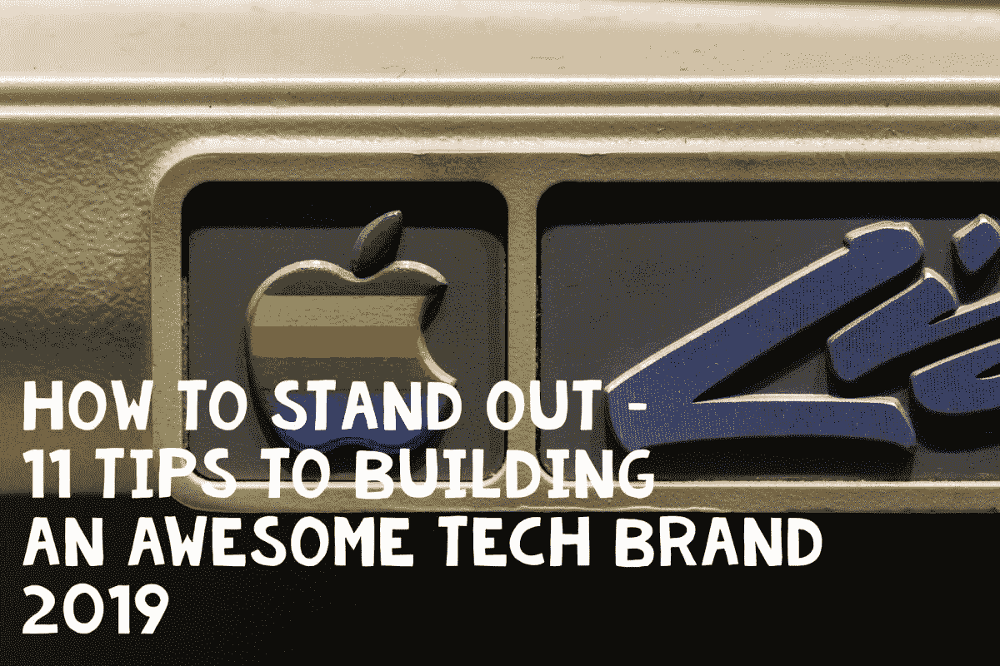
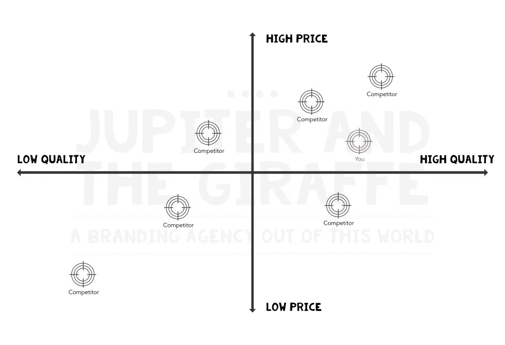
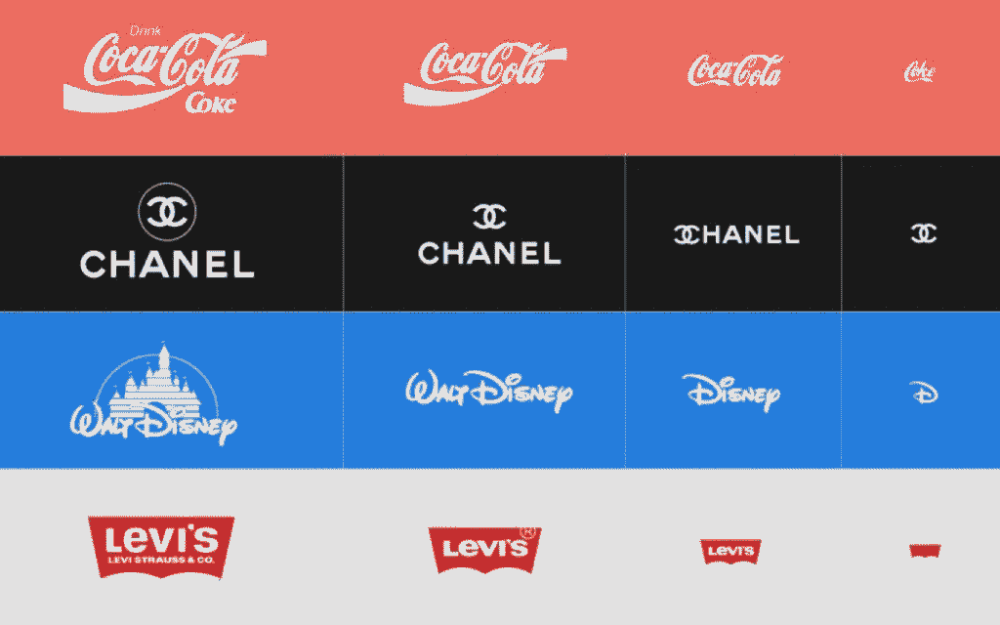
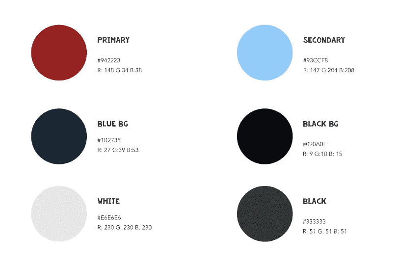

# 如何脱颖而出——打造卓越科技品牌的 11 个技巧 2019 |木星和长颈鹿|博客

> 原文：<https://medium.com/swlh/how-to-stand-out-11-tips-to-building-an-awesome-tech-brand-2019-jupiter-and-the-giraffe-blog-bb31e92c6ad6>



Photo by Jason Leung

我们将讨论如何开始建立一个在科技行业中脱颖而出的优秀品牌。让我们从解决一些关于品牌实际上是什么的常见误解开始。

# 基础工作

# 理解什么是“品牌”

“品牌”一词来源于农民给他们的牛打上标识或商标，这样他们就能被认为是自己的了。由此，你可能会推断出你的标志或商标就是你的品牌的同义词，但现在情况并非如此。“品牌”这个词已经演变成一种远比它更无形的东西。你的品牌就是伟大的马蒂·纽梅尔所说的“一个人对产品、服务或组织的直觉”。这可以解释为你的客户与你的服务之间的任何接触点，向他们传达一种想法、感觉或承诺。这包括你的商标，也包括你的客户服务，你接电话的方式，你网站的设计，甚至你在市场中的定位！在你的客户与你接触的任何时候，都是传达你是谁和你代表什么的一致和相关形象的机会。同样的，你的品牌应该很容易被识别，但是正如你将学到的，可识别性是许多属性的总和。如果你有兴趣了解更多，我们在关于什么是品牌战略的博客中会谈到这一点。

因此，考虑到这一点，你如何开始建立你的品牌？在《木星与长颈鹿》中，我们遵循一个经过反复试验的过程，让我们能够理解你独特的主张，即使你还不太清楚那是什么。

# 配置

如果你在和每个人说话，那么很不幸，你没有和任何人说话。了解你在市场中的位置不仅能让你加深对你的品牌的理解，而且也有很好的商业意义，因为你是解决特定问题的唯一人选。如果他们认为你是行业领导者，那么你将成为解决特定问题的企业。您可以采用多种定位策略。

## 定位策略的类型

## 特点/优势

您可能希望根据您的特点或优势来定位自己。如果你是一种服务，它可能是你提供的服务。虽然这应该在你的品牌定位中发挥作用，但我们不建议这样做，因为你提供全新产品的可能性相对较低。

## 价格

价格是你细分自己的另一种方式。高价格通常代表高质量，注意我说的“代表”——仅仅因为你提供高价格的产品并不一定等同于高质量。有例子表明这种策略是有效的，但这是一个冒险的游戏。不仅仅是你的产品应该交付，围绕它的所有东西都应该保证最高的价格。高价格带来高期望。

## 质量

与价格类似，基于质量来定位自己会产生某些联想，但这并不一定意味着高质量、高价格。随着技术变得更快和更便宜，组织能够以低价格提供高质量的服务。

你可能想做的一个练习是在图表上标出你的竞争对手，以及他们在价格/质量谱上的位置。图表可能看起来像这样…



如果你刚开始你的旅程，这是一个很好的起点，但在某些情况下，这可能需要重新定位。通过市场发展或有意转移到一个新的市场，组织已经有了非常成功的重新定位的例子。对于任何寻求引领市场的企业来说，重新定位应该永远是一个考虑因素。这需要倾听并意识到变化和发展，并拥有积极主动而非被动反应的心态。

我们将在另一篇文章中深入讨论重新定位，敬请关注…

通过你的产品了解你的市场定位是你产品的一小部分。在 Jupiter and the Giraffe，我们大力提倡 Onliness 声明(再次由 Marty Neumeier 提出)。唯一性陈述让你不仅思考你在做什么，还思考你为什么做这件事。我们写了一篇关于[什么是声明](https://blog.jupiterandthegiraffe.com/onlinessstatementgenerator-com-and-what-all-the-fuss-is-about/)的博文，所以我们不会重复，但本质上看起来是这样的；

```
[Company Name] is THE ONLY (category)
THAT (differentiation characteristic)
FOR (customer)
IN (market geography)
WHO (need state)
DURING (underling trend)
```

对于上下文，哈雷戴维森如下…

```
Harley Davidson The ONLY motorcycle manufacturer THAT makes big, loud motorcycles FOR macho guys (and macho "wannabees") mostly IN the United States WHO wants to join a gang of cowboys DURING an era of decreasing personal freedom
```

你必须填补空白，但正如你所看到的，有几个领域越来越深入你的领域。这代表了你对客户的承诺。随着每个接触点的发展，你的品牌应该活在这个承诺中，并在我们真正创造你的品牌资产时发挥关键作用。这是了解你在市场中的位置的一个很好的练习。密切关注“潜在趋势”。这有助于你明确你的目标。在 Jupiter and the Giraffe，我们对 Onliness 声明进行了修改，我们认为这使我们能够促进一个有趣的练习，以开发本质上是您的定位声明。

做完所有这些，你应该对你是谁以及你为什么要做这些有一个清晰的认识。接下来，你必须开始考虑你的客户，因为毕竟，没有你的客户，你的企业将会失败。

# 开发用户角色

你需要考虑你的顾客的原因归结为可联系性。你需要理解你的用户，这样你才能以他们能够理解的方式与他们交流，在解决他们可能遇到的任何问题时，使用他们可能期望的相同语气。有了用户角色，你就有了一个人(尽管是假装的)来解决你和你的同事之间围绕一个决定、设计选择或你的品牌特征可能出现的所有冲突。通过问 X 想要什么来解决冲突，而不是问我们想要什么。我们这样做的方式是开发用户角色。如果你以前从未听说过用户角色，那么很简单，它是一个虚构的人，代表你可能有的客户或想要的客户。人物角色可以基于你的真实客户(如果你有客户的话)，或者一个人物角色可以包含不同客户的许多属性。这里可以概括，但结果应该是具体的，代表一个用户。

如果你发现你没有瞄准正确的客户(重塑品牌的另一个原因)，那么我们认为根据你想要服务的客户来创建一个人是有用的。如果你还没有客户群，你甚至可以进行实际的市场研究来生成这些用户角色。当用户角色来源于真实数据时，它们是最有效的。

你可以搜索很多关于如何生成用户角色的文章，所以我们不会在这里深入讨论，但是这些角色最重要的方面应该是他们遇到的问题或痛点。这是确保你为顾客服务的关键。

你创建的用户角色的数量不应该超过四个。除此之外，你开始失去清晰度和重点，你的品牌将最终吸引不了任何人。当然，您的用户角色应该包含一个名称。用一张你觉得最好的人的照片，把这个人浓缩在你的脑海里，这样你就可以把这个人带进生活。然后，你可以查看客户的人口统计数据——年龄、性别、来自哪里、收入多少、以什么为生。如果你在网站上安装了谷歌分析，你甚至可以在上面找到这些数据！

你应该记下他们的原型，例如“凌乱的创意”或“整洁的音乐家”。如果你正在努力变得有创造力，那么一定要看看[最常见的原型](https://www.learning-mind.com/12-archetypes/)。然后你可以观察他们的性格。这有助于我们假设他们在不同的情况下会有什么样的反应。尽可能深入你认为必要的深度。

# 品牌资产/身份

综上所述，这只是发展你的品牌的基础。重要的是要知道你是谁，你为什么与众不同，你为谁服务，你为什么为他们服务。理解你的承诺和你持有的价值观本质上是你的品牌，只要确保你无论如何都坚持这个想法。我们现在要谈谈我们认为每个新企业应该具备的条件。这些被称为“品牌资产”，通常被混淆为品牌。你的品牌形象是你企业的脸面，应该强化你在前面步骤中确定的价值观和情感。

# 标志；徽标

毫无疑问，你需要一个标志。对我们来说，一个好的标志不仅仅代表你所做的事情。你的标志应该是你为什么做你所做的事情的一种表现。例如，有一个名为“Cloud9”的云计算业务，你的徽标是九朵云，这可能看起来很棒(不会的，九朵云太多了)，但这表明你的徽标没有经过太多的思考，错过了与正确的受众联系并创建有深度的徽标的机会。在一张纸上，开始记下当你考虑你的生意时想到的单词。试着想想你的价值观和代表这些价值观的词语。思考你所做的事情是可以的，但目标是保持抽象。从这些单词中，分出更多的单词，这样我们就越来越抽象了。开始可能会很棘手，但坚持下去，你隐藏的创造力就会开始流动。最终，一些有趣的事情可能会出现。如果你开始没有主意了，把你的客户带进来。他们对你的标志有什么期望？你的竞争对手在做什么？没有必要重新发明轮子，所以看看你的竞争对手，使用有用的东西也可以是一个有用的开始。

保持你的标志简单是很重要的，因为简单的标志更容易记住。令人费解的商标更难记住，这使得人们在第二次看到它时不太可能认出它。



Creating variations can also help optimise your logo for different platforms

# 名字

名字？！是的名字！同样，您的名字是客户的接触点。为什么不把我们从讨论你的业务、你的客户和你的价值观中学到的东西拿来，想出一个反映这些的名字呢？当你发现名字背后的故事时，当你发现有比看上去更多的东西时，这总是令人着迷的。

# 颜色

色彩唤起情感，所以利用色彩心理学。每个大洲都不尽相同，所以要注意你的市场，使用代表你价值观的颜色，并确保它们在正确的地区代表正确的东西。至少有两种颜色。一个主要的，你几乎可以在任何地方使用，另一个辅助的。使用像 Adobe Colou 这样的工具来帮助你。记下十六进制值、RGB 和 Pantone(如果可能)。确保这些是你在创作时唯一使用的颜色，没有什么比看到 15 种不同深浅的蓝色更糟糕的了。木星和长颈鹿的调色板



Jupiter and the Giraffe’s Colour Palette

# 排印

排版也很重要，为了最大的灵活性，你至少要有两个排版家族或变体。第一种字体通常用于标题，可能会出现在徽标中(看看 Jupiter 和 Giraffes 的“KG Summertime Storm”字体)，另一种主要字体用于一般正文。你会想要一些容易辨认的东西。有一些例子，字体看起来很漂亮，但无法阅读！不要犯同样的错误。问别人是否能读懂你的字体。广义上来说，字体可以唤起意义。你可能会认为衬线字体(字母末端有小细节的字体)很正式。合法企业或银行可能会选择使用这种字体。无衬线字体(没有“细节”)更现代。如果你正处于打造自己品牌的阶段，选择你喜欢的字体，或者从谷歌字体等网站上查看一些推荐的字体组合。大型组织经常设计他们自己的字体，很明显，这对于大多数刚起步的企业来说是遥不可及的，因为它很昂贵。

有些情况下，你可能需要更多的字体，但不要过于复杂，一次只用两种。只是被警告，没有逃脱选择字体的兔子洞！

# 声调

最后，很少有企业在刚创办公司时会考虑的一件事是他们的语气。想想看，一群群的朋友经常使用相同的词语，用相似的方式说话。你的企业也应该用一种你的客户觉得可以理解的方式说话。你的语气应该进一步暗示你的品牌价值，你说的话应该被合适的人理解。让你的员工意识到这一点，这样当他们与潜在客户打交道时，他们就会用同样的方式说话。

语调是你的品牌个性闪耀的地方。这是你真正与你的客户打交道的地方，而不仅仅是任何客户，而是合适的客户。如果是一个人，想出三个词来最好地概括你的业务，并用它们来发展你的语气。

# 后续步骤

因此，我们已经轻松地了解了一家初创公司如何创建自己的品牌，并开始发展自己最基本的品牌身份。我们希望发布更多关于个人资产的深入文章，所以请留意这些文章，但这应该足以让你继续下去。

下一步，你还可以做一些更有帮助的事情来同样描绘你的品牌……

# 摄影

明智地选择你使用的照片。这是你的品牌经常被忽视的一个方面。你照片的主题应该是什么？你的照片里应该有人物吗？他们穿的是什么？展示你期望使用你的产品的人的图像是一个很好的、简单的方法，让人们感觉和你的品牌有关联。你也可以更有创造性地思考，思考摄影的风格。为了保持一致性，你的摄影作品应该是一样的。

# 网站(全球资讯网的主机站)

每个企业都需要一个网站。它是你的产品或服务的橱窗。在这里，你的品牌资产将存在于你的网站设计中，伴随着你所建立的任何照片和语调。你的网站应该囊括几乎所有关于你品牌的东西，所以不要错过。模板是让你开始的好方法，但当你的品牌发展时，转向更定制的东西是很重要的。如果您想购买网站，请联系我们。

# 图形元素

图形元素可大可小，你认为合适就行。在你的设计中点缀一些小装饰是识别你品牌的好方法。把这些想成是你的出生标记，并和它们一起玩得开心！也许这是从你的标志或完全不同的东西，但使它相关。

# 包裹

这就是我们，你刚刚上了一堂关于品牌到底是什么和不是什么的速成课。了解你的业务及其与众不同之处，确定它对客户的承诺，并让这种承诺发挥作用，这就构成了你的品牌身份。花时间思考你的品牌资产，让它们变得更有意义，而不仅仅是反映你所做的事情——让它成为你为什么做你所做的事情的原因。

*原载于 2019 年 6 月 24 日*[*【https://blog.jupiterandthegiraffe.com*](https://blog.jupiterandthegiraffe.com/how-to-stand-out-11-tips-to-building-an-awesome-tech-brand-2019/)*。*