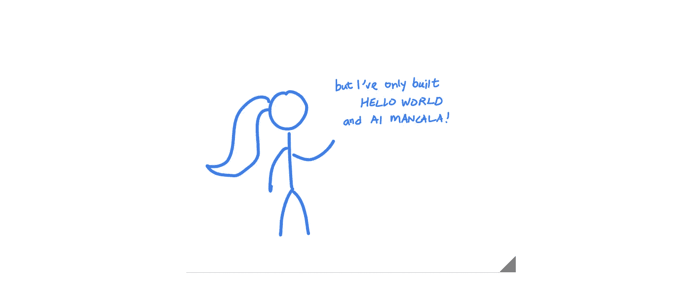

# 作为一名计算机专业的学生，如何开始自由职业

> 原文：<https://medium.com/swlh/how-to-start-freelancing-as-a-computer-science-student-aa2351a28b68>

## 作为一名大学自由职业者，如何找到一份工作、管理好一切并取得成功？

救命啊！我是一名计算机专业的学生，以前从未做过自由职业者。我如何开始自由职业？

我想在这一点上，我们都被告知一些自由职业项目是获得经验和…