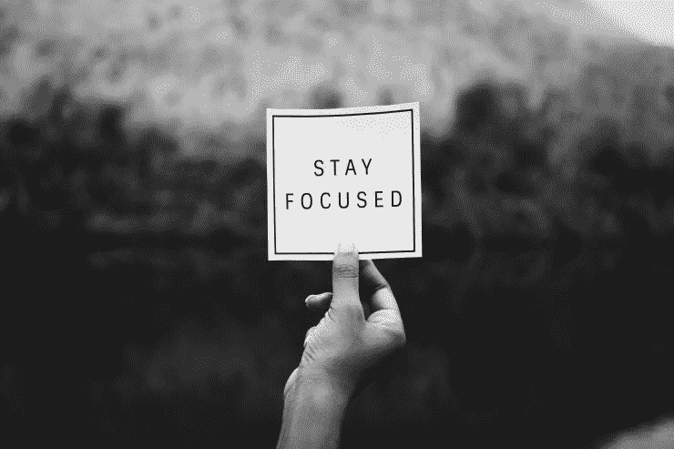

# 如何保持动力和目标

> 原文：<https://medium.com/swlh/how-to-stay-motivated-and-keep-your-goals-adulting-101-5d4d1a0d9740>

最近我经历了一段低迷时期。好像我没有落后也没有进步。我以前在大学里很上进，甚至提前一年毕业。我以优异的成绩在三年内大学毕业。看起来一切都会好起来的，而且在很大程度上，一切都会好起来。但是大学毕业后，我有点累了。