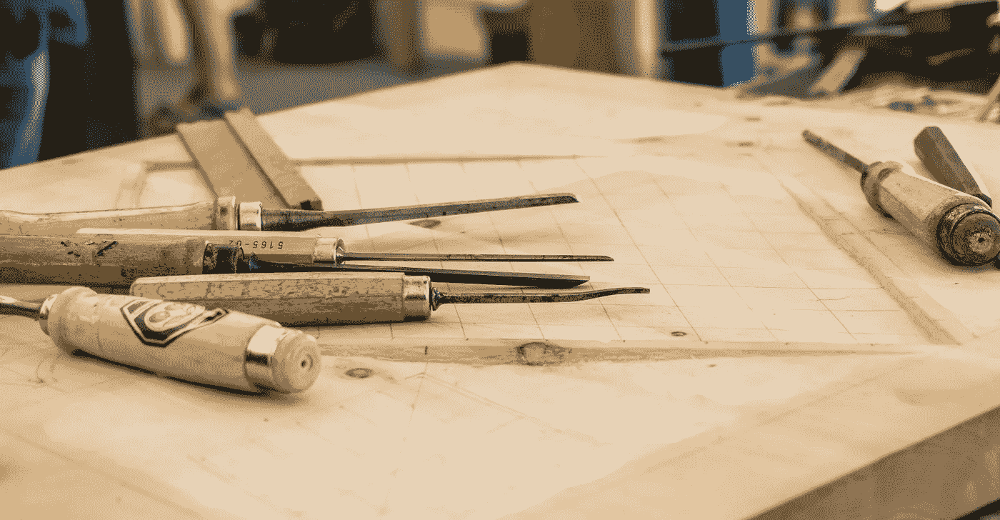

# 如何走出你的舒适区

> 原文：<https://medium.com/swlh/how-to-step-out-of-your-comfort-zone-244bd38da36c>

## 学习新技能的 7 个好处

Photo by [Dominik Scythe](https://unsplash.com/photos/v8vz-Roj8zo?utm_source=unsplash&utm_medium=referral&utm_content=creditCopyText) on [Unsplash](https://unsplash.com/collections/2447970/ambacht?utm_source=unsplash&utm_medium=referral&utm_content=creditCopyText)

我听说，如果我们走出去尝试不同的事情，这对我们的大脑和行为都有好处。

## 这次我会尝试什么新的艺术形式？

今年我决定在艺术系展开我的翅膀，尝试木雕。我是一名水彩画家，有…