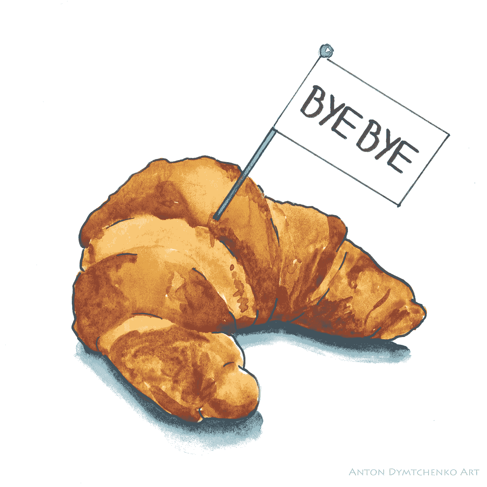

# 如何完全停止吃“坏碳水化合物”

> 原文：<https://medium.com/swlh/how-to-stop-eating-bad-carbs-completely-94a0181d33b1>

让你的生活步入正轨

Illustration by [Yours Truly](http://www.antondy.com)

> “除了卡路里、脂肪、蛋白质和微量营养素，我们现在知道食物是一种强大的表观遗传调节器——这意味着它可以改变我们的 DNA，变得更好或更坏。”——戴维·珀尔玛特博士，谷物大脑