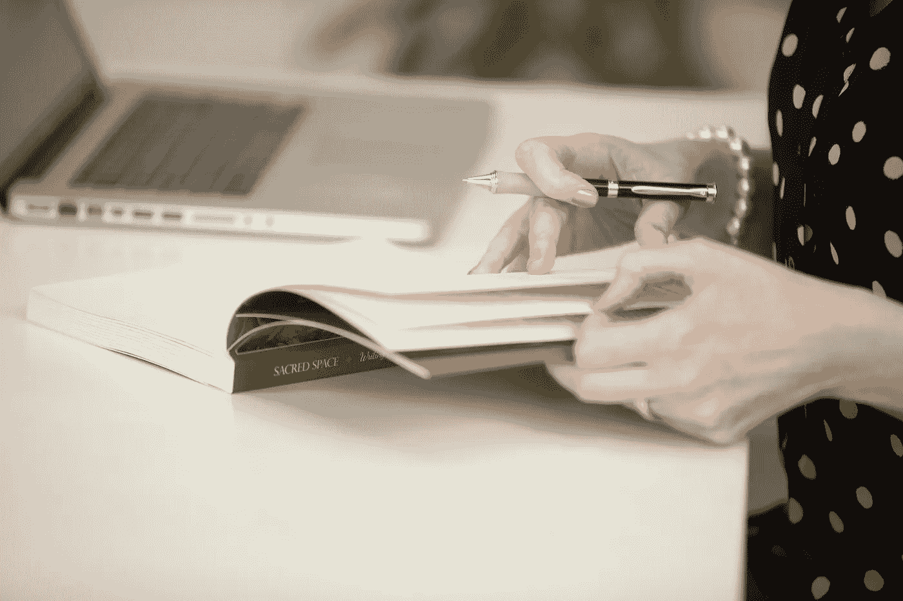

# 如何阻止待办事项清单损害你的自我价值(和底线)

> 原文：<https://medium.com/swlh/how-to-stop-to-do-lists-from-damaging-your-self-worth-and-your-bottom-line-163e2842bb4c>

## 你有做上瘾症吗？

[Michela Quilici Blog](https://michelaquilici.com/blog/)

我最早写待办事项清单的记忆始于我六岁的时候。当我坐在卧室的书桌前，手里拿着铅笔时，我开始在一张有横线的活页纸上写下我需要做的所有事情的清单。