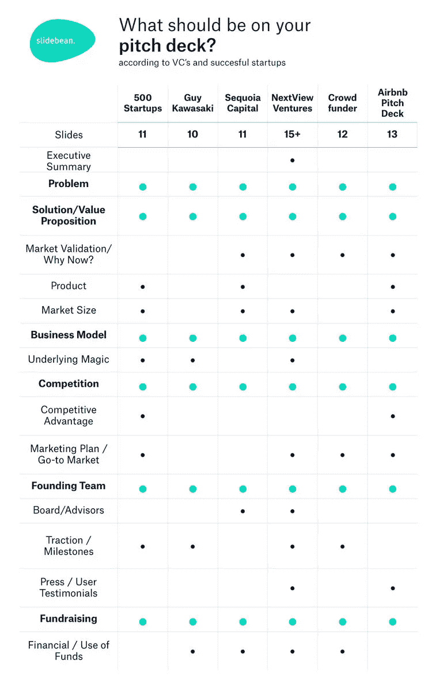
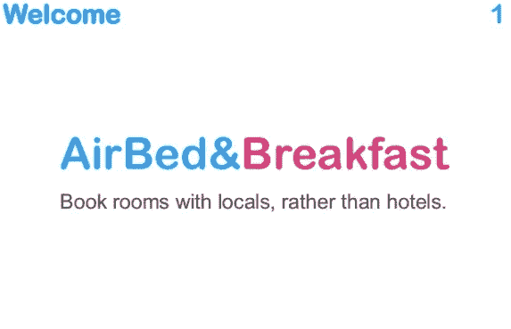
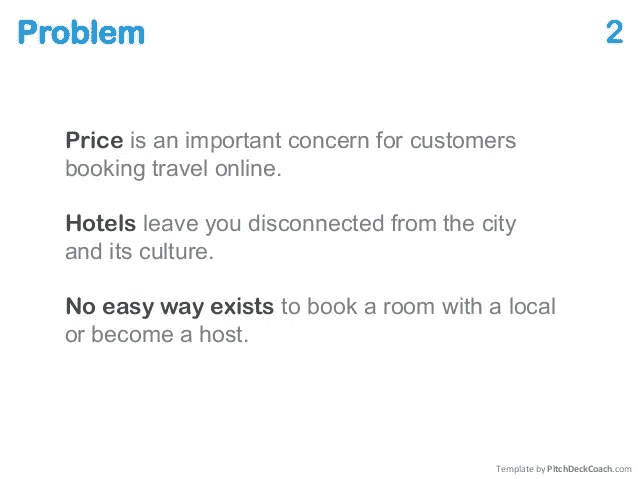
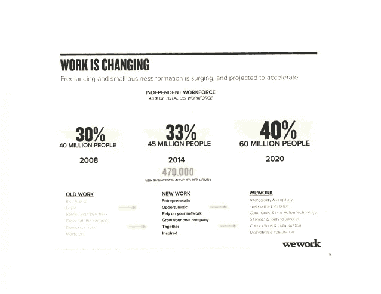

# 如何为投资者构建推介平台

> 原文：<https://medium.com/swlh/how-to-structure-a-pitch-deck-for-investors-4743f9b46a73>

Photo by [Helloquence](https://unsplash.com/photos/5fNmWej4tAA?utm_source=unsplash&utm_medium=referral&utm_content=creditCopyText) on [Unsplash](https://unsplash.com/search/photos/teamwork?utm_source=unsplash&utm_medium=referral&utm_content=creditCopyText)

你的推介材料应该简短有力，同时还要包含足够的信息来说服投资者给你钱

更糟糕的是，每个人都有自己的观点，认为推介材料中应该包含哪些内容。有些人，比如盖伊·川崎，认为一个摊位最多应该有 10 张幻灯片，而其他人认为这个数字应该在 20 张左右。

Slidebean 制作了一张图表，直观地展示了不同风险投资公司和成功初创企业之间的观点差异——似乎我们无法就如何让一个推介平台“好”达成一致。

“[Complete Guide to Pitch Deck Presentation](https://slidebean.com/blog/startups/pitch-deck-presentation-complete-guide)” from [Slidebean](https://slidebean.com/)

如果你正苦于想不出该在你的宣传材料中放些什么，好消息是你并不孤单。

当你在思考你的推销时，试着在讲好故事的框架下思考。

首先，你吸引你的观众进入故事。然后，慢慢建立你的故事，直到达到高潮，最后以一个快乐的结局为大家送行。

在球场环境中，这看起来像什么？

# 第 1 部分:导言

*让投资者在椅子上坐直，开始关注。*

# 扉页

用不超过 10 个字概括你的企业，包括你的企业名称和标志。这正是 Airbnb 在 2008 年在他们的[原始宣传资料中所做的——从第一页开始，它就让投资者思考(与当地人预订房间？这怎么可能呢？)](https://www.slideshare.net/PitchDeckCoach/airbnb-first-pitch-deck-editable)

[AirBnB Pitch Deck](https://www.slideshare.net/PitchDeckCoach/airbnb-first-pitch-deck-editable) from [Malcolm Lewis](https://www.slideshare.net/PitchDeckCoach)

# 问题

你要解决什么问题？问题有多大，投资者为什么要关心？

Airbnb 在酒店和旅游领域也做了出色的工作，并与投资者建立了联系。此时，投资者在想:是的，价格是一个重要因素。是的，酒店里住满了游客，你无法获得“本地”体验。请告诉我更多。

[AirBnB Pitch Deck](https://www.slideshare.net/PitchDeckCoach/airbnb-first-pitch-deck-editable) from [Malcolm Lewis](https://www.slideshare.net/PitchDeckCoach)

# 第 2 部分:故事发展

# 给他们看看你的本事

你的产品将如何解决这个问题？确保您清楚地展示了您的解决方案的优势。如果可以的话，包括三个好处，让信息清晰明了。

# 告诉他们谁想要

你的目标市场是什么？市场有多大？你能积累的统计数据越多越好。

如果你有粉丝在社交媒体上对你赞不绝口，现在是时候把他们拉出来了。

这张幻灯片的重点是向投资者展示你的产品有一个巨大的未开发的市场——数百人对你的产品感到兴奋，并在社交媒体上发布关于你的帖子，这是你的产品有市场的确凿证据。

WeWork 在他们的推介材料中清楚地展示了这一点，看着自由职业者作为一种职业的兴起，以及对灵活工作空间日益增长的需求。

[WeWork pitch deck](https://www.slideshare.net/AlexanderJarvis/wework-pitch-deck-55170129) from [Alexander Jarvis](https://www.slideshare.net/AlexanderJarvis)

# 商业模式

这是你演讲中绝对必要的一部分。你打算怎么赚钱？

投资者希望确信他们能够赚回他们的钱，这意味着他们想要确切地知道你计划如何赚取收入(以及为什么这意味着投资者希望获得良好的回报)

在这张幻灯片上多花点时间，确保它清晰明了、信息丰富。

# 谈论竞争

你将在市场上与谁正面交锋？对 Airbnb 来说，是酒店。对优步来说，是出租车。

尽管许多人认为谈论竞争会对你产生负面影响(因为这会引起人们对与你想做的事情相似的企业的注意)，但这与事实相去甚远。

首先，竞争可以证明你的产品存在市场。第二，谈论竞争向投资者表明，你在认真思考行业的现状，以及你的初创企业如何适应这个环境。

# 谈谈为什么你比竞争对手强

换句话说，是什么让你与众不同？

也许这就是你谈论你的专有技术的地方。或者你谈论你的产品如何填补竞争对手没有填补的空白。

# 走向市场计划

你将如何获得顾客？你将如何获得数百万美元的收入并让你的投资者满意呢？

# 谈谈你的神奇团队

要建立一个成功的企业，你需要一个好主意和一个有能力的团队——投资者比任何人都清楚这一点，[这就是为什么“我们的团队”幻灯片是推介材料中点击率第二高的页面。](https://www.slideshare.net/DocSend/docsend-fundraising-research-49480890/6-Designing_a_Successful_Seed_DeckThe)

你的团队是谁？他们擅长什么？为什么他们会帮助你的企业走向成功？

# 用一些令人印象深刻的数据让他们大吃一惊

你已经把投资者带到了这一步——他们知道为什么，他们知道怎么做，他们知道你会做得比任何人都好。现在是时候用一些令人印象深刻的数据来结束这次演讲了，这些数据将把信息传递给大家。

# 第三部分:结语

# 带回来

以你的企业名称、标志和用不超过 10 个字概括你的公司的句子结尾。

给投资者一点时间来思考你有多棒，然后留出充足的时间来提问。

***要想了解更多关于如何创建营销平台的技巧，请阅读我们的另一篇文章“*** [***9 个让投资者瞠目结舌的营销平台技巧***](https://www.intellicore.press/9-tips-for-creating-a-pitch-deck-that-blows-investors-away/) ***”，或者浏览*** [***我们的网站***](https://www.intellicore.press/) ***来寻找更多创业资源。***

*原载于*[*www . intelli core . press*](https://www.intellicore.press/9-tips-for-creating-a-pitch-deck-that-blows-investors-away/)*。*

## 这篇文章发表在 [The Startup](https://medium.com/swlh) 上，这是 Medium 最大的创业刊物，拥有+415，678 名读者。

## 在这里订阅接收[我们的头条新闻](http://growthsupply.com/the-startup-newsletter/)。

