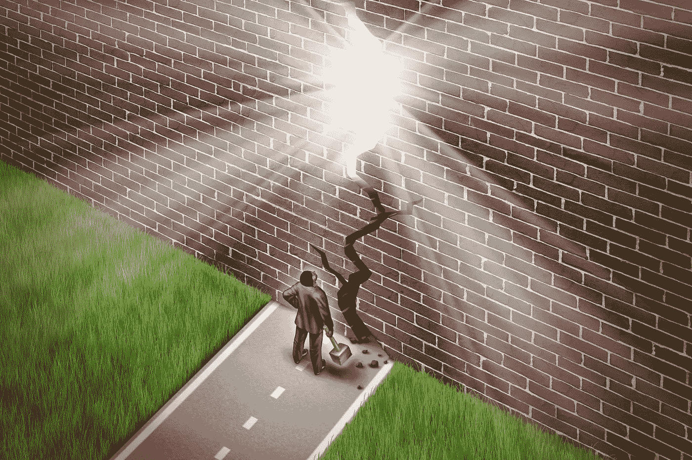

# 如何推倒那堵墙，每次都取得胜利

> 原文：<https://medium.com/swlh/how-to-topple-that-wall-score-victory-every-time-6992ca8b2693>

> 你有机会——每时每刻，每一天——展现最好的自己，即使你碰壁了。你会的。(下面揭秘。)

当我从我写这篇文章的地方向外看时，这里有一条从一端延伸到另一端的彩虹。我们的天空已经亮了将近 30 分钟了。彩虹是我将要告诉你的事情的恰当象征。