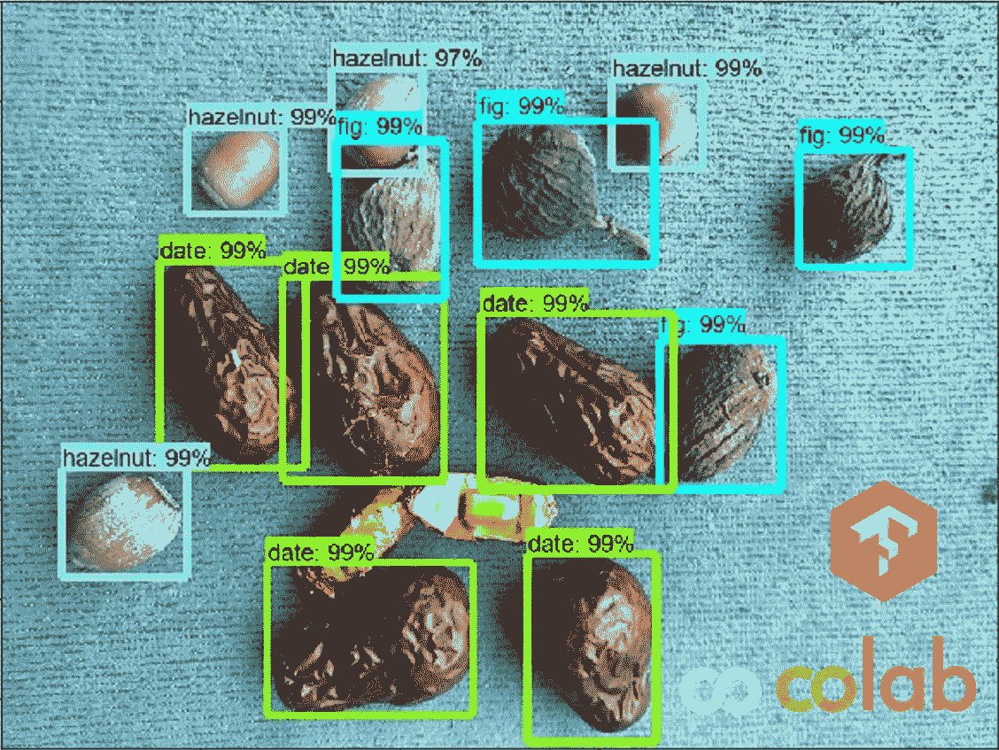
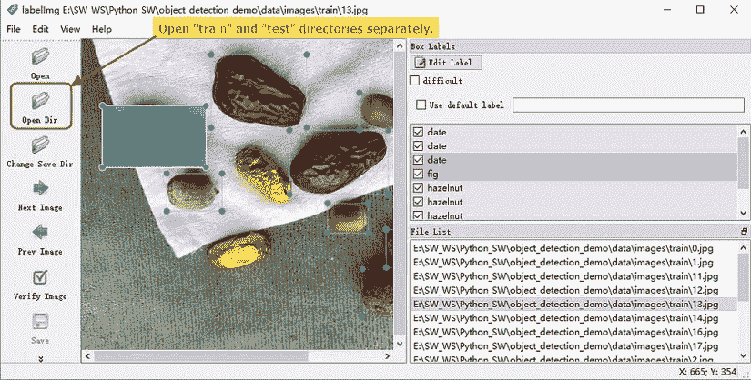
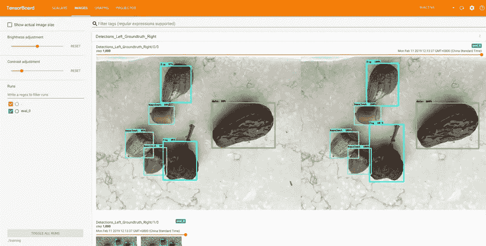
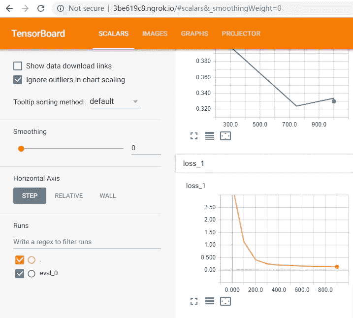
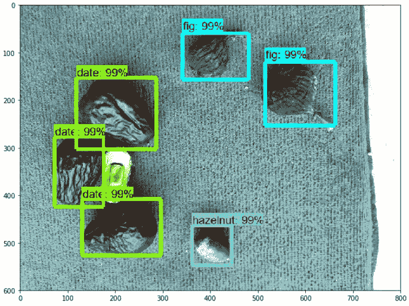

# 如何免费训练一个简单的物体检测模型

> 原文：<https://medium.com/swlh/how-to-train-an-object-detection-model-easy-for-free-f388ff3663e>



在本教程中，您将学习如何使用 TensorFlow 对象检测 API 和 Google Colab 的免费 GPU 轻松训练自定义对象检测模型。

包括注释图像和源代码来完成本教程。

## TL:DR；打开[Colab 笔记本](https://colab.research.google.com/github/Tony607/object_detection_demo/blob/master/tensorflow_object_detection_training_colab.ipynb)开始探索。

否则，让我们从创建带注释的数据集开始。

# 步骤 1:注释一些图像

在此步骤中，您将找到/拍摄图片并注释对象的边界框。只有当你想用你的图片而不是用 [**我的库**](https://github.com/Tony607/object_detection_demo) 自带的图片时才有必要。

如果你的对象是简单的，比如我例子中的坚果和水果，20 张图片就足够了，每张图片包含多个对象。

在我的例子中，我用我的 iPhone 来拍摄这些照片，每张都有 4032 x 3024 的分辨率，如果我们用它作为模型的直接输入，它会淹没模型。相反，将这些照片调整到统一的尺寸`(800, 600)`可以使训练和推断更快。

您可以使用存储库中的 [resize_images.py](https://github.com/Tony607/object_detection_demo/blob/master/resize_images.py) 脚本来调整图像的大小。

首先，保存你的照片，最好是用`jpg`扩展到`./data/raw`目录。然后跑，

```
python resize_images.py --raw-dir ./data/raw --save-dir ./data/images --ext jpg --target-size "(800, 600)"
```

调整后的图像将位于`./data/images/`

接下来，我们将这些文件分成两个目录，`./data/images/train`和`./data/images/test`。该模型将只使用“ **train** 目录中的图像进行训练，而“ **test** 目录中的图像作为评估模型性能的附加数据。



labelImg

用 [**labelImg**](https://tzutalin.github.io/labelImg/) 给调整大小的图像添加注释，这个注释工具支持 Windows 和 Linux，它会在`./data/images/train`和`./data/images/test`目录下生成`xml`文件。

*提示:使用快捷键(* `*w*` *:绘制框、* `*d*` *:下一个文件、* `*a*` *:上一个文件等。)加速标注。*

# 第二步:准备`tfrecord`文件(源包含在 Colab 笔记本中)

在运行这个步骤之后，您将拥有两个文件`train.record`和`test.record`，它们都是二进制文件，每一个都包含相应训练/测试集的编码 jpg 和边界框注释信息。与分别存储每个图像和注释相比，tfrecord 文件格式在训练阶段更易于使用，加载速度也更快。

这样做有两个步骤:

*   为每组(训练/测试)将单独的`*.xml`文件转换为统一的`*.csv`文件。
*   将每组(训练/测试)的注释`*.csv`和图像文件转换为`*.record`文件(TFRecord 格式)。

使用以下脚本生成`tfrecord`文件和`label_map.pbtxt`文件，它们将每个对象类名映射到一个整数。

# 步骤 3:配置培训管道

我们不是从零开始训练模型，而是从一个预先训练好的模型进行迁移学习，以检测日常物体。

与从头开始训练相比，迁移学习需要更少的训练数据。

但是请记住，迁移学习技术假设您的训练数据与用于训练基本模型的数据有些相似。在我们的例子中，使用普通对象的 [coco 数据集](http://cocodataset.org/#home)训练基本模型，我们希望训练模型检测的 3 个目标对象是水果和坚果，即“枣”、“无花果”和“榛子”。它们类似于 coco 数据集中的那些。另一方面，如果您的目标对象是 CT 图像中的肺结节，迁移学习可能不会很好地工作，因为它们与 coco 数据集公共对象相比完全不同，在这种情况下，您可能需要更多的注释，并从头开始训练模型。

为了进行迁移学习培训，我们首先将下载预培训的模型重量/检查点，然后配置相应的 pipeline 配置文件，以告知培训师以下信息。

*   预训练模型检查点路径(微调检查点)，
*   这两个 tfrecord 文件的路径，
*   **label_map.pbtxt** 文件的路径(label_map_path)，
*   训练批次大小(batch_size)
*   训练步数(num_steps)
*   唯一对象的类别数(num_classes)

# 第四步:训练模型

在那之后，我们可以开始训练，这里的 **model_dir** 是存储我们的输出模型的新目录的路径。

在 colab 笔记本中，TensorBoard 还配置为帮助您可视化训练进度和结果。这里有两张 TensorBoard 的截图，显示了对测试图像的预测和对损失值的监控。



TensorBoard Images



TensorBoard Scalars

# 步骤 5:导出并下载一个训练好的模型

一旦您的训练工作完成，您需要提取新训练的模型作为推理图，它将在以后用于执行对象检测。转换可以按如下方式进行:

您可以在路径**fine _ tuned _ model/frozen _ inference _ graph . Pb**找到模型冻结图文件。可以通过 Google Drive 下载，也可以像 colab 笔记本上显示的那样直接下载。

笔记本的最后一部分告诉你如何加载**。pb** 文件、 **label_map.pbtxt** 文件，并对一些测试图像进行预测。下面是一个检测输出示例。



# 结论和进一步的思考

训练对象检测模型可能是资源密集且耗时的。本教程向您展示了它可以像注释 20 幅图像一样简单，并在 Google Colab 上运行一个 Jupyter 笔记本。未来，我们将研究在不同的硬件中部署经过训练的模型，并对它们的性能进行基准测试。举几个部署选项的例子，

*   英特尔 CPU/GPU 采用 OpenVINO 工具套件加速，FP32 和 FP16 量化模型。
*   Movidius 神经计算棒与 OpenVINO 工具包。
*   Nvidia GPU 与 Cuda 工具包。
*   具有 NPU 的 SOC，如 Rockchip RK3399Pro。

*敬请关注，不要忘记查看本教程的*[*GitHub 资源库*](https://github.com/Tony607/object_detection_demo) *和*[*Google Colab 笔记本*](https://colab.research.google.com/github/Tony607/object_detection_demo/blob/master/tensorflow_object_detection_training_colab.ipynb) *。*

*原载于*[*www.dlology.com*](https://www.dlology.com/blog/how-to-train-an-object-detection-model-easy-for-free/)*。*

[](https://medium.com/swlh)

## 这篇文章发表在 [The Startup](https://medium.com/swlh) 上，这是 Medium 最大的创业刊物，拥有+423，678 名读者。

## 在这里订阅接收[我们的头条新闻](https://growthsupply.com/the-startup-newsletter/)。

[](https://medium.com/swlh)