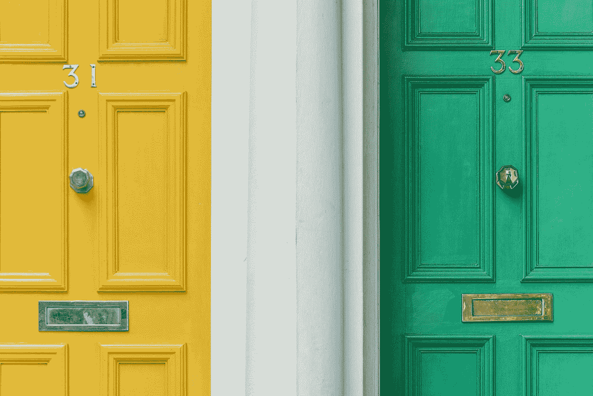

# 如何把一封糟糕的邮件变成一封更好的邮件

> 原文：<https://medium.com/swlh/how-to-turn-a-bad-email-into-a-better-email-a44ebe148390>

Photo by [Christian Stahl](https://unsplash.com/@woodpecker65?utm_source=medium&utm_medium=referral) on [Unsplash](https://unsplash.com?utm_source=medium&utm_medium=referral)

一年前我写不出这篇文章。

我一看就知道文案好，但是我说不出*什么*让它好。

我无法告诉你为什么一些电子邮件和销售页面让我想买一件产品(即使我对它没什么兴趣),为什么其他的几乎让我眼睛出血。