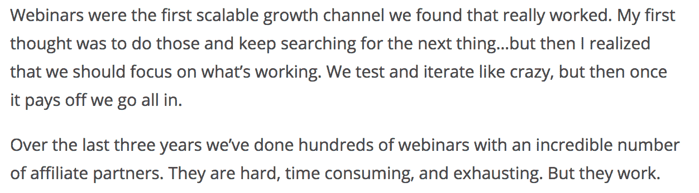

# 如何扭转投资回报率为负的营销活动

> 原文：<https://medium.com/swlh/how-to-turn-a-failing-marketing-campaign-on-its-head-a4c32a55861b>

他的手心出汗了。

*双膝无力；手臂很重。*

*他的毛衣上已经有呕吐物了。*

因此，在电影 *8 英里*中，阿姆说唱道，描述了他的角色在舞台上表演时的紧张。

这些开场白完美地代表了我在主持 Ahrefs 的第一次网上研讨会之前的感受——谢天谢地，没有呕吐。

在听说网络研讨会的巨大转化潜力后，我决定尝试将它作为一种营销渠道。

所以，我做了任何负责任的互联网营销人员都会做的事情:

我花了数不清的时间写尽可能好的剧本，并制作了几十张好看的幻灯片。我还遵循所有“网上研讨会最佳实践”,为网上研讨会与会者创建了登录页面、跟进序列和“特别折扣”优惠。

到了表演时间，我的手在颤抖。我的心脏从胸腔里跳出来。我干净整洁的衬衫上露出了一些非常吸引人的污渍。还好我没有打开网络摄像头——我只放了幻灯片。

因为我预见到我会有巨大的压力，所以我甚至没有事先排练网上研讨会。我刚刚打印了整个网上研讨会的脚本，并逐字逐句地读给 200 名现场听众听。想象一下我的讲话听起来有多普通。

但是等等，这还不是最糟糕的。

我们只能说，这不是一个关于如何面对恐惧走向成功的励志故事。经过大量的工作和巨大的压力，我的 60 分钟网上研讨会失败了。令人失望的是，我们的 SaaS 软件总共只卖出了五件——而且还是在打了很大折扣之后。

此外，我承诺为每一次购买提供免费的搜索引擎优化咨询；一位网络研讨会专家建议我作为“紧急注册奖励”提供，以推动销售。

因此，我不得不在接下来的一周内安排 5 次与买家的 Skype 通话，并尽可能向这些人提供更多的价值。暗示更多的压力。

雪上加霜的是，即使是我的私人咨询也不足以阻止这些客户在几个月后取消他们的 Ahrefs 订阅。

翻译:我的网上研讨会的每次收购成本(CPA)和终身客户价值(LCV)糟透了。

作为 Ahrefs 的 CMO，我的目标是以最少的营销努力换取尽可能高的投资回报率。这次经历之后，我确信网络研讨会是浪费时间。

然而，在为我的[商业博客](https://ahrefs.com/academy/blogging-for-business/)课程采访[布莱恩·哈里斯](https://videofruit.com)时，我的观点发生了变化…

# **如何扩展你的营销渠道**

布莱恩告诉我 [ConvertKit 创始人内森·巴里](http://mbsy.co/glPSt)是如何将网络研讨会变成一个可扩展的系统的。

事实上，Nathan 仍然依赖网络研讨会作为其核心营销渠道。网络研讨会帮助他在 ARR 将 ConvertKit 增长到 1500 万美元。以下是他在最近的文章[“我们第一个 1500 万美元的 15 个教训:](https://nathanbarry.com/15-lessons-15-million/)中所说的话

在和 Bryan 谈过之后，我立即要求介绍 Nathan——我想知道他是如何在一个对我来说非常失败的营销渠道中取得如此大的成功的。

以下是我从与内森的 Skype 私人对话中了解到的情况:

*   Nathan 将合作伙伴网络研讨会提炼为一个可重复的流程。
*   三名全职团队成员负责执行不同的阶段:培养与附属合作伙伴的关系、管理网上研讨会的技术设置和交付实际的网上研讨会。
*   他们依靠与第一批合作伙伴共同举办网络研讨会的成功经验，吸引越来越多的人(及其目标受众)共同举办同一场网络研讨会。

我开始意识到我应该完全预料到我的第一次网上研讨会会失败。

我所要做的就是从我的错误中吸取教训，并重新利用已经投入的所有资源来举办后续的网络研讨会，直到它们获得积极的投资回报。

正如人们所说，第一步总是最难的。我不敢相信我这么容易就放弃了网络研讨会。

*   我已经准备好了整个网上研讨会的内容。我所需要的就是找到弱点并加以改进。
*   我已经准备好登陆页面了。我只需要根据过去的与会者最有共鸣的内容来摆弄一下文案。
*   我已经准备好了所有的电子邮件跟进序列和技术设置。
*   我有我的折扣和奖金。

换句话说，每一次后续的网上研讨会都会比前一次表现得更好，而我需要付出的努力却少得多。

见鬼，我甚至见过一些人运行自动的、预先录制的网络研讨会，他们只在结束时参加现场问答。有些人甚至都懒得做，而是让公司员工来做问答。

谈谈投资回报率。

我相信这适用于你能想到的几乎所有营销渠道:如果你只做一次，投资回报率不会很高。

但是一旦你把它扩展成一个可重复的过程，从你的错误中学习并完善它？这就是奇迹发生的时候。

您可能会想，此时我又回到了网络研讨会。

嗯……当我意识到我可以将网络研讨会变成一个可重复和可扩展的过程时，我现成的网络研讨会脚本和幻灯片已经变得无关紧要了。我也已经取消了所有自动化工具的订阅。

我也在忙其他的事情:在这个过程中的某个地方，我收到了一个邀请，成为一个营销相关播客的嘉宾。

# **我如何衡量播客采访**

类似于我之前作为网上研讨会新手的经历，我为我的第一次播客采访做了过多的准备。

我不仅提前问了所有的问题，还详细地写下了我的答案，因为我知道我在电话中压力会非常大，很可能会忘记如何说话。

现在，当我读我的回答“现场”时，听起来自然吗？

可能不会，但我肯定已经表达了我所有的观点。由于整个过程比做一个完整的网上研讨会占用的资源少得多，我决定坚持下去。

到今天为止，我已经在播客上出现了 20 多次，仅在下周就安排了三次采访。

有趣的是，我不再提前问问题，这样我就可以准备一些“聪明”的答案——我只是跳上一个电话，做我自己。

在做了我的第五次播客采访后，我开始发现我不再像以前那样紧张了。另外，根据我之前的采访，我已经知道我的哪些故事和想法最能引起人们的共鸣。

因此，我决定在 2019 年，我将把我不常见的播客采访变成一个可扩展、可重复的过程，这将帮助我向成千上万的新人们展示 Ahrefs。

整个“可扩展播客过程”非常简单:

1.  我让我的一个团队成员找到所有关于营销、创业、企业家精神等的相关播客，并创建一个包含联系信息和一些关于主持人的详细信息的电子表格。
2.  每月一次，我从这个列表中挑选 10-15 个播客，主动接触主持人，把自己推销成一个客人。在发送了一些这样的推介之后，我意识到我可以创建一个电子邮件模板，我可以根据他们节目的内容对每个播客进行个性化设置。
3.  如果他们同意采访我，我会立即打电话(没有任何事先准备)分享我在其他相关播客上分享的许多相同的技巧和故事。我并不纠结于我的每个采访都是 100%独一无二的，因为这些播客的受众不会重叠太多。此外，重复是学习之母。
4.  这一集发布后，我会与我的 Twitter 粉丝分享，将其列在[我在 Ahrefs](https://ahrefs.com/tim) 的个人资料页面上，并将其列在我未来的电子邮件推介中，以提高我作为嘉宾的可信度。

老实说，我不确定我的播客在为 Ahrefs 带来新客户和增加我们的 ARR 方面有多大效果。但是，考虑到在这些播客采访中投入的时间，如果我们得到的唯一价值是“品牌曝光”，我仍然会很高兴

建立一个从谷歌产生复合流量的营销飞轮 是我们市场部的首要任务。但我一直在寻找“二级”营销渠道，我们可以不费吹灰之力地扩展和执行。

事实上，你现在正在阅读的 Medium 文章是另一个可扩展的营销过程——我的时间得到了优化，以至于我发布的每篇文章都花费了最少的精力。

但是我想这个话题值得写一篇自己的文章。

# **工作更聪明，而不是更努力**

构建成功的可扩展营销流程的关键？

坚持下去就好！

当你第一次执行某个营销策略或渠道时，它很少会对你有效。

因此，不要分散你的精力去参加一个又一个营销活动，试着坚持一段时间，找出如何用最少的投入获得最多的结果。

然后你会想雇佣一些人，把这个过程教给他们，然后继续想出另一个可扩展的营销过程。

如果我是你，我会首先考虑 SEO 和内容营销。

这显然不是最容易开始的营销渠道。但就投资回报率而言:一旦你扩大规模，它将遥遥领先于其他一切。

查看 Ahrefs 的 YouTube 频道获得一些很酷的 SEO 教程。

现在，我很想听听你在营销活动方面的经验。你创造了可重复的系统吗？你尝试过哪些营销平台？

在下面的评论里告诉我。

//

> 感谢阅读。如果你喜欢这篇文章，请随意鼓掌👏按钮几次(👏👏👏👏)帮别人找:)

更多深入的营销文章，请访问 Ahrefs 博客。

//