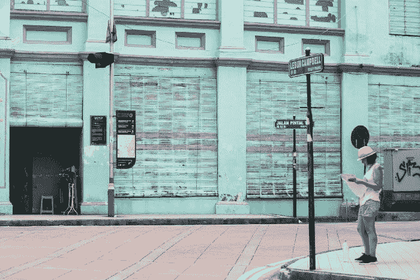

# 如何关闭噪音

> 原文：<https://medium.com/swlh/how-to-turn-off-the-noise-bf7a820f3fbd>

## 这是一个关于如何消除噪音，提高工作效率，以最高标准工作的指南。

埃尔卡里托在 [Unsplash](https://unsplash.com/?utm_source=medium&utm_medium=referral) 上拍摄的照片

受周围环境影响，我们头脑中听到的噪音会极大地影响我们的进步。从社交媒体和比较到回放过去和想象未来，当我们试图克服我们自己制造的障碍时，我们的进步可能是有限的。

有时(或大多数时候)，我们周围的干扰会让我们偏离目标，阻碍我们朝着自己的激情前进。

最近毕业，不像我的许多其他同事，我没有在我的研究领域找到一份全职工作。以典型的人类方式，这引发了一连串的想法，迫使我思考——我可能还不够。

降低我自己的自尊，拿自己和别人比较，陷入“现在怎么办？”的持续状态我内心的声音几乎控制了一切，直到我的一位导师帮我重塑了我的视野，使之最适合我的职位。

对于那些曾经或现在与我处境相同的人，我想与你们分享的是

*你正在你需要的地方。*

你并不孤单。

最后，

用多莉鼓舞人心的话说，

*继续游*。

# 这里有 5 种方法可以帮助我建立自信，保持专注，同时朝着我的激情前进！

# #1

**把较大的任务分成较小的任务。**

有时候，当朝着更大的目标努力时，如果看不到立竿见影的效果，就更容易失去动力。然而，完成较小的任务(这会导致更大的任务)可以让你保持灵感、活力和动力。

# #2

选择你的黄金时刻。

认识到一天中你精力充沛、注意力集中、工作效率最高的时刻。确定有助于你提高工作效率的程序。对我来说，是早上 6 点到 11 点！

# #3

让自己保持忙碌和参与。

当你让自己忙碌的时候，你会优先考虑那些真正重要的事情。忙碌(或优先安排你的时间)迫使你利用你所拥有的时间，反过来让你建立你的软技能和硬技能。以下是一些你可以参与的方式和空间:

*   在你的社区内:关心你的社区？加入当地社区资源中心，你可以成为志愿者，建立一个网络！
*   在你的学校里:加入并成为俱乐部、部门组织、研究机会的一部分，或者甚至找到一份校内/校外的工作(我在大学里做的最好的决定)！
*   参加课外活动:你喜欢运动吗？从每天 12 个小时中抽出 1-2 个小时参加露天健身房和/或参加舞蹈、尊巴或瑜伽课程(同时改善你的身心健康)！

# #4

**变得整洁。**

放弃那些在你生活中没有价值的东西(物质财富)。你所处的空间会影响你的行为。创造一个整洁有序的空间，放满能帮助你保持动力的东西(比如可爱的小狗照片)。

*   如果有人让你分心，让你无法参与你热爱的活动，让他们知道。如果他们仍然挡着你的路，是时候放手了。我得到的最好的建议是:

> *“和那些展现出你最好一面的人在一起，而不是你身上的压力。”*

# #5

**活在当下，留心。**

现在确认**为**。从你的一天中抽出时间来理解你在这个空间中的位置。

提示:只要你意识到你在呼吸，你就没有在思考——利用这一点。

在一个思想和创新发展速度超出我们预期的社会里，找到自己的空间会变得很难。

但是如果你专注于对你来说最重要的事情，事情会变得容易。