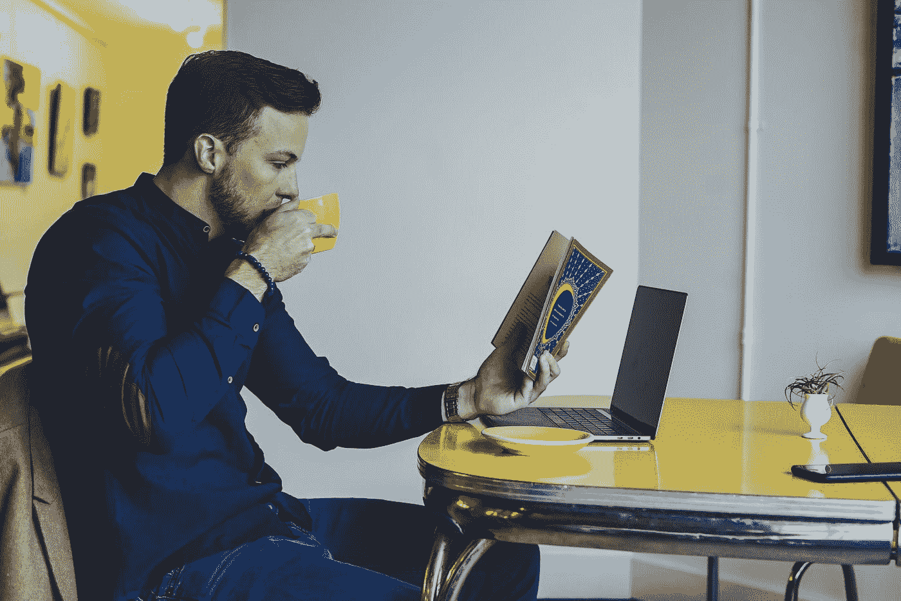

# 如何把你的强迫性读书笔记变成自我提升的黄金

> 原文：<https://medium.com/swlh/how-to-turn-your-compulsive-reading-notes-into-self-improvement-gold-3f53e205221a>

Photo by [Chris Benson](https://unsplash.com/@lordmaui?utm_source=medium&utm_medium=referral) on [Unsplash](https://unsplash.com?utm_source=medium&utm_medium=referral)

毋庸置疑，阅读是让普通人获得巨大成功的最重要的习惯之一。世界上无数的百万富翁和亿万富翁都同意，阅读让他们探索新的想法、观点和技能，而这些通常没有书是无法获得的。反过来，他们将这些见解转化为制胜策略。