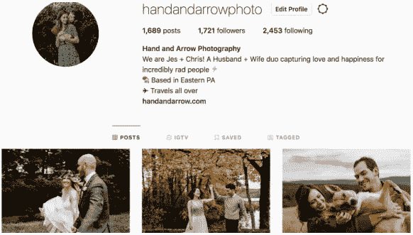

# 如何使用 Instagram 营销你的摄影业务

> 原文：<https://medium.com/swlh/how-to-use-instagram-to-market-your-photography-business-b779b28f4a76>

*最后更新:2019 年 8 月 9 日*

刚开始时，许多摄影师，尽管他们可能很有才华，也会对投入到一个新的摄影行业中的与实际拍摄无关的工作量感到惊讶。

从日程安排，到[交通](https://formedfromlight.com/blog/mileiq-mileage-tracking-review/)，再到会计，大多数摄影师最终会戴上很多他们从未预料到的帽子。