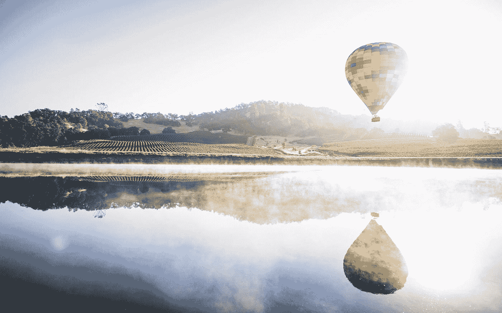

# 如何利用 Medium 和 Quora 推广你的 MVP

> 原文：<https://medium.com/swlh/how-to-use-medium-and-quora-to-promote-your-mvp-75be8758a6>

## 你的 MVP 不会营销自己。这里有一些通过内容营销获得前 1000 名用户的技巧。

Photo by [Sebastien Gabriel](https://unsplash.com/@sgabriel?utm_source=medium&utm_medium=referral) on [Unsplash](https://unsplash.com?utm_source=medium&utm_medium=referral)

在上一篇文章中，我提供了一个[一步一步的指南](/swlh/how-to-launch-a-marketplace-mvp-without-any-code-2766d15b0c62?source=friends_link&sk=49bb1adf3ca09081d016f1791c070ed5)关于如何在不写任何代码的情况下创建一个市场 MVP。今天，我将分享我对如何将你的 MVP 提升到…