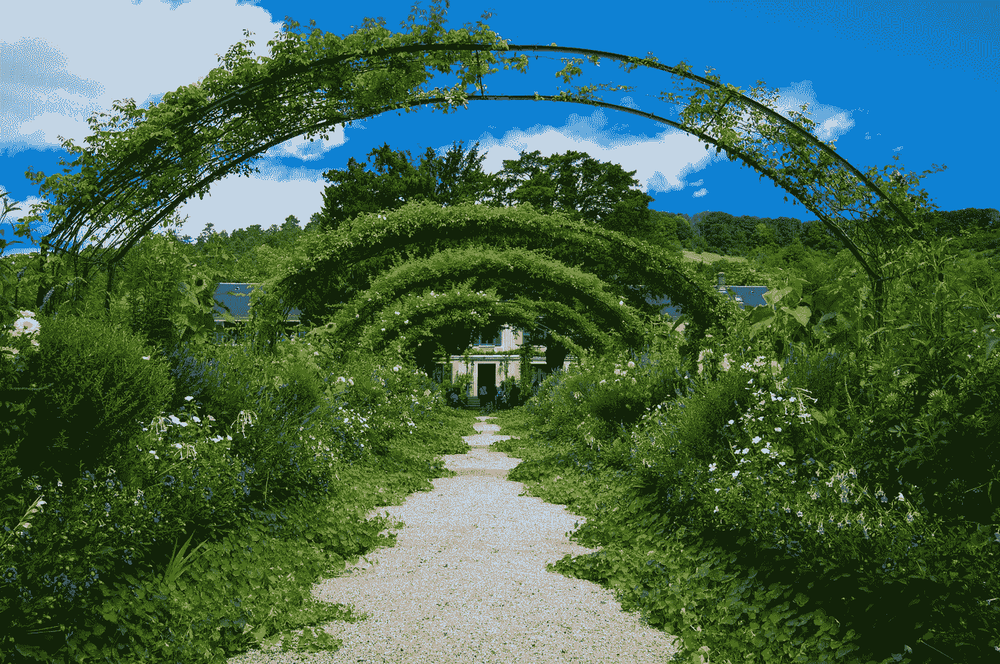

# 如何利用永续农业设计可持续生活

> 原文：<https://medium.com/swlh/how-to-use-permaculture-to-design-a-sustainable-life-c880e1cce04b>

## 这 12 条原则不仅仅适用于花园

Photo by [Veronica Reverse](https://unsplash.com/@vereverse?utm_source=unsplash&utm_medium=referral&utm_content=creditCopyText)

ermaculture 是一套基于模仿生态系统的模式和适应性的设计原则。当我第一次开始研究[永久农业](https://en.wikipedia.org/wiki/Permaculture)时，那是因为我关心气候和人类的未来。