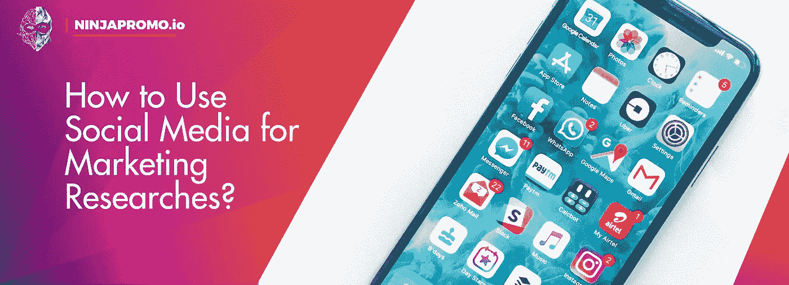
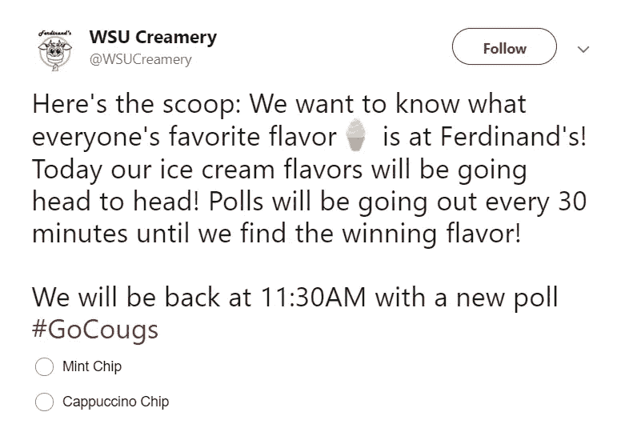

# 如何使用社交媒体进行营销研究？

> 原文：<https://medium.com/swlh/how-to-use-social-media-for-marketing-researches-5b3e10a2c7d5>

无法想象如何在营销研究上节省时间和金钱？NinjaPromo 将阐明这个想法。

老实说，社交网络很难被称为营销研究的理想来源。然而，对于大公司来说，社交网站的营销研究是极其重要的，因为这是品牌最卓越的粉丝花费时间的地方。

此外，在社交网站上，我们可以观察到顾客的**坦率意见**，因为消费者渴望与品牌沟通。以下是关于这一点的统计数据:

*   **18 岁至 34 岁的消费者中，95%的人可能会在社交网站上关注该品牌。**
*   **买家表示，他们在社交网站上为与他们互动的品牌多花了 20-40%的钱。**
*   **在社交网站上有过与某个品牌互动经历的客户中，有 71%的人最有可能把它推荐给朋友和熟人。**

值得注意的是，并不是所有的营销研究都需要大量的参与者和群体中的高活跃度。例如，当 **GE 医疗保健生命科学**想要了解他们的潜在客户以何种方式讨论蛋白质纯化问题时，专家们分析了关于该主题的大约 50 万条评论。获得的数据有助于改进内容，并使网站上的文字更容易被用户使用和理解。

## **社交网络是一个有用的工具，可以帮助你获得以下信息:**

*   来自消费者的即时反馈，关于他们使用你的产品或服务的个人体验的信息。
*   关于如何改进产品或服务的信息。

Photo by [NordWood Themes](https://unsplash.com/photos/yyMJNPgQ-X8?utm_source=unsplash&utm_medium=referral&utm_content=creditCopyText) on [Unsplash](https://unsplash.com/search/photos/social-network?utm_source=unsplash&utm_medium=referral&utm_content=creditCopyText)

**SNSs 的主要优势是可以非常快速地收集数据**，因为几乎一半的用户每天至少登录他们的个人资料一次(如果不是一百次的话)。

所以，在 SNSs 的帮助下，你可以很快得到客户的反馈。例如，一项研究发现社交网络比通过电子邮件跟踪客户反馈的效率高三倍。

此外，使用社交网络，你可以节省研究费用。大多数功能(例如，民意测验)以零成本收集数据。

但值得记住的是，SNS 作为营销研究工具并不适合所有人。如果你的团队没有数十万(或数百万)的用户，就不要指望他们会成为有效的数据来源。

但是，对于小企业来说，有一种可能:**竞争品牌的社交倾听。分析他们的群体，你就能了解你的潜在客户对什么不满意，或者他们想要什么。**

那么，可以用于社交网站营销研究的方法主要有哪些呢？

# **社交网络营销研究方法**

有三种适合社交网络的定性研究:

*   **定性内容分析**(点赞/评论/转发数量)——评估消费者在社交网络中的参与度可以表明营销信息或产品的吸引力。
*   **观察**——被动地收集顾客的反馈或跟踪顾客对你的品牌或竞争对手的看法。
*   **投票/提问**——直接在社交网站上提问，鼓励用户分享他们的想法和感受。

显然，只在那些你的客户花费大部分时间并且最活跃的社交网站上进行市场调研是有意义的。**下面你会发现一些战术和策略。**

*   **民意调查。**最受欢迎的社交网站提供民意调查选项。通常来说，民意调查比任何其他类型的帖子都更受欢迎。创建投票、获得有价值的反馈和分析数据并不需要花费太多时间或精力。最重要的是，民意调查有双重目标:增加社交网络参与度和市场研究。

*   **竞赛**。赢得奖品的机会可以很容易地鼓励订户和关注者提供他们的电子邮件地址，与您分享自己生成的内容(如照片、视频、评论)或留下对您产品的反馈。
*   **呼吁行动的帖子。你可以精确地问一个开放式问题，而不是组织一个多项选择的投票。因此，你可以收到成千上万来自客户的回复，能够评估他们的情绪，并受到启发去创造新的东西。**

*   **追踪品牌参考。你甚至可以从那些不是你追随者的人那里获得有价值的信息。据统计，在 SNSs 上讨论某个品牌的人，96%都不是其所在群体的订阅者。使用社交倾听的工具:Google Alerts(免费，这也是它受新手喜爱的原因)、Hootsuite、Brand24、提提、Brandwatch 等。**
*   **表情符号滑块。2018 年 5 月推出的一个奇怪的 Instagram** 功能。值得注意的是，具有这一新功能的故事获得的互动比其他故事多 15%。这使您能够获得比有两个选项可供选择的调查更完整的反馈。例如，ASOS 允许粉丝用表情滑块给他们的产品打分。

*   **监测(在 Twitter 上)**监测是一种监测客户行为的方法，目的是了解他们对公司或产品的想法。例如，当一家专注于健康饮食的比萨连锁店 BellaBrava 的老板想在欧洲开一家新餐厅时，他创建了一个反映其核心价值的关键词列表(例如，“有机”、“蔬菜”、“素食”)，并跟踪在 Twitter 和其他社交工具上谈论此事的人。因此，该公司已经确定了 10 个市场潜力最大的地方，可以在那里新开一家餐厅。

# **结论**

SNSs 中的倾听和监控意味着对你的目标受众的深入了解。如果你在社交网站上与每个人都打成一片，你就能获得更多优势，并坚持不懈地以最佳方式管理你的所有数字活动。

这是一种时间和金钱的节省，同时获得良好的营销投资回报，并利用观众的优势，使您的营销活动变得更加个性化，并保持相关性。

*感谢您阅读这篇文章！如果你喜欢，请分享它，并告诉我们你对使用社交媒体进行营销研究的看法。另外，你可能会喜欢我们的其他故事:*

> — [今年有哪些 ICO 项目会成功？](/swlh/what-ico-projects-will-be-successful-this-year-d65c68dd892c)
> 
> —[2019 年影响者营销— Instagram 风格](/datadriveninvestor/influencer-marketing-2019-instagram-style-29bc6ad9f00b)
> 
> — [电子邮件营销死了吗？](http://blog.markgrowth.com/is-e-mail-marketing-dead-72f5eebce2fc?utm_source=medium&utm_medium=organic&utm_campaign=promo)
> 
> — T [年度趋势:Stablecoins 代替 ICO](/@NinjaPromoAgency/trend-of-the-year-stablecoins-instead-of-ico-688d28844a7a)

## 这篇文章发表在 [The Startup](https://medium.com/swlh) 上，这是 Medium 最大的创业刊物，拥有+439，678 名读者。

## 在这里订阅接收[我们的头条新闻](https://growthsupply.com/the-startup-newsletter/)。

