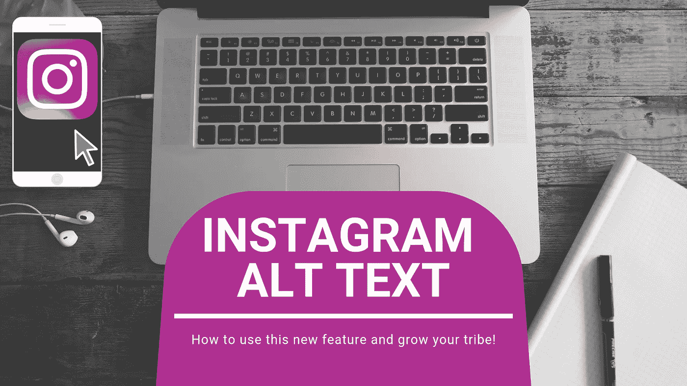
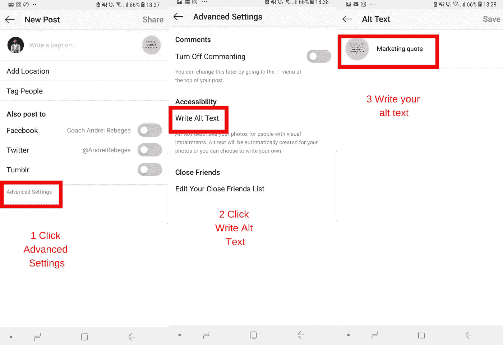
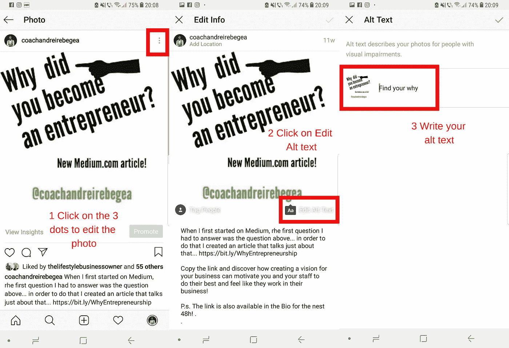

# 如何使用新的 Instagram Alt 标签进行 Seo

> 原文：<https://medium.com/swlh/how-to-use-the-new-instagram-alt-tag-for-seo-f9c697e019f5>

## 现在，您可以在 Instagram 照片和视频后面添加文本

Start using this feature right now and follow me on Instagram at [CoachAndreiRebegea](https://instagram.com/coachandreirebegea/)

一周前，Instagram 推出了一个关于照片和视频的新功能！替代文本或标记。这将如何影响你的内容被发现的方式？在本文中，您将了解为什么这非常重要，如何使用它，以及这个标签可以为您的业务做些什么。

在每台电脑上，您都可以找到 ALT 键(或者 Option 键，如果您使用的是 Apple 产品)。这代表着选择，当你试图同时做很多事情时，它可以帮助你。

> 学习和创新是相辅相成的。成功的傲慢在于认为你昨天所做的足以应付明天——威廉·波拉德。

在 Instagram 上，当你的粉丝的网络连接很差，照片无法加载时，ALT 文本就会显示出来。当这种情况发生时，人们会看到你的 ALT 标签，至少知道一些你的帖子。这是脸书通过 Instagram 的一个非常有趣的举动。到目前为止，Instagram 上的照片只有一个描述，但没有一个或多个关键词可以告诉搜索引擎这张照片到底是关于什么的。现在这种情况因为这个新的选择而改变了。

ALT 标签在网上几乎无处不在。每个网站都有标签，Pinterest 上的大多数照片都有标签，你可能看不到，但非常重要。这个替代文本不会成为你一直使用的复制粘贴描述。这必须完全代表你的照片是什么。

现在你可能会问为什么在发帖时要关注这个标签…以下是一些原因:

*   它可以帮助网速慢的人——否则他们看不到任何东西。现在有专为视力障碍者设计的手机，这个标签将会为他们大声朗读出来。这为你的企业打开了新客户的大门。
*   这给了 Instagram 更多的数据来处理。IG 有一个新的算法，试图识别每张照片是什么。通过这样做，IG 将自动搜索新的人来显示您的照片。简而言之，IG 代表你做免费的定位，当你试图增加你的观众时，这是非常重要的。
*   它提高了你的搜索引擎优化排名。SEO 代表搜索引擎优化，代表着你为提高网站在搜索引擎中的排名所做的一切。到目前为止，Instagram SEO 只是通过照片描述来完成的。现在有了这个功能，你的照片将开始在谷歌图片搜索中获得排名。

> IG 有一个新的算法，试图识别每张照片是什么。通过这样做，IG 将自动搜索新的人来显示您的照片。简而言之，IG 代表你做免费的定位，当你试图增加你的观众时，这是非常重要的。

添加 ALT 标签对你的 Instagram 成长非常重要。平台希望成为人人共享的平台。这也包括有视觉障碍的人。如果你没有在你的帖子上添加标签文本，Instagram 会自动为你添加一个。我打赌你可能比 Instagram 更有创造力，更了解你的东西。

> 没有变化，就没有创新、创造力或改进的动力。那些发起变革的人将有更好的机会来管理不可避免的变革——威廉·波拉德

# 如何给新的 IG 帖子添加新的 ALT 标签？

很简单:

*   首先，你上传一张照片或一段视频(是的，视频也可以有这个标签)
*   其次，你点击“高级设置”
*   第三，您选择“编写替代文本”
*   第四，发挥你的创造力，选择一个好的关键词或一组关键词来描述你的照片。

为了让你更简单，我结合了我的账户的多个截图，让这个过程对你来说更容易。

**Follow me on Instagram for more tips like this at** [**CoachAndreiRebegea**](http://instagram.com/coachandreirebegea/)

# 现在让我们把重点放在老照片上…你如何在那里添加一个 ALT 标签文本？

在旧帖子上添加标签需要更多步骤，但仍然很简单:

*   您选择您想要添加标签的照片
*   您按下屏幕右上角的“…”，好像您想要编辑描述
*   你选择“编辑”
*   在照片的右下角，你点击“添加替代文本”
*   你写你的标签

正如我以前做过的那样，下面是我在我的帐户上的旧帖子上添加标签的拼贴画:

On this post, I was promoting my first [Medium](https://medium.com/u/504c7870fdb6?source=post_page-----f9c697e019f5--------------------------------) Article. You can read it [here](/@AndreiRebegea/why-did-you-become-an-entrepreneur-8307b6cdac13)!

现在你知道如何使用 ALT 标签了。让我们谈一谈你应该如何创建你的标签。当你这样做的时候，你必须记住两件事。一种是网速慢的人。另一个是人工智能或算法，它会读取你的标签，并向喜欢类似照片的人展示你的照片。

Instagram 还为这段文字增加了 100 个字符的限制，目的是为了帮助 SEO 排名，让人思考，而不仅仅是复制粘贴照片描述。

当你写标签时，你应该描述图像，想象一个人在滚动，在某个时候他看不到你的照片，但看到了你的标签。你如何吸引那个人点击你的个人资料来了解更多关于你和你的企业的信息？如果你的照片中有人，你也应该使用他们的名字。不要害怕使用关键词。正如你在照片中看到的，我的标签关键词丰富。在这张新照片上，我确切地说了这张照片是什么，一句营销名言。在第二个问题上，我说了一些人们通常在网上搜索的东西“找到你的为什么”，这真正代表了我所推广的文章的内容。

> 你打算如何在 Instagram 营销工作中使用这一新功能？在下面给我写个评论，我们来聊聊吧！

👉***请轻点或点击*** 👏**帮助他人获得灵感，学习如何更好地使用这个 Instagram 新功能。**

## *用这份免费礼物开始新的一年吧！*

*你是小企业主吗？我刚刚创建了一个指南，里面有很多练习和技巧，教你如何增加利润。什么时候开始从你的生意中获得更好的回报？在下面获取您的指南！👇👇👇*

> *[http://andreirebegea.com/iwanttogrowmyprofits/](http://andreirebegea.com/iwanttogrowmyprofits/)*

**

## *这篇文章发表在[《创业](https://medium.com/swlh)》上，这是 Medium 最大的创业刊物，有+412，714 人关注。*

## *订阅接收[我们的头条新闻](http://growthsupply.com/the-startup-newsletter/)。*

**