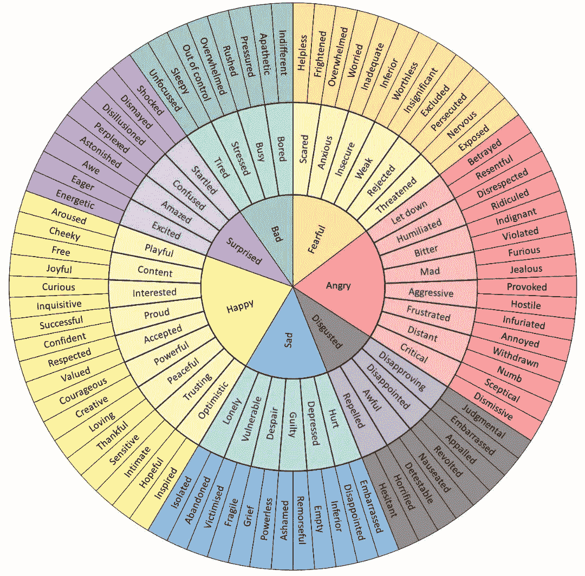

# 如何利用情感之轮写出更好的虚构人物

> 原文：<https://medium.com/swlh/how-to-use-the-wheel-of-emotions-to-write-better-fictional-characters-a86ba6381fe2>

Wheel of Emotions

心理学家使用各种各样的工具来帮助他们咨询的人把他们的感觉和情绪用语言表达出来。用语言表达你的感受是大多数治疗的核心组成部分之一。

创造强有力的虚构人物也依赖于将感觉和情绪投入到页面上的文字中，并将这些情绪…