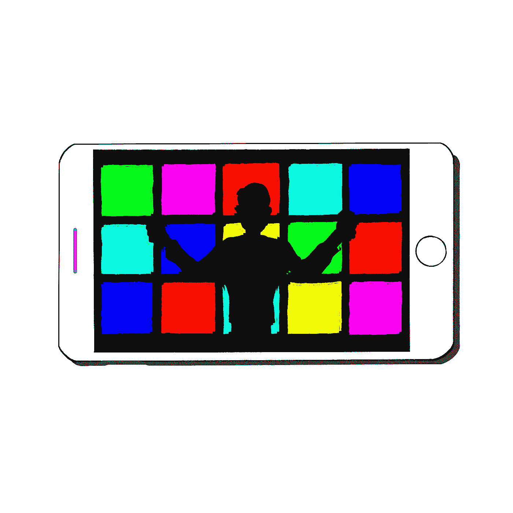

# 如何使用手机作为工具

> 原文：<https://medium.com/swlh/how-to-use-your-phone-as-a-tool-8cdb865b39d3>

## 不是玩具！

Illustration by [Yours Truly](http://www.antondy.com)

毫无疑问，智能手机是 2010 年代的标志性消费产品。尽管它有很多有用的功能，但它加剧了一系列问题，包括:注意力不集中，网络成瘾，睡眠障碍，社交焦虑，“害怕错过”，抑郁，欺凌，弯曲的姿势，早期黄斑变性，分心驾驶，当然还有“smombies”(不能…