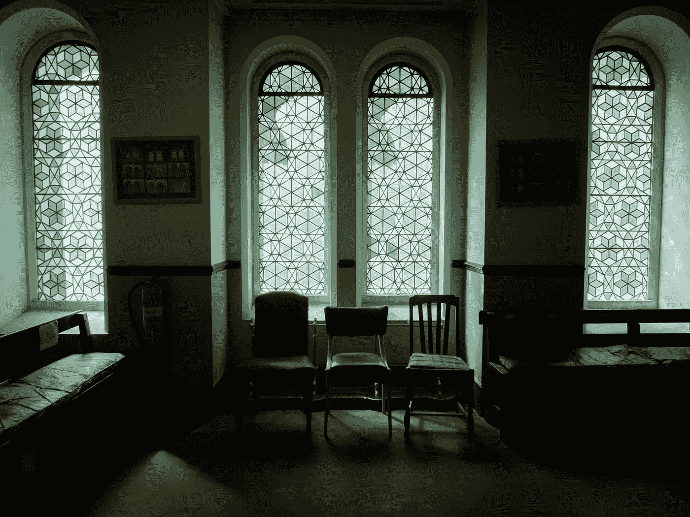

# 如何等待平静

> 原文：<https://medium.com/swlh/how-to-wait-out-a-lull-30567a641bdb>

## 当我成为自由职业者时，每个人都警告我会有间歇。他们说，平静的时间和项目之间的间隙是交易的一部分。我以为“预先警告是预先准备好的”，直到我的第一个平静不知从哪里来，打了我一耳光。

A waiting room — one of the photos I took while I was waiting out my lull.

自从我成为自由职业者的第一天起，我就一直在全力以赴地工作。(毫不夸张——我周五完成了工作，周六开始了我的第一份自由职业。)我拒绝了很多机会。今年早些时候甚至有一段时间，我忙得好像要淹死了。这是一种验证——我的生意蒸蒸日上，人们喜欢我的工作，我赢得了良好的声誉。

一切都很顺利。然后，就不是了。不知从哪里冒出来的——一阵间歇。我从全职工作到每周工作一天。我正在做的大项目马上就慢了下来，我已经安排好的一些线索也泡汤了。

起初我认为休息会对我有好处。确实如此——在最初的几周。我有点担心钱，但我已经预料到了(并为此做了准备)。

但是，当第三周的平静期到来时，没有新的作品，掌掴开始了。我不够好。巴掌。我的工作很糟糕。巴掌。我失败了。巴掌。创办自己的公司是个错误。巴掌。

当我进入平静期一个月的时候，压倒性的恐惧取代了掌掴。我觉得自己堕落了，充满了自我怀疑。

然后就像开始一样突然，结束了。大项目开始了，新项目来了，我又舒舒服服地忙碌起来。但是恐惧并没有消失。我害怕我会再次被掌掴和碾碎。

所以我想出了一个行动计划，并与大家分享，因为我怀疑我不是唯一一个经历这种情况的人:

# 1.我赚的钱都存 50%

一个朋友告诉我，把我挣的所有钱的 50%存起来——远远超过我需要存起来以支付税款的比例。我讨厌这个主意，但无论如何还是不情愿地这么做了，并削减了我的开支。哦天啊！我现在很高兴，因为这是我的可取之处。这意味着我有一笔可观的缓冲资金来度过这段平静期(以及在我等待领工资期间的余波)。我的目标是在接下来的几个月里补充资金，并在银行里存够六个月的生活费，以防万一。

(2022 年更新:我现在不存 50%是因为我是一家有限公司而不是一个独家交易商。相反，我用银行账户里的储蓄“口袋”为未来尽可能多的月份留出工资和红利。)

# 2.不要忘记“管道”

通过与其他自由职业者的讨论，我意识到我的间歇部分是因为今年早些时候工作太多。因为我有太多的项目在忙，我忽略了我的“管道”。我没有做我通常做的事情来开始关于工作的对话，直到几个月后才看到影响。另外，老实说，我已经意识到我不擅长为自己创造机会。(我正在努力！)

# 3.利用停工时间做点什么

把我所有的时间都花在行骗上，或者接受一份我并不真正想做的事情的合同，这很有诱惑力。相反，我利用所有额外的空闲时间:

*   接受一些我本来做不了的公益工作
*   投入到一个创造性的项目中([每天拍 36 张照片，持续一个月](https://www.instagram.com/explore/tags/36adaymay/)
*   (经常)在海里游泳

所有这些事情都很好地分散了我的担忧，而且它们帮助我完成了第四点。

# 4.把工作放在它的位置上

我的平静让我感觉如此糟糕的部分原因是，我又陷入了一些关于工作在我生活中的角色的坏习惯。工作不应该是一切，也不应该是我作为一个人得到认可的唯一来源。但我的行为就像它是，这就是为什么我经历了我的平静作为拍打，粉碎拒绝。通过做其他事情来恢复平衡，帮助我找回了自己的观点，并意识到我在工作之外还有目标和用途。

**你经历过平静期吗？你是如何应付他们的？**