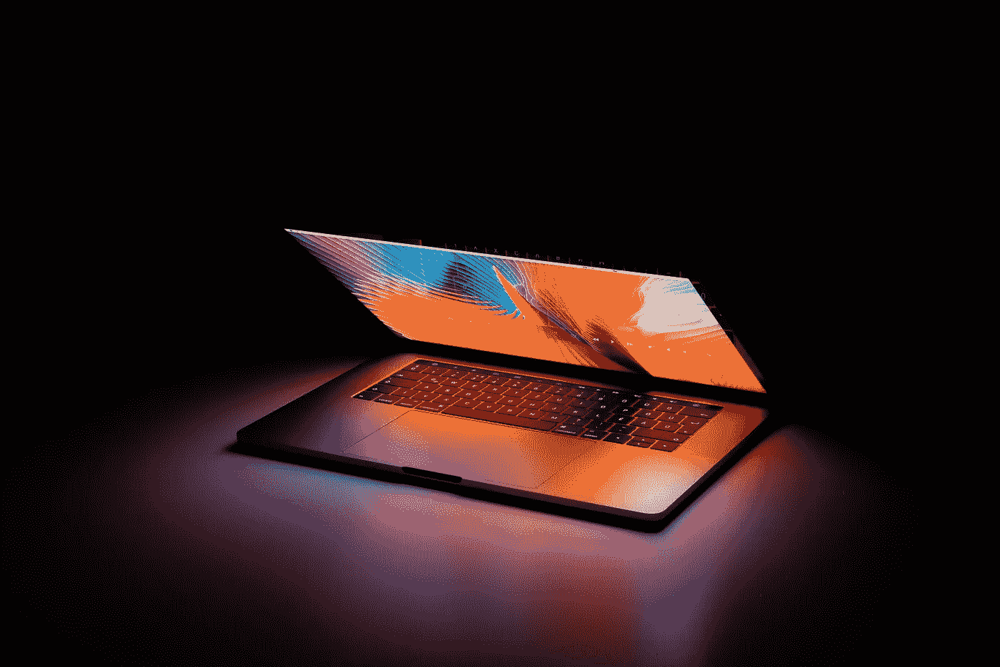

# 如何在 21 世纪获胜:尽可能长时间地“免费”

> 原文：<https://medium.com/swlh/how-to-win-in-the-21st-century-as-much-free-as-possible-for-as-long-as-possible-6cb43b6f76c>

## 为什么阿里巴巴价值 5000 亿美元，这与未来智能手机将如何免费发放有什么关系？

如果你想在 21 世纪(上半叶)赢得胜利，这个游戏的名字很清楚: