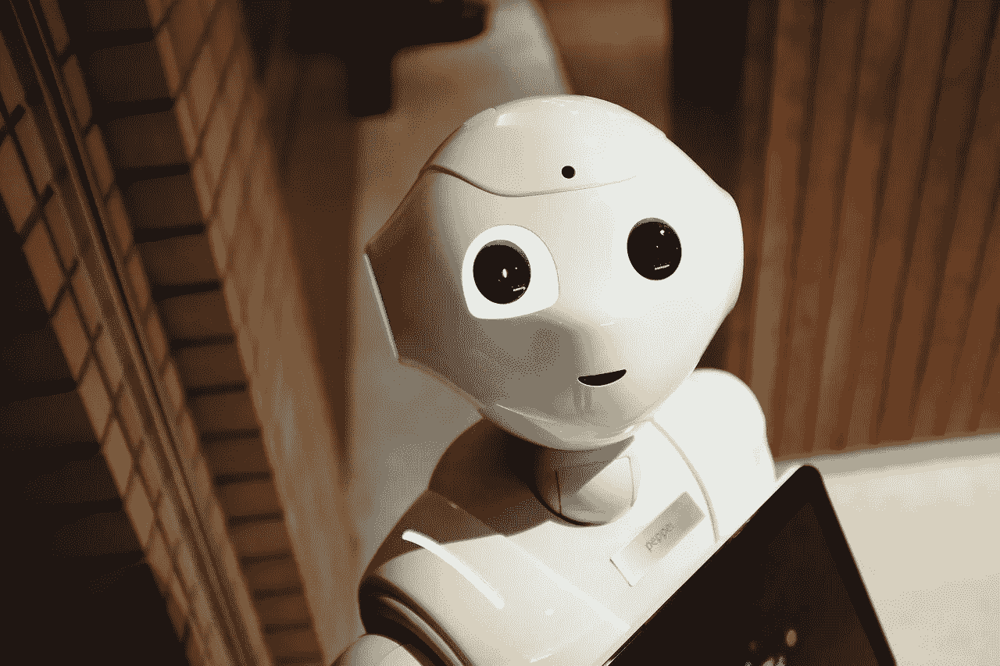

# 如何战胜机器人:这些是机器人无法取代的人

> 原文：<https://medium.com/swlh/how-to-win-vs-robot-these-are-the-people-robots-cant-replace-ec42f6f4642c>

Pixabay cc

想象一下当你的老板把你叫到办公室的那一刻。
*“请坐。“有件事我必须告诉你，”*她说。
她继续说:*“你已经在这里工作了 15 年，工作出色。”* 你感到快乐。一个天真的想法突然出现在你的脑海里:*“我终于要升职了！”但是你的老板丢下了炸弹。
*“不幸的是，我们将不得不让* …*