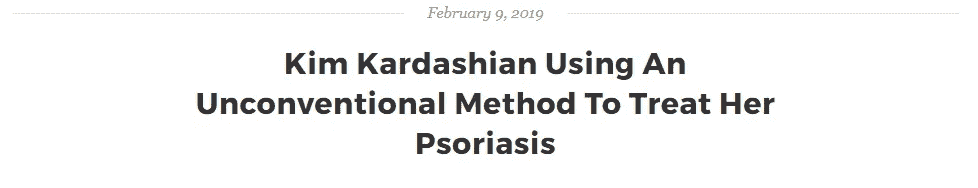

# 如何只写 10-15 篇博文并享受多年稳定的流量？

> 原文：<https://medium.com/swlh/how-to-write-just-10-15-blogs-enjoy-a-steady-stream-of-traffic-for-years-c4e3aa10e1c5>

Photo by [Carlos Muza](https://unsplash.com/photos/hpjSkU2UYSU?utm_source=unsplash&utm_medium=referral&utm_content=creditCopyText) on [Unsplash](https://unsplash.com/?utm_source=unsplash&utm_medium=referral&utm_content=creditCopyText)

那是星期五晚上。

我独自一人在办公室。

我检查了时间。—已经是晚上 8 点多了。

尽管我本可以做很多其他的事情，比如准时离开办公室，带我美丽的妻子出去吃晚餐，或者早点回家，为我们两个人做晚餐，然后舒舒服服地躺在床上看《网飞》。

但是相反，我已经写完了(我认为是)我迄今为止最好的一篇文章。

我非常兴奋。谁不会呢？——我花了整整一周的时间写这篇文章，做研究，修改错别字，润色我的文案。

我把整篇文章从头到尾校对了 6 遍，以确保每一个基本点都包含在内。

我心里在想:“这应该行得通！”。

所以，我点击了发布。

还有…

什么都没有。没有交通。

我等了一个星期，但仍然一无所获。

好吧，我有点夸张了。我确实看到了一点交通上涨，并收到了一些询问。

但是博客并没有产生预期的结果。

最糟糕的是。—过去两个月以来，每个博客都出现了这种情况。我未能通过博客发展业务。

*我犯了什么错误吗？*

你打赌我是！

我正在写(我现在想称之为)*【时间内容】*。

这是我(我相信你们很多人)犯的第一个错误。

# 关注趋势

我知道写下任何特定时刻让我们兴奋的事情都很有诱惑力。

它可能是一个令人兴奋的新应用发布，一个热门的行业话题，或者只是任何随机的东西。

不管是什么，我希望你能消除这种诱惑。

每当你有写一些热门话题的冲动时，就问自己这个简单的问题:

> 这个博客会在几个月甚至几年后产生流量吗？

我从个人经历中知道，10 次中有 9 次，答案是否定的。

所以，不要做。不要为了潮流而在博客上写时间性的内容。

这里有一个例子:

这是我称之为*时间内容的最好例证。*虽然现在这可能是相关的，但它肯定产生了流量高峰。但是一周后呢？一个月后？一年后呢？

你认为人们会搜索这个吗？

伙计，我希望不是！

反正重点是这个！—如果你想产生被动流量，只关注有机搜索潜力高的主题。

找到人们月复一月、年复一年都在搜索的博客主题。

一旦你找到 10-15 个这样的博客主题，为每个主题写下“伟大”的内容。

记住，没有“伟大”的内容，你就看不到成功。每个月都不会看到被动流量。

现在，我相信你一定在想——

> 发布“伟大”的内容？谢谢伙计，我以前从没听过这个建议…

谢谢你的讽刺，但你知道吗？—我也讨厌这种含糊的建议，这就是为什么我要解释我所说的优秀内容的确切含义。

# 什么是“伟大”的内容？

虽然伟大的内容可能是主观的，就像成功对每个人都是主观的一样。

但是，如果我必须定义伟大内容的确切特征，那么这些特征将是质量、独特性和权威性。

## **质量**

内容质量又是主观的。但是在我 4 年的网上写作中，我发现当人们谈论内容质量时，他们通常指的是写得好，提供解决方案，视觉上吸引人。

所以如果你想确保每个看到你的内容的人都认为它是一个高质量的内容，那么你需要在写作的时候记住这三点。

## **独特性**

因为我建议不要写时态内容，而要专注于写具有高度有机搜索潜力的主题，所以很有可能有人已经发表了一篇关于该主题的经过充分研究的文章。

成千上万的人可能已经有了。

那么你应该怎么做呢？

掉题目想法？—当然不是！

答案是为该主题编写 100%独特的内容，除非实现 100%的独特性极其困难。

所以，除非你是个天才，否则只有一种方法可以出版独一无二的东西。—融合自己的亲身经历。

这就是我在我写的每个博客中所做的。

事实上，这也是我在本文开头所做的。

## **权威**

权威很重要。

例如，如果你想减肥，你会从一个被撕碎的人或一个胖家伙那里读到减肥秘诀吗？

一切都是如此。

以我为例。如今，人们雇佣我在全球流行的平台上发表他们的文章，比如 Clutch、Entrepreneur、Upwork 等等。

这不仅仅是因为我有 4 年多写文章的经验。这些人，我的客户雇佣我，因为他们知道我的文章会带来流量并被分享。他们雇用我是因为他们知道我写的是能产生结果的史诗内容。

*而且他们怎么知道我写的是史诗内容？*

因为我的作品发表在媒体的顶级刊物上，包括[艺术+营销](https://artplusmarketing.com/what-really-holds-us-back-from-becoming-what-we-want-to-be-24076e8cc698)、[写作合作社](https://writingcooperative.com/1-unconventional-way-to-come-up-with-new-content-ideas-that-people-will-want-to-read-immediately-fa62be6fc2db)、[上升](https://theascent.pub/5-major-causes-of-failure-which-of-these-is-holding-you-back-c036a252a079)和印度顶级媒体平台——[你的故事](https://yourstory.com/2018/10/successful-brands-differently-others-content-strategy-2/)。

虽然我的大多数客户在这些平台上阅读了我的作品，然后联系我，但仅仅在这些平台上发布我的文章并不足以吸引这些客户。

我还必须不停地推销这些文章。事实上，这也是你应该做的。

# 不停地推广你的内容

简单地说，不是每个月发布 10-15 个博客，而是写 10-15 个具有良好的有机搜索潜力的博客，并将所有资源集中在创建反向链接上，以在谷歌中对相关关键词进行排名。

不管你写的内容有多好，如果你不推广它，你就没有机会在你的目标搜索词中排名靠前。

永远记住，

更多的推广=更多的反向链接。

更多的反向链接=更高的排名。

排名越高=每月被动流量越多。

因此，在人们可能会觉得有用的地方推广你的博客，从那里你还会得到一个*‘do-follow’*反向链接。

# 就是这样！

这就是你所需要做的，在几个月甚至几年内产生稳定的被动流量。

*原载于 2019 年 2 月 11 日*[*【www.screwedupengineer.com*](http://www.screwedupengineer.com/how-to-choose-blog-topics-that-bring-traffic-years/)*。*

## 在[上多了解我搞砸的工程师](http://www.screwedupengineer.com/)。

## 这篇文章发表在 [The Startup](https://medium.com/swlh) 上，这是 Medium 最大的创业刊物，拥有+423，678 名读者。

## 在此订阅接收[我们的头条新闻](https://growthsupply.com/the-startup-newsletter/)。

