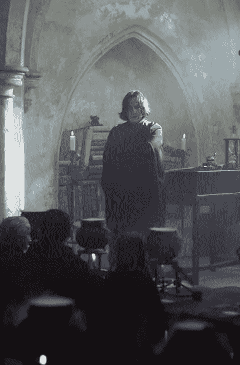

# 如何写西弗勒斯·斯内普

> 原文：<https://medium.com/swlh/how-to-write-severus-snape-7aef632acba3>

Chris Columbus, et al. HARRY POTTER AND THE SORCERER’S STONE. USA/UK, 2001.

当我说西弗勒斯·斯内普是我最喜欢的角色时，我总是得到奇怪的表情。我的意思是，让我们面对它——他是一个可怕的人。所以我们不要把我对他性格的欣赏和对他缺点的宽容混为一谈。事实上，我要说的是，正是因为这些缺点，我才倾向于阅读或写作以他为主角的同人小说。但这不应该是为西弗勒斯·斯内普辩护，不——这是如何写他。

公平地说，这是我在同人小说中对他的描述，也是我对这个角色的看法和思考。虽然我不会称之为“官方同人小说标准”，但这是我对什么构成了一个描绘良好的西弗勒斯·斯内普的定义。

那么如何着手呢？我可以告诉你我为他保留的所有描述符，我观察到的哪种行为，副词和措辞。但这不足以产生一个忠实和原创的写照。机械是不够的。如果你想要有深度和意义的美丽的原创人物，他们需要活着。他们是人。他们有欲望、需要、缺点、问题、历史、抱负——他们的存在与他们自己息息相关。你在调查他们的生活，揭示他们更多的性格，而不是创造性格。

我知道这么说很奇怪。他们实际上是我们想象的人。我知道——我明白你的意思，但如果他们只是这样，没人会在乎。我们为什么要关心钢铁侠，罗宾汉，或者哈利波特？我们关心他们，是因为他们代表了什么，我们在现实生活中看到的相似之处，也因为我们不仅仅把他们视为某个虚构的人物。

为什么我要进入这个？没有人问一个好角色的定义是什么。好吧，如果你在寻找如何写斯内普的帮助，这是相关的。抨击他很容易。他甚至活该。但是如果你想抓住他的本质，你也要关心他。我认为奥森·斯科特在《安德的游戏》中描述得最好:

> “当我真正了解我的敌人，了解到足以击败他的那一刻，我也爱他。我认为不可能真正理解一个人，他们想要什么，他们相信什么，而不是像他们爱自己那样爱他们。然后，就在我爱他们的那一刻，我摧毁了他们。”

我要通过分析他的性格来教你怎么写他。首先，我们必须决定去哪所学校:艾伦·瑞克曼电影《斯内普》还是原著《斯内普》。对我自己来说，我是一部偶尔加入电影元素的图书佳能。在经历了所有艰难的发展之后，改变你不喜欢他的角色的事情很容易开始——但是我不相信把事情藏在地板下面就像它从未发生过一样。还有，我对救赎之弧很着迷，我能说什么呢？

让我们来谈谈西弗勒斯·斯内普吧！从哪里开始？我应该从我们在魔法石中遇到的那个人开始吗？这是一个非常好的介绍。

> 奇洛教授戴着可笑的头巾，正在和一位头发油腻、鹰钩鼻、皮肤蜡黄的老师说话。
> 
> *这件事发生得非常突然。鹰钩鼻的老师透过奇洛的头巾，直直地看着哈利的眼睛——哈利额头上的伤疤突然感到一阵刺痛。*
> 
> *“哎哟！”哈利用手拍了拍脑袋。*
> 
> *“什么事？”珀西问道。*
> 
> *“N-无。”*
> 
> 疼痛来得快去得也快。更难摆脱的是哈利从老师的眼神中得到的感觉——一种他根本不喜欢哈利的感觉。
> 
> “和奇洛教授说话的那个老师是谁？”他问珀西。
> 
> 哦，你已经认识奇洛了，是吗？难怪他看起来这么紧张，那是斯内普教授。他教魔药，但他并不想教——所有人都知道他在争夺奇洛的职位。斯内普对黑魔法知道得太多了。”
> 
> 哈利看了斯内普一会儿，但斯内普没有再看他。

啊，这里有这么多东西要打开！这是哈利的伤疤伤害他的第一个场景，一个重要的气氛时刻，它与斯内普的介绍一起分享。这既让他成为整个系列的红鲱鱼，也坚定了他对活着的男孩的仇恨。但当你知道他对莉莉的感情，詹姆斯在学校如何欺负他时，这一幕就复杂多了。作为第一次体验他的读者，你并不知道这一切。但是当你写他的时候，你需要知道它，因为它通知了他的行动，解释了他的想法，以及为什么他可能会这样看或说这件事——即使主角没有主意。J.K .罗琳在艾伦·瑞克曼出现在书中之前就通知了他，这样他就可以在银幕上更好地刻画这个角色。

现在，如果你想读波特莫尔的《全盘接受》,请便。然而，我对此并不满意。这是一个很好的总结，但如果你要给他写信，你需要更多。

西弗勒斯·斯内普在成长过程中感到被束缚和孤立，因为他的父亲托拜厄斯对麻瓜产生了怨恨，托拜厄斯是一个嗜酒如命的酒鬼，“什么都不喜欢”佳能在这里变得模糊不清，留下了许多未说。我看到了几种不同的解释来填补空白。至于我，事情是这样的:

作为一个纯血统的人，艾琳·普林斯因嫁给一个麻瓜而被剥夺了继承权。她的丈夫不知道她是一个女巫，当他们签订协议，并怨恨她欺骗他。斯内普经常在睡觉时听着他父母的争吵声，早上他会发现他的母亲把她的瘀伤藏在一个护身符后面。一个不知道自己是女巫的女孩莉莉·埃文斯像善良的灯塔一样闪耀着光芒。斯内普第一次有了一个当他走进房间时不会怒视他的人。他有个最好的朋友。

他们一起去了霍格沃茨，她被分到格兰芬多学院，而他去了斯莱特林。一开始还不错。她没有让众议院的分歧阻止她，所以其他人都试图介入。一帮格兰芬多男生毫不留情地欺负他。他放弃了他麻瓜父亲的名字，在他的书上签名为混血王子。在夏天，只有他和莉莉，虽然他想远离家人，但他为那些只有她和他，没有人要求什么的时刻而活着。

但是在家里，事情并没有改变。当他介入保护他的母亲时，他是那个带着瘀伤离开的人。他倾向于憎恨麻瓜，并加入了这场日益壮大的运动。他想要更多的力量——阻止他父亲的力量，打败波特的力量，赢得莉莉的力量，他害怕莉莉会忘记他。然后，像一头蠢驴一样，他在痛苦和尴尬的时候对她大打出手。他骂她是从朋友那里学来的，她转过身，再也不回头——知道他会后悔一辈子。

当然，仍有一些未解之谜。他的父母发生了什么事，或者詹姆斯·波特救了他的命，或者他到底是什么时候成为食死徒的？这些问题大部分都没有答案，而且对理解他也不重要。

有许多不同的道路，但它们一定都通向那一天，他无意中听到特里劳妮教授在猪头楼上的一个房间里做了一个预言。然而，他没有听完整个故事，而是向黑魔王讲述了部分预言。只有当他解释了这些话并决定以波特夫妇为目标时，斯内普才意识到他把莉莉放在了伏地魔的路上——这是他从未想过要做的事。斯内普恳求他放过她，用了书中最糟糕的借口，因为他们是黑魔王唯一会考虑的理由——但是他知道他们还不够。所以，冒着一切危险，他在邓布利多面前结束了生命。他警告他，发誓他的忠诚，并恳求他保护莉莉的安全——这样做，他就会成为邓布利多的内线。但这还不够，当他发现莉莉死了，他的世界崩溃了。他出现了，喝醉了，被摧毁了，斥责邓布利多没能保护她——并同意保护她唯一的儿子。

**TLDR；**他基本上就是那个悲伤的情绪男孩，拍了一些难看的软呢帽照片，并加入了一个种族主义民族主义运动，因为他无法处理朋友分区。他变成了一个纳粹巫师，当巫师希特勒决定谋杀一个他从 12 岁起就迷恋的女孩时，他改变了立场。

这就是哈利·波特第一次见到的人——一个痛苦、怨恨的人，看着哈利，看到他所有的失败。他没能得到那个女孩。他没能救她。他不想改变，但他被过去所困扰，所以他抨击他周围的每个人。他表现出严重的偏袒，幼稚的恶意，并故意不公平地给哈利一个残酷的教训。他是个恶霸，自私，报复心强。尽管他有资格，但他甚至不能得到他梦寐以求的工作——这个职位受到了诅咒，他太有价值了，不能冒这个险。然而，与此同时，他是一个秘密间谍，假装扮演一个世纪以来最可怕的巫师的双重间谍。他不知道如何处理自己的情绪，我认为对他来说，把詹姆斯投射到哈利身上比他接受自己配不上莉莉更容易。

所以这就是他的背景，那他的性格呢？定义他的台词是什么？好吧，让我们不要拐弯抹角。他很残忍。有一次，他在上交哈利的药水瓶后，在罗恩已经让药水消失后，故意把药水瓶掉在地上，这意味着他那天的成绩不及格。他报复心很强，会找任何理由来惩罚格兰芬多，哈利，或者任何一个罪有应得的人。如果有什么的话，让他们保持谦逊是他的职责。这个人应该为最长的怨恨得到某种奖励。

他有一种专制的教学风格。不要和斯内普顶嘴。要么听他的，要么滚蛋——别抱怨了！—他会无视对立的观点。但他不会给出空洞的威胁，他会认真对待他说的每一句话，当事情不按他的方式进行时，他会发脾气，表现为恶言恶语、瞪眼睛和扔椅子。学生们生活在对他的拘留的恐惧中是有原因的——众所周知，他在没有魔法的情况下取出角蟾的内脏或清理医院病房的便盆。

但他也是个间谍，而且他很擅长这个。他熟练地保持着自己的身份。我是说，哈里怀疑他是有原因的。但是莉莉是他的基石，不管发生了什么，他对邓布利多始终不渝。他尽可能地保护哈利，尽管他对自己关心这个男孩的安全感到愤怒，因为他对这个男孩来说意味着什么。

那是西弗勒斯·斯内普。他在两个强有力的人物之间走钢丝，希望自己不会失去平衡。

所有这些都很重要，因为它影响了他在我的同人小说中的第一次互动。他的虐待史意味着无论他有多愤怒，他自己都不会打孩子。他憎恨那些有着容易被宠坏的童年的人，认为他是那个需要教导他们生活的不公平的人。他认为他应该得到更多。

如果你了解他是谁，他从哪里来，你就会知道他会有什么反应。

但是我想让斯内普*改变！我们毕竟是在这里写同人小说，而斯内普绝对不会收养哈利·波特。*错了！我们的工作是说服他，并通过这样做让读者相信斯内普正在改变。即使他在发现哈利和德思礼一家的虐待生活之前完全进入角色，他也不能当场收养这个孩子。他需要与这些知识斗争，否认它正在发生，然后重新评估一切。**

诀窍是——不要改变斯内普的性格。只是把他扔在迫使他面对他的恶魔的环境中，尤其是当他不想面对的时候。促使他考虑自己的行为。慢慢来。记住他是什么样的人。

那么，如何写西弗勒斯·斯内普呢？小心点。我觉得他就像一颗弹片炸弹。他尖锐、强硬、冷酷、暴怒，但他小心翼翼地保持克制，尽量不过度扩张，以免给自己惹上麻烦。他毕竟是斯莱特林的。他知道底线在哪里，有时会越过它。他的情绪高涨，多年的怨恨，但他把这一切都藏在胸口，埋在里面——玻璃碎片和生锈的钉子威胁着他周围的每个人。他不在乎脆弱，不相信溺爱或加糖会让事情变得更容易。如果他面前晃来晃去的胡萝卜被抢走，炸弹就会爆炸。他太渴望得到认可，渴望得到承认，渴望得到社会的祝贺——他生活在幕后，注定要生活在阴影中。所以，粉碎他的希望，看着他爆发，他会责怪周围的人。

我总是回想起他在书中的第一次演讲，因为它很好地设定了他的语调。

> “你在这里学习微妙的科学和制作药剂的精确艺术，”他开始说道。他说话声音不大，但他们听得一字不漏。“由于这里没有什么愚蠢的魔杖挥舞，你们中的许多人很难相信这是魔法。我不指望你会真正理解缓缓沸腾的大锅的美，它闪烁的烟雾，液体在人体血管中蔓延的微妙力量，蛊惑心灵，迷惑感官……我可以教你如何装瓶成名，酿造荣耀，甚至阻止死亡——如果你不像我通常要教的那样是一群笨蛋的话。”

起初，模仿这一点似乎令人望而生畏。这里的文字有一种诗意，他的措辞是故意的。我发现大声读出来很有帮助，用那种赤裸裸的耳语，让我的牙齿清晰地发音。斯内普用词谨慎，总会借机嘲讽。这是以下两者的区别:

“把那本书收起来！我的课上没有阅读，”他冷冷地说。

对比:

“这是什么？”他说着，从她手中抢走了那本书。“吉德罗·洛哈特的《神奇的我》？告诉我，洛克哈特对今天药剂的酿造有什么建议吗？也许如果你一直注意的话，你会在三分钟前知道把你的药水从火上拿下来。我猜你今晚又要被罚留堂了，”他咆哮着说，随手把书扔回到桌子上。

但是当我写西弗勒斯·斯内普时，我看到他油腻的头发和蜡黄的皮肤。我看到他的黑眼睛，像冰冷黑暗的隧道和他的黑色长袍。他是他教室里的捕食者，一只过度生长的蝙蝠，寻找弱点并嘲笑它。他等着你给他一个理由，他点燃煤气灯，他冷笑，他高高在上，充满权威。他嘴唇卷曲，眼睛愤怒地瞪着，说话时小心翼翼，好像重要的时候他的牙齿是刀一样，对不重要的事情嗤之以鼻。他内心隐藏着邪恶的情感。

但如果你认真打好基础，你就可以软化他的棱角，让他重新在乎一些东西。

那么，你怎么写西弗勒斯·斯内普呢？你想让我接下来写谁？