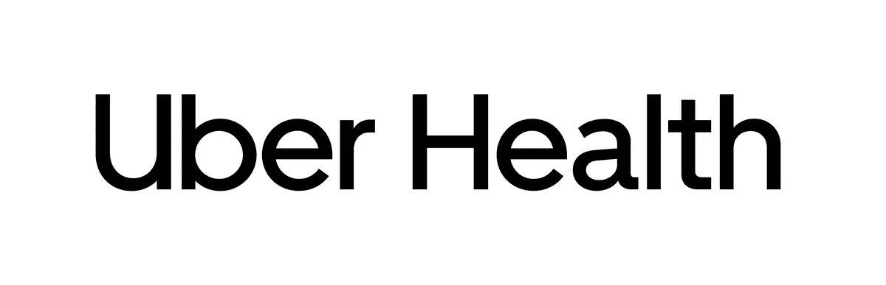
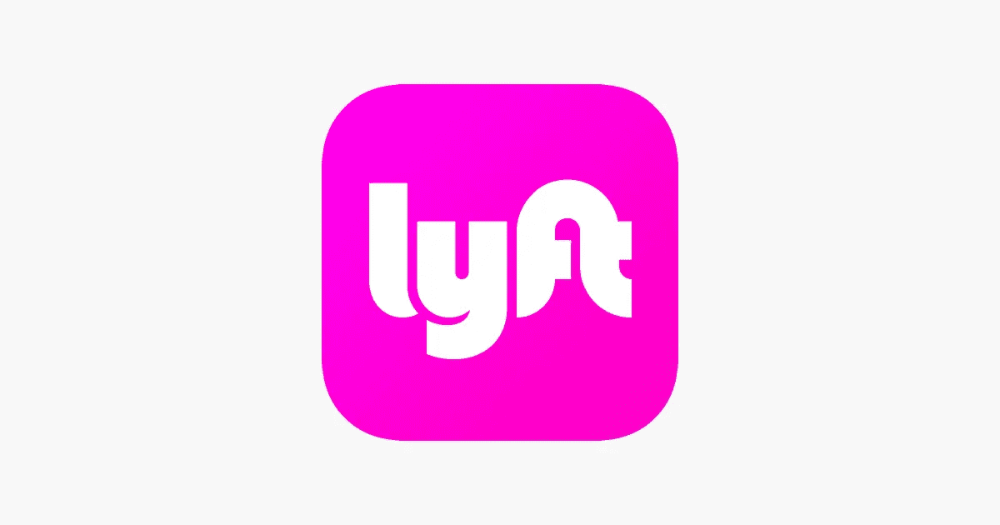

# 优步和 Lyft 如何成为医疗保健领域的主要参与者

> 原文：<https://medium.com/swlh/how-uber-and-lyft-became-major-players-in-the-healthcare-space-38a06285e890>

在我关于 MBTA 按需辅助运输试点项目的文章中，我提到了与优步和 Lyft 在**非紧急医疗运输(NEMT)** 服务方面的合作。我想了解更多细节…