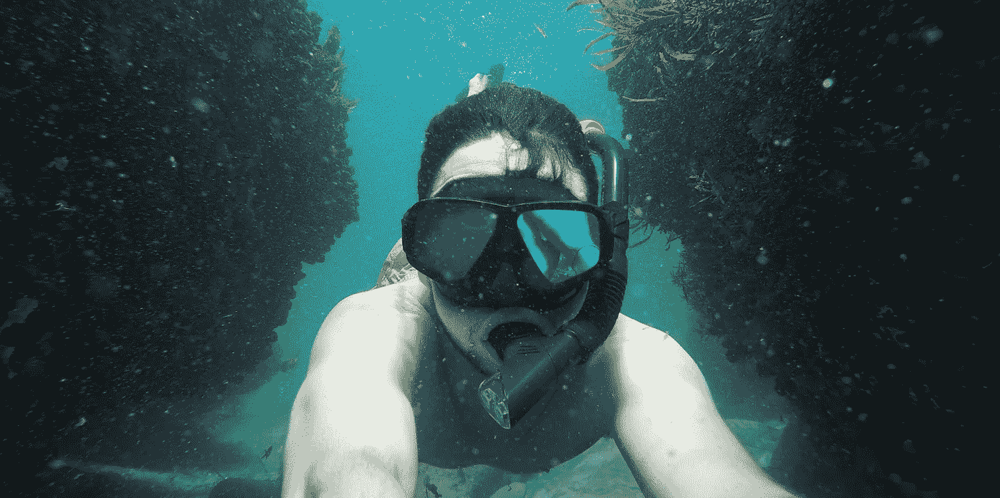
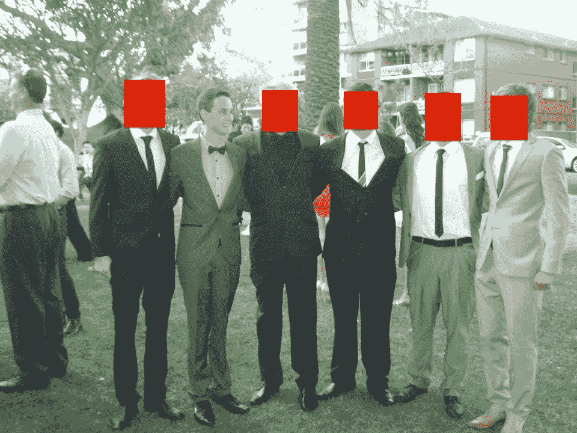
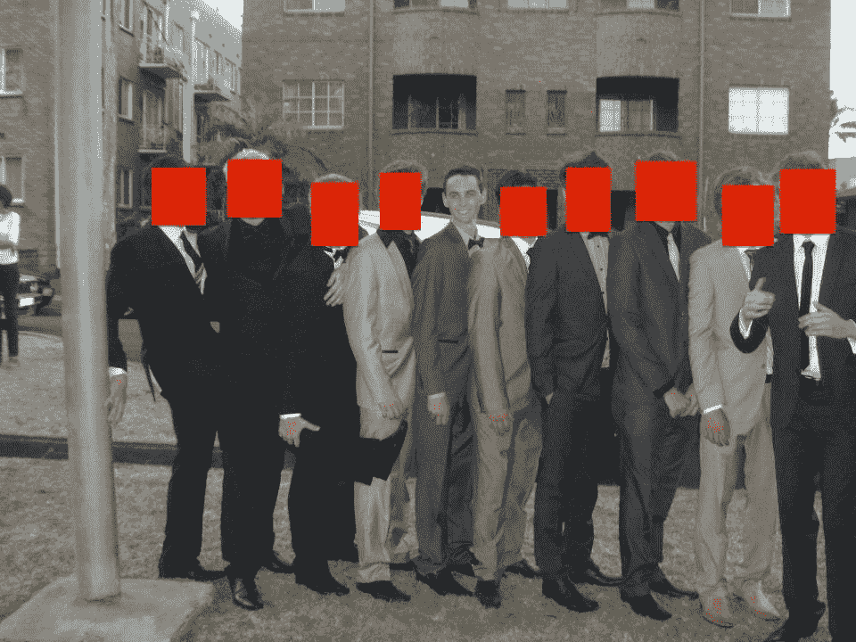

# 溃疡性结肠炎如何教会我相信自己

> 原文：<https://medium.com/swlh/how-ulcerative-colitis-taught-me-to-believe-in-myself-7d355c39fdfb>

## 当一切都对你不利时，保持绝对的确定性。

如果你整个过程都在怀疑自己，你就不能指望有所成就，但不幸的是，这在人们中间很普遍，尤其是那些让外界因素影响自己想法的人。

# 这个过程的起起落落

当你最终决定去追逐你的目标时，那是令人兴奋的。你迫不及待地陷入困境并开始取得一些进展，但随着时间的推移，几天变成几个月，你开始意识到这并不像一开始看起来那么简单。

你注意到你失败的次数比成功的次数多得多，你似乎在打一场小赢大输的无休止的战斗。

很快，你的动力减弱，你看不到最终目标。

这是大多数人放弃的地方。

> 他们看不到尽头，他们认定自己的目标不可能实现，于是放弃了。

这是你能做的最糟糕的事情。唯一能保证你永远达不到目标的就是放弃。关于放弃的事情是它的目标-自杀。如果你正处于准备放弃的状态，你实际上比你想象的更有可能接近成功。

# 从零开始

虽然这篇文章的重点是保持对你的目标的绝对肯定，但我想给你一个替代的例子来说明为什么它如此重要。

我想把它带回我的[慢性病](https://jessekerema.com/about/)。

**溃疡性结肠炎。**

我在 2012 年被确诊，但在那之前整整一年都有症状，因为我愚蠢地认为症状会消失。从那以后，我有过大约 6 次[突发症状](https://jessekerema.com/6-things-to-remember-to-mentally-beat-your-ulcerative-colitis-diagnosis/)，直到我开始注射，症状才真正得到缓解。

My year 12 formal. I weighed 55kgs.

2 weeks before this photo that suit fit perfectly.

但是其中一次突发事件真的改变了我看待生活和实现目标的方式。

**这是 2013 年的大爆发……**

开始的很慢，我的肩膀有点疼。我没多想，要么是那样，要么是我选择了无视。

再次…

我全职从事销售工作，直到最近才从最初的情绪失控中完全恢复过来。我只想做个正常人，我只想让它消失。愚蠢的我选择忽略任何警告信号。

所以，不出所料，他们变得更糟了。

差很多！

我的肩膀疼痛很快变成了我的肩膀被永久性地贴在我的耳朵附近。给你一个思路，把耳朵放在肩膀上，尽量把脖子伸直。

从那里，更多的痛苦开始了。

首先是我手指的关节。然后是我的脚趾。然后我身体的每一个关节。

我说的不是疼痛。

> 这是我一生中感到的最大的痛苦。

早上我要花 15 分钟才能把腿挪到床的一边，再花半个小时才能动起来。

三个月来每天早上。

这是地狱，我看不到尽头。

如果我不是因为疲劳而睡觉，我会看电视节目。我不起床，除非我需要去洗手间，这本身就是死亡，因为我不能不吐。

没吃饭体重 56 公斤。

情况越来越糟。

直到我决定适可而止，我做了一个不安全但完全值得的决定。

我决定自我治疗，重新服用医用类固醇。

现在我知道这是难以置信的愚蠢，但一旦我这样做了，我慢慢地开始感觉更好。

一天天地，我变得更加活泼。

是的，在那段恢复期，有糟糕的日子，也有美好的日子，但最终，我坚持到了最后。最终，我又变回了人类。

在那 3 个月里，我放弃了健康，也放弃了自己。

我受够了。

# 放弃是无法前进的

在地狱的 3 个月里，我会看着我的朋友们在社交媒体上做什么，并不断问自己为什么我必须经历我正在经历的事情。

为什么我不能健康？

为什么这事会发生在我身上？

这是不变的，绝对没有好处。这让我一直保持着失败者的心态。

不管我为变得更好所做的是对还是错，它仍然标志着我生命中一个非常重要的时刻。

> 你必须控制局面，你需要保持确定。

我不记得是什么触动了我，但从那一刻起，我决心变得更好，并开始取得一些进步。所以事情就是这样。

我保持乐观。我一直保持着动力，最终，我变得更好，病情得到缓解。从那里，我开始了我的第一次创业。

# 当世界与你为敌时保持坚定

不管你在追求什么，你总是会遇到问题。无论是慢性疾病，改变生活的事件，还是任何阻挡在你和你的目标之间的墙，都保证你会有所发现。

在过去的一年里，我遇到了很多麻烦。

*   结肠炎突然发作
*   缺乏经验
*   不认识合适的人
*   没有合适的技能
*   多了去了

这样的例子不胜枚举，但我从未将它们视为一种退出的手段。

如果你想达到你的目标，你需要保持一致，你需要相信自己。

没有这两样东西，你将一无所有，你将会失败。

只要记住，下次你认为它“太难”的时候。

你停下来的那一秒就是你失去的那一秒。如果你能一点一点地前进，你最终会成功的。

即使你花了 5 年时间，但在现实中，5 年后你拥有了你想要的一切，这算什么？无论如何，要相信自己！

*原载于 2019 年 1 月 30 日*[*【jessekerema.com】*](https://jessekerema.com/how-ulcerative-colitis-taught-me-to-believe-in-myself/)*。*

## 这篇文章发表在 [The Startup](https://medium.com/swlh) 上，这是 Medium 最大的创业刊物，拥有+418，678 名读者。

## 在这里订阅接收[我们的头条新闻](http://growthsupply.com/the-startup-newsletter/)。

