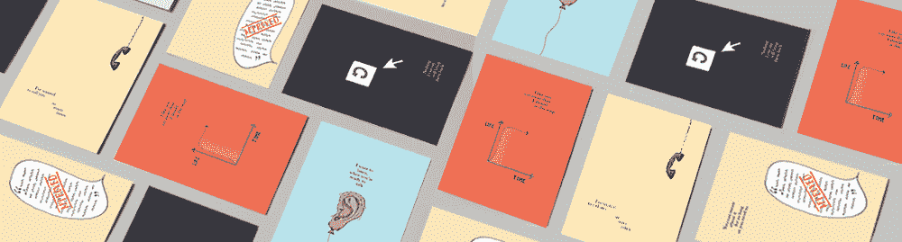
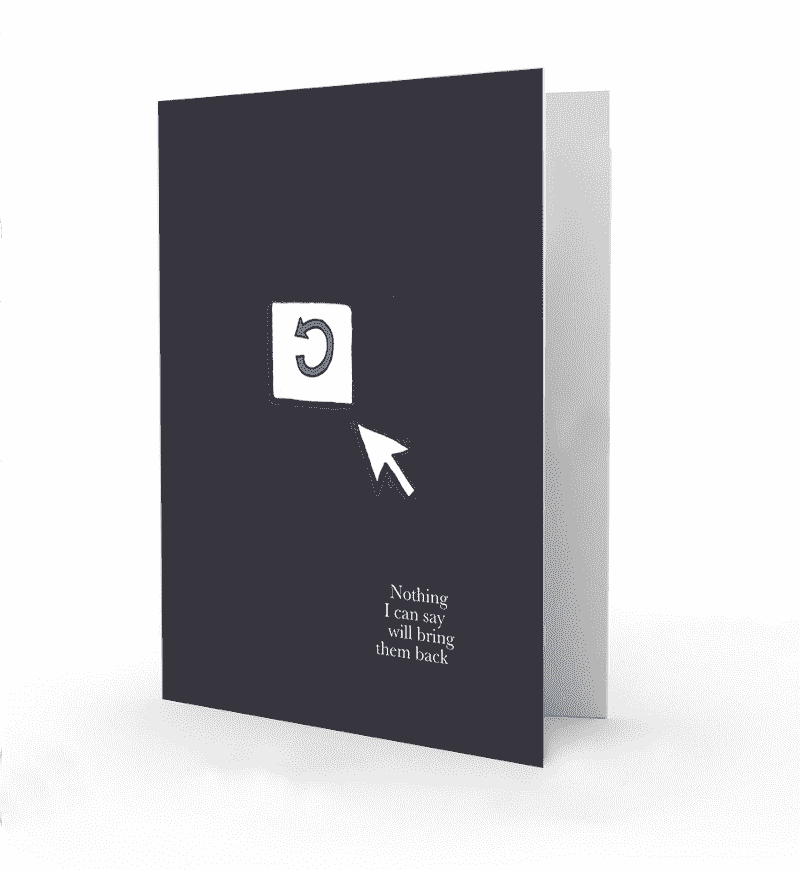
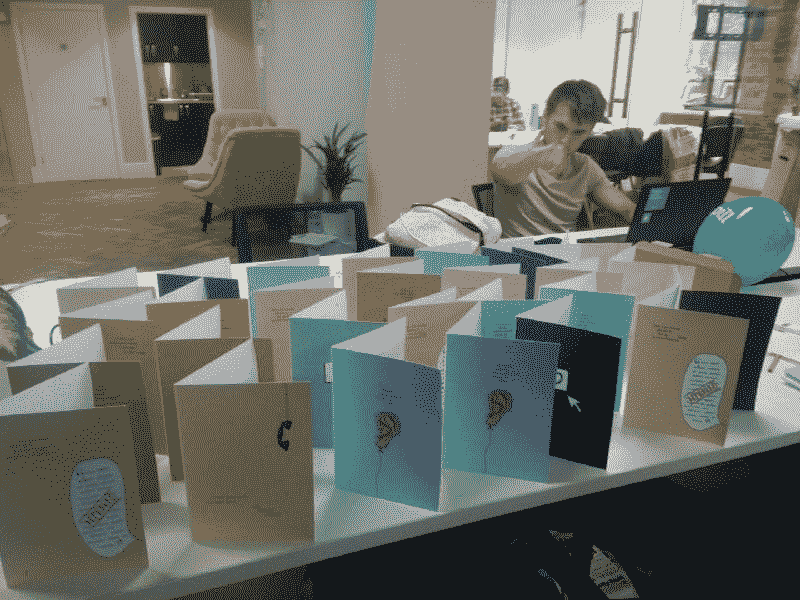
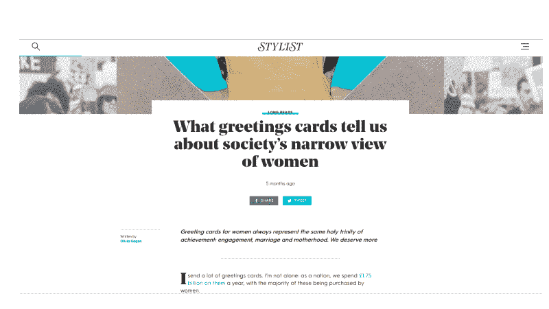
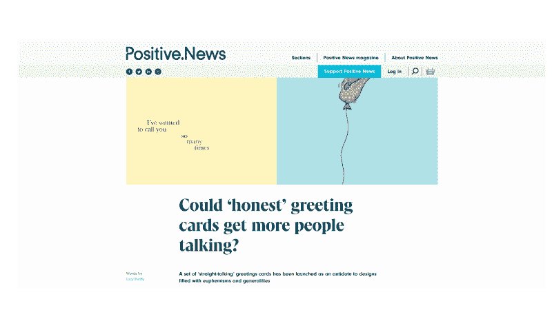
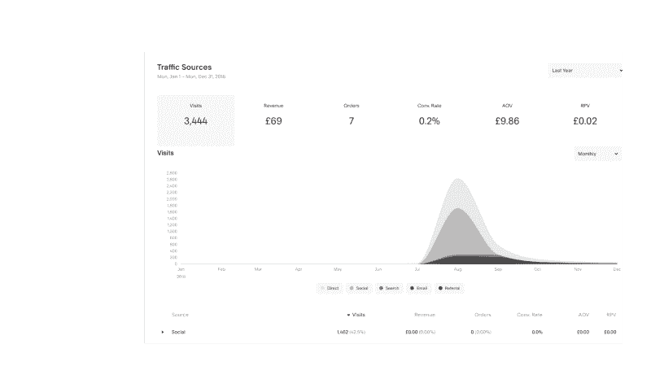

# 我们如何利用副业来推广我们的公司

> 原文：<https://medium.com/swlh/how-we-used-a-side-business-to-promote-our-company-b0596b019ed8>

大约五个月前，我参加了一个诗歌晚会。我以前从未去过，说实话，我觉得有点不适应。这可能是我在前诗歌混合的对话等级中结束的原因之一…我开始和一个独自在角落里的人说话。他原来是其中一个诗人:想必其他人都知道他是一个诗人，他可能正在努力为演出做心理准备。当开始越来越接近开始的时间，其余的诗人来了，加入了我们的谈话。六位诗人和我:)

活动结束后，我走回家。在路上，我碰到了一位诗人，我们聊了聊。聊了一会儿，我对他的表现称赞了几句，结果发现他前世是一家大型贺卡公司的贺卡写手。

像我一样痴迷于 500 天的夏天，我有很多问题。你最畅销的卡片是什么？你一天要制作多少张卡片？你是怎么想出这些短语的？他告诉我关于日常工作的一切，以及他的创造力是如何经常被压制的。例如，树懒在一个季节特别“流行”,所以每个系列中至少有一张卡片需要有一个与树懒相关的双关语。

# 这个想法

第二天，在办公室里，我告诉我的同事威尔要见一个真实生活中的贺卡作者。我们讨论了不得不写一些平淡无奇、多愁善感、完全避免说出任何人真实感受的贺卡有多难。"我们是一家很酷的精神健康公司！"我们以为。“让我们推出贺卡品牌吧！它会很酷，会给我们的网站带来数百万的点击量！”

We wanted to move away from bland cards which proclaimed euphemisms like “With sympathy”.

# 死刑

接下来的一周，威尔想出了五种卡片设计，旨在说出人们真实的感受和想说的话，但*就是不说*。我们花 200 英镑雇了一个认识我们一个同事的插画师来画这些画。在尝试了许多不同的颜色、布局和字体组合后，我们选定了最喜欢的设计。

- Our longlist of potential designs

我们的策略相当简单:

1.  设计卡片
2.  把它们放在 Squarespace 网站上
3.  尽量推广网站。

我们在 [Punchy Cards](https://www.punchycards.com/) 网站的底部包含了一个到我们主网站的链接，试图将一些流量转换回 Spill。

# 结果呢

我们最终在[黑客新闻](https://news.ycombinator.com/item?id=17773428)上收到了 43 张赞成票，我们在 HN 主页上停留了大约 24 小时。我们不得不在 HN 上贴了两次有力的卡片，它才得到了任何关注。

我们收到了黑客新闻的大约 2000 次点击，一夜之间，我们的“强力卡片”从谷歌的第六页上升到了第一页的第一名。在那里找到我们的人给了我们 12.00 英镑的卡销售额。

我们也张贴了产品搜索，但我们只收到 2 个 upvotes 和 3 个意见:(

接下来，我们给一群英国记者发了电子邮件，告诉他们关于打孔卡的事情。我们出现在 Stylist 的一篇[文章中(这在英国是一件大事)。我们在他们的网站上，也在他们的印刷报纸上。这导致了 14 次直接网站浏览和 0.00 英镑的贺卡销售额。](https://www.stylist.co.uk/long-reads/thoughtful-cards-birthday-cards-gift-cards-women-gin-prosecco-cake-shopping-feminism-business-career/225415)

我们还出现在[正面新闻](https://www.positive.news/society/could-honest-greeting-cards-get-more-people-talking/)(比《时尚》杂志小得多的出版物)中。在这里，我们收到了 248 个网站浏览量和 36.00 英镑的贺卡销售收入。

最后，我们收到了 144 个谷歌搜索点击，我相信这是由于造型师的文章。这导致了 18.00 英镑的卡销售额。

到目前为止，该项目已经产生了 98 次点击量来查看漏油网站。

# 总结

我们真的很喜欢制作有力的卡片，这个前提与我们在 [Spill](https://www.spill.chat/) 所做的事情(谈论你的真实感受)非常吻合。它没有花费太多的时间来设置，而且运行起来非常便宜。我们卖卡也赚回了一些钱(90%的利润率)！

我们计划在下周花几天时间为情人节制作一系列新的贺卡，因为我们第一次并没有真正针对某个特定的事件——记者通常喜欢用这个作为诱饵。

我希望这能让你了解提出与主品牌相关但独立的“营销理念”的过程，你可以分发它的方式，以及我们所得到的结果——一些可以作为基准的东西。如果你有任何问题，你可以发邮件给我，地址是 calvin@spill.chat，如果你想阅读更多来自 spill 的文章，你可以看看这里的。

感谢阅读！

## 这篇文章发表在 [The Startup](https://medium.com/swlh) 上，这是 Medium 最大的创业刊物，拥有+415，678 名读者。

## 在这里订阅接收[我们的头条新闻](http://growthsupply.com/the-startup-newsletter/)。

